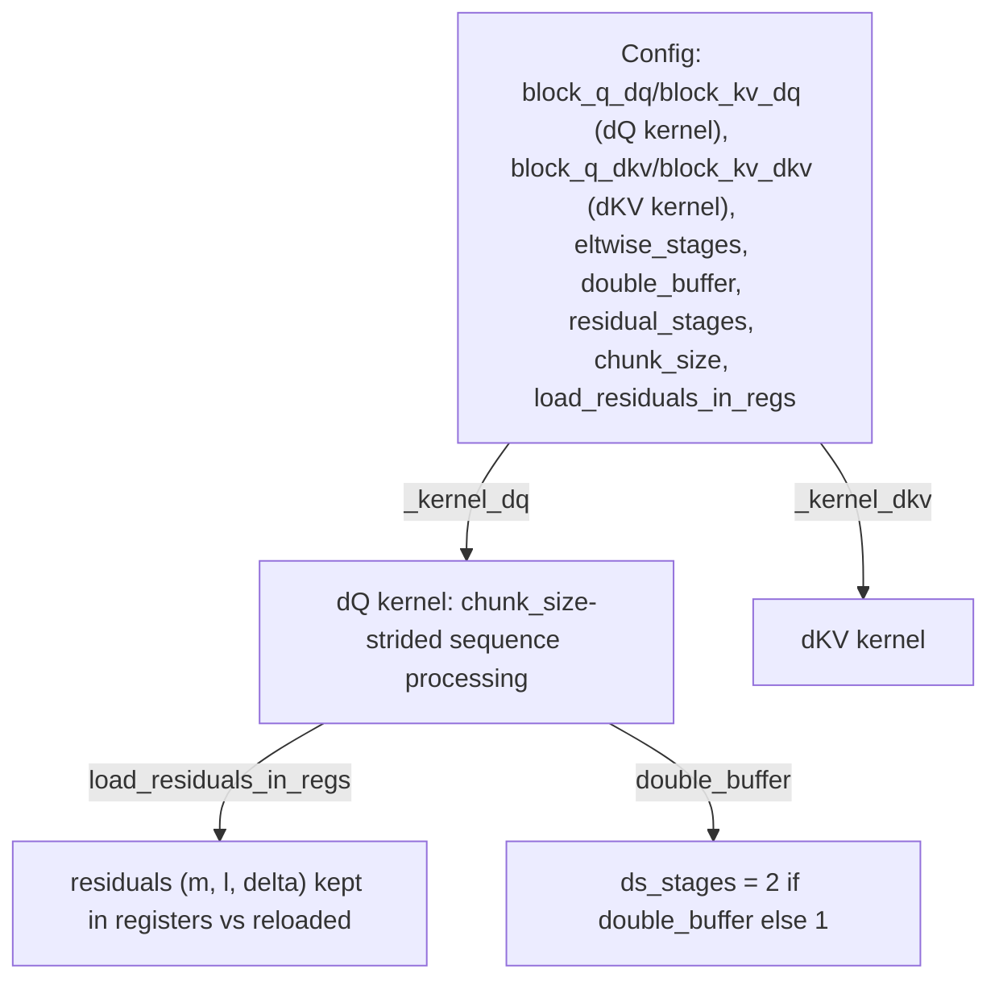

# tokamax._src.ops.attention.pallas_mosaic_gpu_vjp_kernel_sm100 — flash-attention backward, split dQ/dKV configs, residual-in-regs option

## Overview

This module implements the SM100 (Blackwell) backward pass (VJP) for flash attention, with a
[`Config`](../catalog/tokamax/_src/ops/attention/pallas_mosaic_gpu_vjp_kernel_sm100.md#Config) that
extends the shared VJP config's dQ/dKV block sizes (
[`block_q_dq`](../catalog/tokamax/_src/ops/attention/pallas_mosaic_gpu_vjp_common.md#Config.block_q_dq)/
[`block_kv_dq`](../catalog/tokamax/_src/ops/attention/pallas_mosaic_gpu_vjp_common.md#Config.block_kv_dq)/
[`block_q_dkv`](../catalog/tokamax/_src/ops/attention/pallas_mosaic_gpu_vjp_common.md#Config.block_q_dkv)/
[`block_kv_dkv`](../catalog/tokamax/_src/ops/attention/pallas_mosaic_gpu_vjp_common.md#Config.block_kv_dkv))
with SM100-specific tuning knobs:
[`eltwise_stages`](../catalog/tokamax/_src/ops/attention/pallas_mosaic_gpu_vjp_kernel_sm100.md#Config.eltwise_stages),
[`double_buffer`](../catalog/tokamax/_src/ops/attention/pallas_mosaic_gpu_vjp_kernel_sm100.md#Config.double_buffer),
[`residual_stages`](../catalog/tokamax/_src/ops/attention/pallas_mosaic_gpu_vjp_kernel_sm100.md#Config.residual_stages),
[`chunk_size`](../catalog/tokamax/_src/ops/attention/pallas_mosaic_gpu_vjp_kernel_sm100.md#Config.chunk_size),
and
[`load_residuals_in_regs`](../catalog/tokamax/_src/ops/attention/pallas_mosaic_gpu_vjp_kernel_sm100.md#Config.load_residuals_in_regs).
The backward pass computes dQ and dKV via separate kernels
([`_kernel_dq`](../catalog/tokamax/_src/ops/attention/pallas_mosaic_gpu_vjp_kernel_sm100.md#_kernel_dq)/
[`_kernel_dkv`](../catalog/tokamax/_src/ops/attention/pallas_mosaic_gpu_vjp_kernel_sm100.md#_kernel_dkv)),
each with its own independently-tunable block sizes.

## Diagram

## Design rationale (why it's built this way)

**dQ and dKV are computed by separate kernels with independently-tunable block sizes, not one
combined backward kernel.** The
[`Config`](../catalog/tokamax/_src/ops/attention/pallas_mosaic_gpu_vjp_kernel_sm100.md#Config)
inherited from `vjp_common` carries distinct
[`block_q_dq`](../catalog/tokamax/_src/ops/attention/pallas_mosaic_gpu_vjp_common.md#Config.block_q_dq)/
[`block_kv_dq`](../catalog/tokamax/_src/ops/attention/pallas_mosaic_gpu_vjp_common.md#Config.block_kv_dq)
vs.
[`block_q_dkv`](../catalog/tokamax/_src/ops/attention/pallas_mosaic_gpu_vjp_common.md#Config.block_q_dkv)/
[`block_kv_dkv`](../catalog/tokamax/_src/ops/attention/pallas_mosaic_gpu_vjp_common.md#Config.block_kv_dkv)
pairs — since dQ and dKV have different data-access patterns (dQ iterates the K/V dimension per
fixed Q block; dKV iterates the Q dimension per fixed K/V block), the optimal tile sizes for each
generally differ, so the config exposes them as independently tunable rather than sharing one block
size across both.

**`load_residuals_in_regs` is an explicit config knob trading register pressure for avoided
memory traffic, applied to the flash-attention softmax statistics (m, l, delta).** The class
docstring for
[`load_residuals_in_regs`](../catalog/tokamax/_src/ops/attention/pallas_mosaic_gpu_vjp_kernel_sm100.md#Config.load_residuals_in_regs)
describes it as "whether to load residuals (m, l, delta) into registers" — these three per-row
scalars (softmax max, sum, and the D-term used in the backward recurrence) are needed repeatedly
throughout the dQ/dKV kernel loops; keeping them resident in registers avoids repeated memory
loads, at the cost of register pressure that could otherwise go toward higher occupancy or larger
tiles — an explicit, benchmarkable tradeoff rather than one fixed choice.

**`double_buffer` explicitly doubles the SMEM staging depth for one specific data path** (as seen
in `ds_stages = 2 if config.double_buffer else 1`), letting the kernel overlap loading the next
chunk's `ds`-related data with computing on the current chunk, at the cost of double the SMEM
footprint for that allocation.

## Entry points

- [`Config`](../catalog/tokamax/_src/ops/attention/pallas_mosaic_gpu_vjp_kernel_sm100.md#Config) —
  the SM100 VJP kernel's tuning configuration.
- [`_kernel_dq`](../catalog/tokamax/_src/ops/attention/pallas_mosaic_gpu_vjp_kernel_sm100.md#_kernel_dq) /
  [`_kernel_dkv`](../catalog/tokamax/_src/ops/attention/pallas_mosaic_gpu_vjp_kernel_sm100.md#_kernel_dkv) —
  the two separate backward kernels for dQ and dKV respectively.
- [`PallasMosaicGpuFlashAttentionVjp._fwd`](../catalog/tokamax/_src/ops/attention/pallas_mosaic_gpu_vjp.md#PallasMosaicGpuFlashAttentionVjp._fwd) —
  the `Op`-protocol entry point dispatching into both kernels.

## Mechanism (step-by-step)

1. **[`PallasMosaicGpuFlashAttentionVjp._fwd`](../catalog/tokamax/_src/ops/attention/pallas_mosaic_gpu_vjp.md#PallasMosaicGpuFlashAttentionVjp._fwd)
   is invoked as the backward pass** for
   [`DotProductAttention`](tokamax-_src-ops-attention-base.md), receiving the forward pass's
   residuals.
2. **[`_kernel_dq`](../catalog/tokamax/_src/ops/attention/pallas_mosaic_gpu_vjp_kernel_sm100.md#_kernel_dq)
   computes the query gradient**, processing the sequence dimension in
   [`chunk_size`](../catalog/tokamax/_src/ops/attention/pallas_mosaic_gpu_vjp_kernel_sm100.md#Config.chunk_size)-sized
   strides, optionally keeping the (m, l, delta) residuals resident in registers per
   [`load_residuals_in_regs`](../catalog/tokamax/_src/ops/attention/pallas_mosaic_gpu_vjp_kernel_sm100.md#Config.load_residuals_in_regs).
3. **[`_kernel_dkv`](../catalog/tokamax/_src/ops/attention/pallas_mosaic_gpu_vjp_kernel_sm100.md#_kernel_dkv)
   computes the key/value gradients** using its own independently-configured block sizes.

## Key data structures

- **[`Config`](../catalog/tokamax/_src/ops/attention/pallas_mosaic_gpu_vjp_kernel_sm100.md#Config)** —
  extends the shared VJP `block_q_dq`/`block_kv_dq`/`block_q_dkv`/`block_kv_dkv` fields with
  [`eltwise_stages`](../catalog/tokamax/_src/ops/attention/pallas_mosaic_gpu_vjp_kernel_sm100.md#Config.eltwise_stages)
  (pipeline stages for elementwise ops),
  [`double_buffer`](../catalog/tokamax/_src/ops/attention/pallas_mosaic_gpu_vjp_kernel_sm100.md#Config.double_buffer),
  [`residual_stages`](../catalog/tokamax/_src/ops/attention/pallas_mosaic_gpu_vjp_kernel_sm100.md#Config.residual_stages),
  [`chunk_size`](../catalog/tokamax/_src/ops/attention/pallas_mosaic_gpu_vjp_kernel_sm100.md#Config.chunk_size)
  (multiple of 32, ≥ 32), and
  [`load_residuals_in_regs`](../catalog/tokamax/_src/ops/attention/pallas_mosaic_gpu_vjp_kernel_sm100.md#Config.load_residuals_in_regs).

## Dynamics (design intent)

Because dQ/dKV block sizes are independent config fields, an autotuning search over this `Config`
type explores a strictly larger space than one shared block-size search would — at the cost of
proportionally more candidate configs to benchmark.

## Edge cases

- [`Config.chunk_size`](../catalog/tokamax/_src/ops/attention/pallas_mosaic_gpu_vjp_kernel_sm100.md#Config.chunk_size)
  is constrained to multiples of 32 with a minimum of 32 (via `pydantic.conint`) — a chunk size
  narrower than one warp's natural granularity is rejected at construction.

## Open questions

- The precise register-pressure/occupancy tradeoff curve for
  [`load_residuals_in_regs`](../catalog/tokamax/_src/ops/attention/pallas_mosaic_gpu_vjp_kernel_sm100.md#Config.load_residuals_in_regs)
  (at what point keeping residuals in registers starts hurting occupancy enough to offset the
  memory-traffic savings) is not addressed by this packet's cited subgraph.

## See also
- [tokamax-_src-ops-attention-pallas_mosaic_gpu_kernel_sm100](tokamax-_src-ops-attention-pallas_mosaic_gpu_kernel_sm100.md) —
  the forward-pass SM100 kernel this module's VJP complements.
- [tokamax-_src-ops-attention-base](tokamax-_src-ops-attention-base.md) — `DotProductAttention`,
  the op whose backward this module implements.
