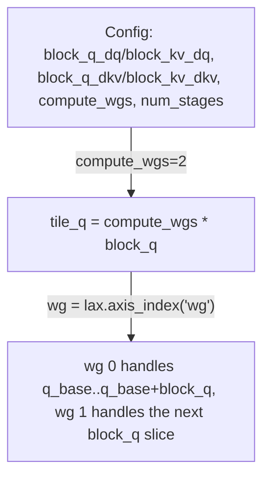

# tokamax._src.ops.attention.pallas_mosaic_gpu_vjp_kernel_sm90 — Hopper flash-attention backward, compute_wgs warpgroup fan-out

<!-- connect:up:begin -->
> **Cross-repo concept:** part of [flash-attention](../../../concepts/flash-attention.md), [mosaic-kernel](../../../concepts/mosaic-kernel.md), [pallas-kernel](../../../concepts/pallas-kernel.md) across this wiki's repos.
<!-- connect:up:end -->
## Overview

This module implements the SM90 (Hopper) backward pass (VJP) for flash attention, reusing
[`vjp_common.Config`](../catalog/tokamax/_src/ops/attention/pallas_mosaic_gpu_vjp_common.md#Config)
directly (`Config = vjp_common.Config`) rather than subclassing it. The key SM90-specific tuning
field is
[`compute_wgs`](../catalog/tokamax/_src/ops/attention/pallas_mosaic_gpu_vjp_common.md#Config.compute_wgs)
(1 or 2), the number of compute warpgroups that cooperatively process one logical Q tile: the
kernel computes `tile_q = compute_wgs * block_q` and assigns each warpgroup (`wg =
lax.axis_index("wg")`) its own `block_q`-sized slice within that tile.

## Diagram

## Design rationale (why it's built this way)

**`compute_wgs` fans a logical Q tile out across multiple cooperating compute warpgroups, each
handling its own `block_q` slice — a different parallelization axis than SM100's 2-CTA collective
MMA.** The kernel computes `tile_q = compute_wgs * block_q` and derives each warpgroup's Q offset
as `qi * tile_q + wg * block_q` — since Hopper's warp-specialized programming model assigns
distinct roles to different warpgroups within one CTA (rather than SM100's cross-CTA collective
MMA), `compute_wgs` is the SM90-appropriate way to scale compute parallelism within a single CTA's
warpgroups.

**`Config` is reused by direct assignment (`Config = vjp_common.Config`) rather than subclassed**,
unlike the SM100 kernel module, because SM90 introduces no additional config fields beyond what
`vjp_common.Config` already provides (`compute_wgs` is itself defined on the shared base) — a
simpler backend needs no config specialization at all.

## Entry points

- [`PallasMosaicGpuFlashAttentionVjp._fwd`](../catalog/tokamax/_src/ops/attention/pallas_mosaic_gpu_vjp.md#PallasMosaicGpuFlashAttentionVjp._fwd) —
  the `Op`-protocol backward entry point for this SM90 implementation.
- [`get_heuristics_config`](../catalog/tokamax/_src/ops/attention/pallas_mosaic_gpu_vjp_kernel_sm90.md#get_heuristics_config) —
  reached to derive default block sizes/`compute_wgs` when no explicit or cached config is
  supplied.

## Mechanism (step-by-step)

1. **[`get_heuristics_config`](../catalog/tokamax/_src/ops/attention/pallas_mosaic_gpu_vjp_kernel_sm90.md#get_heuristics_config)
   derives a default
   [`Config`](../catalog/tokamax/_src/ops/attention/pallas_mosaic_gpu_vjp_common.md#Config)** from
   the call's input shapes.
2. **The dQ kernel computes `tile_q` as
   [`compute_wgs`](../catalog/tokamax/_src/ops/attention/pallas_mosaic_gpu_vjp_common.md#Config.compute_wgs)
   `* block_q`**, and assigns each warpgroup its own `block_q`-wide Q slice within that tile via
   `qi * tile_q + wg * block_q`.
3. **Each warpgroup independently processes its assigned Q slice**, iterating K/V tiles sized by
   [`Config.block_kv_dq`](../catalog/tokamax/_src/ops/attention/pallas_mosaic_gpu_vjp_common.md#Config.block_kv_dq)
   (looping `lb` to `ub = pl.cdiv(kv_seq_len, block_kv_dq)`), producing its portion of dQ.

## Key data structures

- **[`Config`](../catalog/tokamax/_src/ops/attention/pallas_mosaic_gpu_vjp_common.md#Config)** —
  shared with [tokamax-_src-ops-attention-pallas_mosaic_gpu_vjp_kernel_sm100](tokamax-_src-ops-attention-pallas_mosaic_gpu_vjp_kernel_sm100.md);
  [`compute_wgs`](../catalog/tokamax/_src/ops/attention/pallas_mosaic_gpu_vjp_common.md#Config.compute_wgs)
  is the field this SM90 kernel relies on most directly.

## Dynamics (design intent)

Because `compute_wgs` scales the number of warpgroups cooperating on one Q tile rather than the
tile size itself, increasing it changes how much of the CTA's total warpgroup capacity is devoted
to this kernel's compute role versus other roles (e.g. a dedicated loading/TMA warpgroup) in the
broader warp-specialized pipeline.

## Edge cases

- `compute_wgs` is constrained to `pydantic.PositiveInt` with a default of 2 on the shared
  `vjp_common.Config` — the SM90 kernel's own logic (splitting `tile_q` by `wg =
  lax.axis_index("wg")`) implicitly assumes the actual launched warpgroup-axis size matches
  `compute_wgs`; a mismatch between the two is not caught by `Config`'s own validation.

## Open questions

- Whether `compute_wgs=1` (single compute warpgroup) is ever preferred in practice, or `2` is
  effectively the only value used, is not addressed by this packet's cited subgraph.

## See also
- [tokamax-_src-ops-attention-pallas_mosaic_gpu_vjp_kernel_sm100](tokamax-_src-ops-attention-pallas_mosaic_gpu_vjp_kernel_sm100.md) —
  the SM100 (Blackwell) counterpart, using a different parallelization strategy
  (`load_residuals_in_regs`/`double_buffer`/collective MMA) for the same backward computation.
