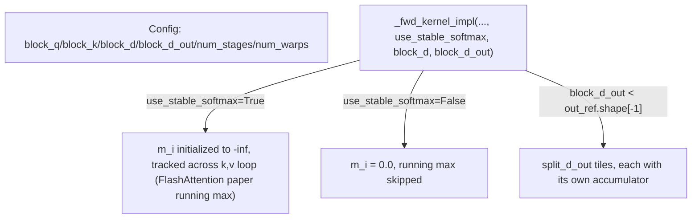

# tokamax._src.ops.attention.pallas_triton — Triton flash attention, AUTO-resolved stable-softmax, split head-dim tiling

<!-- connect:up:begin -->
> **Cross-repo concept:** part of [autotuning](../../../concepts/autotuning.md), [flash-attention](../../../concepts/flash-attention.md) across this wiki's repos.
<!-- connect:up:end -->
## Overview

[`PallasTritonFlashAttention`](../catalog/tokamax/_src/ops/attention/pallas_triton.md#PallasTritonFlashAttention._fwd)
is tokamax's Pallas-Triton backend for
[`DotProductAttention`](tokamax-_src-ops-attention-base.md). Its
[`use_stable_softmax`](../catalog/tokamax/_src/ops/attention/pallas_triton.md#PallasTritonFlashAttention.use_stable_softmax)
field defaults to `AUTO`, resolved via `base.needs_stable_softmax(...)`, trading the numerically
safer running-max flash-attention softmax normalization against a cheaper variant that skips
tracking the running max entirely.
[`Config`](../catalog/tokamax/_src/ops/attention/pallas_triton.md#Config) additionally supports
splitting the head dimension (
[`block_d`](../catalog/tokamax/_src/ops/attention/pallas_triton.md#Config.block_d)/
[`block_d_out`](../catalog/tokamax/_src/ops/attention/pallas_triton.md#Config.block_d_out)) into
multiple tiles when the full head dimension doesn't fit conveniently in one block.

## Diagram

## Design rationale (why it's built this way)

**`use_stable_softmax` defaults to `AUTO`, resolved per-call via a heuristic rather than always
enabled or always disabled.**
[`PallasTritonFlashAttention.use_stable_softmax`](../catalog/tokamax/_src/ops/attention/pallas_triton.md#PallasTritonFlashAttention.use_stable_softmax)
is typed `bool | type[AUTO]` and, when `AUTO`, resolved via `base.needs_stable_softmax(...)` — since
tracking the running max (`m_i`, per the FlashAttention algorithm) adds compute/register overhead
but protects against numerical overflow in the softmax exponentials, whether it's actually needed
depends on the input dtype/scale, so the framework makes an informed per-call decision rather than
forcing a single fixed trade-off on every caller.

**The head (and output) dimension can be split into multiple tiles (`split_d`/`split_d_out`), each
with its own accumulator, rather than requiring the whole head dimension to fit in one block.**
`_fwd_kernel_impl` computes `split_d_out = out_ref.shape[-1] // block_d_out` and maintains a list of
`accs` (one accumulator per split), with a `TODO` comment noting a possible further optimization
("try to use a for loop around the whole kernel rather than having a list of tiles... M and L will
be computed only in the first iteration") — this lets the kernel handle head dimensions larger than
what fits efficiently in registers/shared memory for a single tile.

## Entry points

- [`PallasTritonFlashAttention._fwd`](../catalog/tokamax/_src/ops/attention/pallas_triton.md#PallasTritonFlashAttention._fwd) —
  the `Op`-protocol forward implementation dispatching into the Triton kernel.
- [`PallasTritonFlashAttention._get_autotuning_configs`](../catalog/tokamax/_src/ops/attention/pallas_triton.md#PallasTritonFlashAttention._get_autotuning_configs) /
  [`_get_heuristics_config`](../catalog/tokamax/_src/ops/attention/pallas_triton.md#PallasTritonFlashAttention._get_heuristics_config) —
  the autotuning/heuristics hooks for this backend, per the base [`Op`](tokamax-_src-ops-op.md)
  contract.

## Mechanism (step-by-step)

1. **[`PallasTritonFlashAttention._fwd`](../catalog/tokamax/_src/ops/attention/pallas_triton.md#PallasTritonFlashAttention._fwd)
   resolves `use_stable_softmax`** from `AUTO` to a concrete boolean if needed, based on the
   input's numerical characteristics.
2. **[`_fwd_kernel_impl`](../catalog/tokamax/_src/ops/attention/pallas_triton.md#_fwd_kernel_impl)
   initializes `m_i`** to `-inf` (if stable) or `0.0` (if not), and `l_i`/`accs` for the running
   softmax normalization and output accumulation.
3. **[`_fwd_kernel_impl`](../catalog/tokamax/_src/ops/attention/pallas_triton.md#_fwd_kernel_impl)
   loops over K/V tiles**, updating `m_i`/`l_i`/`accs` per the (stable or unstable) flash-attention
   recurrence, with the head/output dimension split into `split_d`/`split_d_out`
   independently-accumulated tiles if configured.

## Key data structures

- **[`Config`](../catalog/tokamax/_src/ops/attention/pallas_triton.md#Config)** —
  [`block_q`](../catalog/tokamax/_src/ops/attention/pallas_triton.md#Config.block_q)/
  [`block_k`](../catalog/tokamax/_src/ops/attention/pallas_triton.md#Config.block_k)/
  [`block_d`](../catalog/tokamax/_src/ops/attention/pallas_triton.md#Config.block_d)/
  [`block_d_out`](../catalog/tokamax/_src/ops/attention/pallas_triton.md#Config.block_d_out)/
  [`num_stages`](../catalog/tokamax/_src/ops/attention/pallas_triton.md#Config.num_stages)/
  [`num_warps`](../catalog/tokamax/_src/ops/attention/pallas_triton.md#Config.num_warps).

## Dynamics (design intent)

Because `use_stable_softmax`'s `AUTO` resolution happens per-call (not once, globally), the same
kernel code path can serve both numerically-sensitive and numerically-safe-to-simplify calls,
letting the framework pick the cheaper unstable path whenever `base.needs_stable_softmax`
determines it's safe.

## Edge cases

- The `TODO` comment on the split-`d` handling notes the current list-of-tiles approach
  recomputes/duplicates work across splits that a restructured loop could avoid ("M and L will be
  computed only in the first iteration" if refactored) — the current implementation is not yet the
  most efficient possible for `split_d > 1`.

## Open questions

- What criteria `base.needs_stable_softmax` uses to decide `AUTO` resolution (dtype thresholds,
  scale heuristics, etc.) is not addressed by this packet's cited subgraph — that logic lives in
  the base op module.

## See also
- [tokamax-_src-ops-attention-base](tokamax-_src-ops-attention-base.md) — `DotProductAttention`,
  the op this Triton backend implements.
- [tokamax-_src-ops-op](tokamax-_src-ops-op.md) — `Op`, the `_get_autotuning_configs`/
  `_get_heuristics_config` contract this module fulfills.
