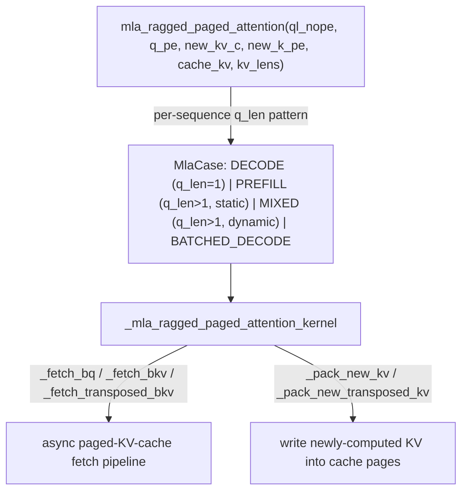

# tokamax._src.ops.experimental.mla.pallas_mosaic_tpu_kernel — MLA ragged+paged attention, MlaCase dispatch

## Overview

[`mla_ragged_paged_attention`](../catalog/tokamax/_src/ops/experimental/mla/pallas_mosaic_tpu_kernel.md#mla_ragged_paged_attention)
is a TPU Pallas kernel for Multi-head Latent Attention (MLA, DeepSeek-V2/V3-style compressed KV
cache) combined with ragged (variable per-request sequence length) and paged (fixed-size KV-cache
pages, vLLM-style) attention, serving inference workloads with continuous batching.
[`MlaCase`](../catalog/tokamax/_src/ops/experimental/mla/pallas_mosaic_tpu_kernel.md#MlaCase) is an
enum distinguishing `DECODE`/`PREFILL`/`MIXED`/`BATCHED_DECODE` request patterns, since a batch of
concurrently-served requests can be at different generation stages. Query tensors are split into
`ql_nope`/`q_pe` — MLA's "no positional encoding" vs. "positional encoding (RoPE)" components.

## Diagram

## Design rationale (why it's built this way)

**Requests are dispatched by `MlaCase` based on their query-length *pattern*, not just a
prefill/decode binary flag — because a served batch can genuinely mix both.** The enum's docstring
distinguishes `DECODE` (`q_len = 1`), `PREFILL` (`q_len > 1`, static), and `MIXED` (`q_len > 1`,
dynamic) — in a continuous-batching inference server, some sequences in one batch may be
generating one token at a time (decode) while others are still processing their initial prompt
(prefill), so the kernel needs a case that explicitly handles this heterogeneous mix rather than
assuming every request in a batch shares one mode.

**Query tensors are split into `ql_nope`/`q_pe` reflecting MLA's architectural separation of
content and positional information.** The parameter comments label `ql_nope` (`actual_lkv_dim`) and
`q_pe` (`actual_r_dim`) as distinct tensors — this mirrors DeepSeek's MLA design, where queries/keys
are decomposed into a compressed "latent" content component (no positional encoding applied) and a
smaller rotary-position-encoded component, and the kernel must handle both separately since they
have different dimensions and different roles in the attention score computation.

## Entry points

- [`mla_ragged_paged_attention`](../catalog/tokamax/_src/ops/experimental/mla/pallas_mosaic_tpu_kernel.md#mla_ragged_paged_attention) —
  the top-level kernel entry point.
- [`PallasTpuMultiHeadLatentAttention._fwd`](../catalog/tokamax/_src/ops/experimental/mla/pallas_mosaic_tpu.md#PallasTpuMultiHeadLatentAttention._fwd) —
  the `Op`-protocol forward implementation invoking this kernel.

## Mechanism (step-by-step)

1. **[`mla_ragged_paged_attention`](../catalog/tokamax/_src/ops/experimental/mla/pallas_mosaic_tpu_kernel.md#mla_ragged_paged_attention)
   determines the [`MlaCase`](../catalog/tokamax/_src/ops/experimental/mla/pallas_mosaic_tpu_kernel.md#MlaCase)**
   applicable to the current batch of requests.
2. **The kernel asynchronously fetches query and paged-KV-cache blocks** via
   [`_fetch_bq`](../catalog/tokamax/_src/ops/experimental/mla/pallas_mosaic_tpu_kernel.md#_mla_ragged_paged_attention_kernel._fetch_bq)/
   [`_fetch_bkv`](../catalog/tokamax/_src/ops/experimental/mla/pallas_mosaic_tpu_kernel.md#_mla_ragged_paged_attention_kernel._fetch_bkv)/
   [`_fetch_transposed_bkv`](../catalog/tokamax/_src/ops/experimental/mla/pallas_mosaic_tpu_kernel.md#_mla_ragged_paged_attention_kernel._fetch_transposed_bkv),
   pipelining these loads against compute.
3. **Newly computed KV entries are packed back into the paged cache** via
   [`_pack_new_kv`](../catalog/tokamax/_src/ops/experimental/mla/pallas_mosaic_tpu_kernel.md#_mla_ragged_paged_attention_kernel._pack_new_kv)/
   [`_pack_new_transposed_kv`](../catalog/tokamax/_src/ops/experimental/mla/pallas_mosaic_tpu_kernel.md#_mla_ragged_paged_attention_kernel._pack_new_transposed_kv),
   updating only the relevant pages for the current step.

## Key data structures

- **[`MlaCase`](../catalog/tokamax/_src/ops/experimental/mla/pallas_mosaic_tpu_kernel.md#MlaCase)** —
  [`DECODE`](../catalog/tokamax/_src/ops/experimental/mla/pallas_mosaic_tpu_kernel.md#MlaCase.DECODE)/
  [`PREFILL`](../catalog/tokamax/_src/ops/experimental/mla/pallas_mosaic_tpu_kernel.md#MlaCase.PREFILL)/
  [`MIXED`](../catalog/tokamax/_src/ops/experimental/mla/pallas_mosaic_tpu_kernel.md#MlaCase.MIXED)/
  [`BATCHED_DECODE`](../catalog/tokamax/_src/ops/experimental/mla/pallas_mosaic_tpu_kernel.md#MlaCase.BATCHED_DECODE);
  exposes a [`symbol`](../catalog/tokamax/_src/ops/experimental/mla/pallas_mosaic_tpu_kernel.md#MlaCase.symbol)
  property mapping each case to a short string tag (`"d"`/`"p"`/`"m"`/`"bd"`).

## Dynamics (design intent)

Because `MlaCase` is determined per invocation (not fixed at kernel-compile time in a way that
prevents mixing), a single served batch with heterogeneous request stages can be handled by one
kernel invocation under the `MIXED` case, rather than requiring the serving layer to partition
requests into separately-dispatched prefill and decode kernel calls.

## Edge cases

- `static_validate_inputs`'s comment notes validation is "[e]xpect[ed] to run... during compile
  time" — shape/consistency checks on the ragged/paged inputs are meant to be caught by tracing,
  not deferred to runtime.

## Open questions

- The precise conditions distinguishing `MIXED` from `BATCHED_DECODE` (both handling multiple
  sequences, per the enum's four-way split) are not further detailed within this packet's cited
  subgraph beyond the docstring's three-case summary (which does not separately describe
  `BATCHED_DECODE`).

## See also
- [tokamax-_src-ops-attention-base](tokamax-_src-ops-attention-base.md) — `DotProductAttention`,
  the more general non-MLA, non-paged attention op this experimental kernel specializes beyond.
