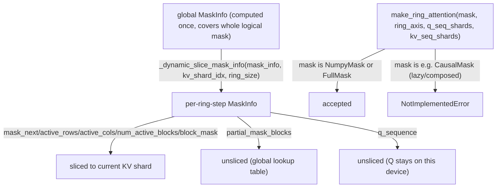

# tokamax._src.ops.experimental.tpu.splash_attention.ring_attention_kernel — ring-sharded MaskInfo slicing, materialized-mask-only restriction

## Overview

This module implements Ring Attention on top of splash attention: K/V blocks are sharded across a
ring of devices (rotating via a `jax` scan over `ring_axis`), and
[`_dynamic_slice_mask_info`](../catalog/tokamax/_src/ops/experimental/tpu/splash_attention/ring_attention_kernel.md#_dynamic_slice_mask_info)
re-slices the globally-computed
[`MaskInfo`](tokamax-_src-ops-experimental-tpu-splash_attention-splash_attention_mask_info.md) to
the current device's KV shard at each ring step — except for
[`partial_mask_blocks`](../catalog/tokamax/_src/ops/experimental/tpu/splash_attention/splash_attention_mask_info.md#MaskInfo.partial_mask_blocks)
(global, not sharded) and
[`q_sequence`](../catalog/tokamax/_src/ops/experimental/tpu/splash_attention/splash_attention_mask_info.md#MaskInfo.q_sequence)
(stationary, since only KV rotates around the ring while Q stays on one device).
[`make_ring_attention`](../catalog/tokamax/_src/ops/experimental/tpu/splash_attention/ring_attention_kernel.md#make_ring_attention)
restricts masks to concrete, materialized kinds
([`NumpyMask`](tokamax-_src-ops-experimental-tpu-splash_attention-splash_attention_mask.md)/
`FullMask`), rejecting lazily-composed mask expressions.

## Diagram

## Design rationale (why it's built this way)

**Most `MaskInfo` fields are re-sliced per ring step to the current KV shard, but `partial_mask_blocks`
and `q_sequence` are deliberately left unsliced, for two different reasons.**
[`_dynamic_slice_mask_info`](../catalog/tokamax/_src/ops/experimental/tpu/splash_attention/ring_attention_kernel.md#_dynamic_slice_mask_info)'s
code comments state `partial_mask_blocks` are "global" (the lookup table
[`mask_next`](../catalog/tokamax/_src/ops/experimental/tpu/splash_attention/splash_attention_mask_info.md#MaskInfo.mask_next)
indexes into it regardless of which KV shard is currently active, so the table itself doesn't need
per-shard slicing) while `q_sequence` "stays stationary" (because in ring attention only K/V rotate
around the ring — Q remains resident on its original device for the whole computation) — treating
all `MaskInfo` fields uniformly would either incorrectly slice data that must stay whole, or fail to
slice data that does vary by shard.

**`make_ring_attention` only accepts concrete, materialized mask representations
(`NumpyMask`/`FullMask`), rejecting lazily-composed masks like `CausalMask` outright.**
[`make_ring_attention`](../catalog/tokamax/_src/ops/experimental/tpu/splash_attention/ring_attention_kernel.md#make_ring_attention)
raises `NotImplementedError` for any mask type other than `NumpyMask`/`FullMask` — since
ring attention's per-shard `MaskInfo` slicing logic operates on the compiled/materialized mask
metadata, not the lazy composition tree that other mask kinds (
[`CausalMask`](tokamax-_src-ops-experimental-tpu-splash_attention-splash_attention_mask.md),
`LogicalAnd`/`LogicalOr` compositions) represent, ring attention's mask input must already be (or be
converted to) a concrete array before this kernel can slice it correctly per ring step.

## Entry points

- [`make_ring_attention`](../catalog/tokamax/_src/ops/experimental/tpu/splash_attention/ring_attention_kernel.md#make_ring_attention) —
  the top-level constructor for a ring-sharded splash attention kernel.
- [`_dynamic_slice_mask_info`](../catalog/tokamax/_src/ops/experimental/tpu/splash_attention/ring_attention_kernel.md#_dynamic_slice_mask_info) —
  reached once per ring step to re-slice the global mask metadata to the current shard.
- [`_ring_attention`](../catalog/tokamax/_src/ops/experimental/tpu/splash_attention/ring_attention_kernel.md#_ring_attention) —
  the core ring-attention computation, scanning over `ring_axis`.

## Mechanism (step-by-step)

1. **[`make_ring_attention`](../catalog/tokamax/_src/ops/experimental/tpu/splash_attention/ring_attention_kernel.md#make_ring_attention)
   validates the mask is 2D and either `np.ndarray` (wrapped into
   [`NumpyMask`](tokamax-_src-ops-experimental-tpu-splash_attention-splash_attention_mask.md)) or
   already `NumpyMask`/`FullMask`**, raising for any other mask kind.
2. **The global [`MaskInfo`](../catalog/tokamax/_src/ops/experimental/tpu/splash_attention/splash_attention_mask_info.md#MaskInfo)
   is computed once** for the full logical mask.
3. **At each ring step, [`_dynamic_slice_mask_info`](../catalog/tokamax/_src/ops/experimental/tpu/splash_attention/ring_attention_kernel.md#_dynamic_slice_mask_info)
   dynamically slices the per-shard-varying fields** (`mask_next`/`active_rows`/`active_cols`/
   `num_active_blocks`/`block_mask`) to the current `kv_shard_idx`, while passing through
   [`partial_mask_blocks`](../catalog/tokamax/_src/ops/experimental/tpu/splash_attention/splash_attention_mask_info.md#MaskInfo.partial_mask_blocks)/
   [`q_sequence`](../catalog/tokamax/_src/ops/experimental/tpu/splash_attention/splash_attention_mask_info.md#MaskInfo.q_sequence)
   unchanged.
4. **[`_ring_attention`](../catalog/tokamax/_src/ops/experimental/tpu/splash_attention/ring_attention_kernel.md#_ring_attention)
   scans over the ring axis**, at each step invoking splash attention's forward/backward with the
   per-step-sliced `MaskInfo` and the current KV shard's data (rotated in from the neighboring
   device).

## Key data structures

- **[`MaskInfo`](tokamax-_src-ops-experimental-tpu-splash_attention-splash_attention_mask_info.md)** —
  reused directly from the non-ring splash attention module; this module's contribution is the
  per-ring-step slicing logic, not a new metadata type.

## Dynamics (design intent)

Because `q_sequence` is never re-sliced (Q doesn't rotate), the memory/communication cost of ring
attention scales with the K/V shard size rotating through the ring, not with the query sequence
length — consistent with ring attention's whole design point of parallelizing the KV dimension
across devices while keeping Q local.

## Edge cases

- [`make_ring_attention`](../catalog/tokamax/_src/ops/experimental/tpu/splash_attention/ring_attention_kernel.md#make_ring_attention)
  raises `ValueError` if the mask's shape isn't 2-dimensional — a higher-rank (e.g. batched) mask
  input is rejected before any ring-sharding logic runs.
- [`_dynamic_slice_mask_info`](../catalog/tokamax/_src/ops/experimental/tpu/splash_attention/ring_attention_kernel.md#_dynamic_slice_mask_info)'s
  `slice_if_exists` helper passes through `None` fields unchanged — a `MaskInfo` with some fields
  legitimately unset (e.g. no `q_sequence` for non-causal masks) doesn't need special-casing beyond
  this `None` check.

## Open questions

- Whether structured lazy masks (`CausalMask`, etc.) could in principle be supported by ring
  attention via an on-the-fly materialization step, or whether the restriction to
  `NumpyMask`/`FullMask` reflects a more fundamental limitation, is not addressed by this packet's
  cited subgraph.

## See also
- [tokamax-_src-ops-experimental-tpu-splash_attention-splash_attention_mask_info](tokamax-_src-ops-experimental-tpu-splash_attention-splash_attention_mask_info.md) —
  `MaskInfo`, the block-sparsity metadata this module slices per ring step.
- [tokamax-_src-ops-experimental-tpu-splash_attention-splash_attention_mask](tokamax-_src-ops-experimental-tpu-splash_attention-splash_attention_mask.md) —
  `NumpyMask`/`FullMask`, the only mask kinds this module's `make_ring_attention` accepts.
- [tokamax-_src-ops-experimental-tpu-splash_attention-splash_attention_kernel](tokamax-_src-ops-experimental-tpu-splash_attention-splash_attention_kernel.md) —
  the non-ring-sharded splash attention kernel this module builds on.
