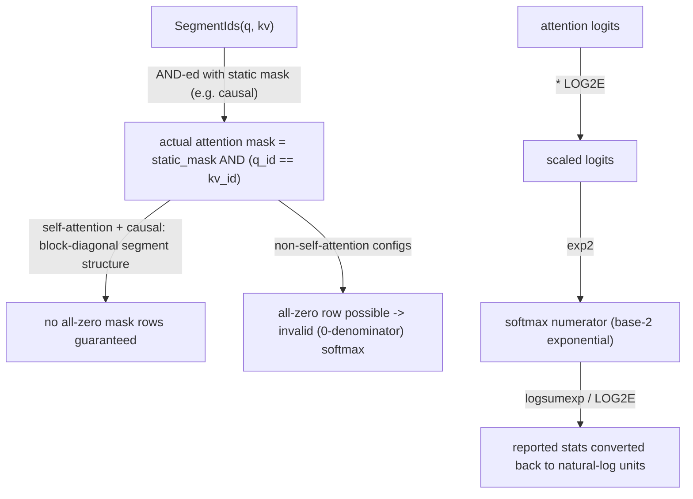

# tokamax._src.ops.experimental.tpu.splash_attention.splash_attention_kernel — SegmentIds packing, LOG2E base-2 softmax, QKVLayout

<!-- connect:up:begin -->
> **Cross-repo concept:** part of [splash-attention](../../../concepts/splash-attention.md) across this wiki's repos.
<!-- connect:up:end -->
## Overview

This module implements TPU splash attention: block-sparse attention driven by
[`MaskInfo`](tokamax-_src-ops-experimental-tpu-splash_attention-splash_attention_mask_info.md)
(skipping fully-masked-out blocks entirely).
[`SegmentIds`](../catalog/tokamax/_src/ops/experimental/tpu/splash_attention/base.md#SegmentIds)
supports packed-sequence training (multiple sequences concatenated into one batch row, with
cross-sequence attention prevented via matching integer IDs).
[`LOG2E`](../catalog/tokamax/_src/ops/experimental/tpu/splash_attention/splash_attention_kernel.md#LOG2E)
scales logits so the softmax exponential can use the (typically faster) base-2 `exp2` hardware
path.
[`QKVLayout`](../catalog/tokamax/_src/ops/experimental/tpu/splash_attention/splash_attention_kernel.md#QKVLayout)
selects whether the head dimension or sequence dimension is minor (last) in memory.

## Diagram

## Design rationale (why it's built this way)

**`SegmentIds` documents a specific correctness precondition it relies on (no all-zero mask rows)
and explains exactly when that precondition holds vs. breaks.** The class docstring states: "It is
important that the [combined mask] does not have any all-zero rows... Otherwise it would result in
an invalid softmax (the denominator would be 0). This condition holds for causal self-attention
because... segment ids form a block diagonal matrix so at least one element in each row is set. It
is easy to break this condition with non-self-attention configurations" — packed-sequence training
for ordinary causal self-attention is safe by construction (every token attends at least to
itself), but the same packing scheme applied to cross-attention configurations has no such
guarantee, so callers combining `SegmentIds` with non-self-attention must independently ensure no
row is entirely masked out.

**Softmax computation is scaled by `LOG2E` to use base-2 exponentiation, with results converted
back to natural-log units before being reported as residuals.** Logits and stability terms
(`attn_logits_soft_cap`, `max_logit_estimate`, `sink`, `q`) are multiplied by
[`LOG2E`](../catalog/tokamax/_src/ops/experimental/tpu/splash_attention/splash_attention_kernel.md#LOG2E)
before the exponential, and `logsumexp`/`max_logits` are divided by `LOG2E` before being returned
as residuals — this is the same GPU/TPU-hardware-favoring `exp2`-over-`exp` optimization seen in
[tokamax-_src-ops-flex_attention-pallas_triton](tokamax-_src-ops-flex_attention-pallas_triton.md),
applied here to splash attention's TPU kernel, with the conversion back to natural-log units kept
localized so external consumers of the residuals see standard (base-e) logsumexp/max-logit values.

## Entry points

- [`_make_splash_attention`](../catalog/tokamax/_src/ops/experimental/tpu/splash_attention/splash_attention_kernel.md#_make_splash_attention) /
  [`_make_dynamic_splash_attention`](../catalog/tokamax/_src/ops/experimental/tpu/splash_attention/splash_attention_kernel.md#_make_dynamic_splash_attention) —
  construct a callable
  [`SplashAttentionKernel`](../catalog/tokamax/_src/ops/experimental/tpu/splash_attention/splash_attention_kernel.md#SplashAttentionKernel)
  from a mask and config (static vs. dynamic mask variants respectively).
- [`_splash_attention_forward`](../catalog/tokamax/_src/ops/experimental/tpu/splash_attention/splash_attention_kernel.md#_splash_attention_forward) —
  the forward-pass entry point.
- [`_splash_attention_bwd_dkv`](../catalog/tokamax/_src/ops/experimental/tpu/splash_attention/splash_attention_kernel.md#_splash_attention_bwd_dkv) —
  the dKV backward-pass entry point.

## Mechanism (step-by-step)

1. **A [`SplashAttentionKernel`](../catalog/tokamax/_src/ops/experimental/tpu/splash_attention/splash_attention_kernel.md#SplashAttentionKernel)
   is constructed** from a logical mask (compiled to
   [`MaskInfo`](tokamax-_src-ops-experimental-tpu-splash_attention-splash_attention_mask_info.md))
   and a [`SplashConfig`](../catalog/tokamax/_src/ops/experimental/tpu/splash_attention/splash_attention_kernel.md#SplashConfig)
   (tile sizes for forward/dQ/dKV phases).
2. **If [`SegmentIds`](../catalog/tokamax/_src/ops/experimental/tpu/splash_attention/base.md#SegmentIds)
   are supplied, they're AND-ed with the static mask** to prevent cross-segment attention within a
   packed batch row.
3. **[`_splash_attention_forward`](../catalog/tokamax/_src/ops/experimental/tpu/splash_attention/splash_attention_kernel.md#_splash_attention_forward)
   scales logits by `LOG2E`**, computes the block-sparse attention (skipping
   [`MaskInfo`](tokamax-_src-ops-experimental-tpu-splash_attention-splash_attention_mask_info.md)-omitted
   blocks entirely), and converts `logsumexp`/`max_logits` back to natural-log units before
   returning residuals.

## Key data structures

- **[`SegmentIds`](../catalog/tokamax/_src/ops/experimental/tpu/splash_attention/base.md#SegmentIds)** —
  [`q`](../catalog/tokamax/_src/ops/experimental/tpu/splash_attention/base.md#SegmentIds.q)/
  [`kv`](../catalog/tokamax/_src/ops/experimental/tpu/splash_attention/base.md#SegmentIds.kv)
  integer-ID arrays, one per sequence position.
- **[`QKVLayout`](../catalog/tokamax/_src/ops/experimental/tpu/splash_attention/splash_attention_kernel.md#QKVLayout)** —
  [`HEAD_DIM_MINOR`](../catalog/tokamax/_src/ops/experimental/tpu/splash_attention/splash_attention_kernel.md#QKVLayout.HEAD_DIM_MINOR)
  (`[..., seq_len, head_dim]`) vs. `SEQ_MINOR` (`[..., head_dim, seq_len]`).
- **[`SplashConfig`](../catalog/tokamax/_src/ops/experimental/tpu/splash_attention/splash_attention_kernel.md#SplashConfig)** —
  [`block_kv`](../catalog/tokamax/_src/ops/experimental/tpu/splash_attention/splash_attention_kernel.md#SplashConfig.block_kv)/
  `block_kv_dkv`, per the class docstring "negligible effect on numerics, but affect performance
  greatly."

## Dynamics (design intent)

Because `QKVLayout` is an `IntEnum` (explicitly noted in a comment as chosen "to make it JSON
serializable as regen metadata"), the layout choice can be persisted alongside cached/regenerated
kernel metadata without needing a custom serialization scheme.

## Edge cases

- A kernel-naming helper in this module asserts `save_residuals` is only combined with
  `phase == "fwd"` — residual-saving is not a valid configuration for the dQ/dKV backward phases.
- Per `SegmentIds`'s own docstring, using it in a non-self-attention configuration can silently
  produce an all-zero mask row (invalid, zero-denominator softmax) — this is a caller
  responsibility to avoid, not something the class itself validates.

## See also
- [tokamax-_src-ops-experimental-tpu-splash_attention-splash_attention_mask](tokamax-_src-ops-experimental-tpu-splash_attention-splash_attention_mask.md) —
  `Mask`/`CausalMask`, the logical mask this kernel is parametrized by.
- [tokamax-_src-ops-experimental-tpu-splash_attention-splash_attention_mask_info](tokamax-_src-ops-experimental-tpu-splash_attention-splash_attention_mask_info.md) —
  `MaskInfo`, the compiled block-sparsity metadata this kernel iterates over.
- [tokamax-_src-ops-flex_attention-pallas_triton](tokamax-_src-ops-flex_attention-pallas_triton.md) —
  the analogous `use_base2`/`LOG2E`-style softmax-exponential optimization on the GPU/Triton side.
