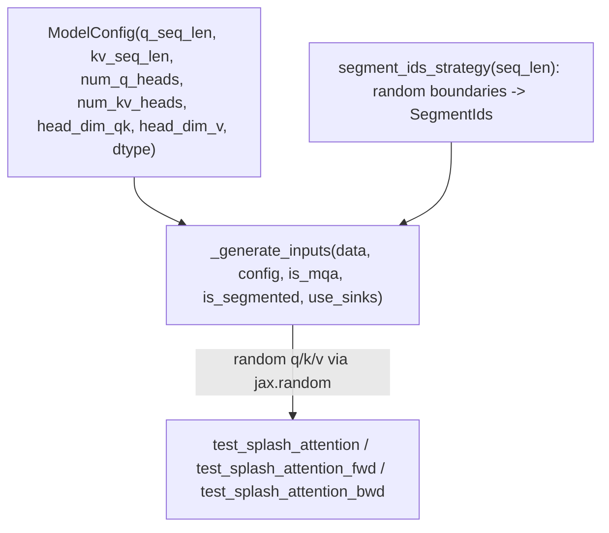

# tokamax._src.ops.experimental.tpu.splash_attention.splash_attention_kernel_test — hypothesis-based property testing across MQA/MHA/segmented configs

## Overview

This test module validates splash attention correctness via property-based testing (the
`hypothesis` library, aliased `hps`), randomly generating
`ModelConfig`s
(sequence lengths, head counts/dims, dtype) and
[`SegmentIds`](tokamax-_src-ops-experimental-tpu-splash_attention-splash_attention_kernel.md)
patterns, then comparing splash attention's output against a reference implementation across MQA
vs. MHA and segmented vs. non-segmented configurations.
[`_generate_inputs`](../catalog/tokamax/_src/ops/experimental/tpu/splash_attention/splash_attention_kernel_test.md#_generate_inputs)
draws randomized q/k/v tensors and optional segment IDs for each test case.

## Diagram

## Design rationale (why it's built this way)

**Segment boundaries are generated with a minimum-length correction, based on an empirically
observed (not fully understood) edge case.**
`segment_ids_strategy`'s
code includes the comment "Not sure why, but short segments can trip things up" alongside logic
that extends any segment shorter than 2 tokens — this is an honest acknowledgment that the test
generator was tuned to avoid a known-problematic input shape without the underlying root cause
being fully diagnosed, rather than silently only testing "safe" inputs without disclosure.

**Test configurations are parametrized across both attention-head sharing (MQA vs. MHA) and
sequence-packing (segmented vs. non-segmented) as independent axes.**
[`_generate_inputs`](../catalog/tokamax/_src/ops/experimental/tpu/splash_attention/splash_attention_kernel_test.md#_generate_inputs)
takes `is_mqa`/`is_segmented` as separate boolean parameters, each changing the generated k/v
shapes or whether
[`SegmentIds`](tokamax-_src-ops-experimental-tpu-splash_attention-splash_attention_kernel.md) are
included — since these two properties can combine in any of four ways and each has historically
been a source of kernel bugs (per the broader splash attention module's correctness caveats around
segment IDs), testing them as independent axes gives broader coverage than testing only the
"both enabled" or "both disabled" combinations.

## Entry points

- [`_generate_inputs`](../catalog/tokamax/_src/ops/experimental/tpu/splash_attention/splash_attention_kernel_test.md#_generate_inputs) —
  the shared randomized-input generator every test case builds on.
- [`SplashAttentionTest.test_splash_attention`](../catalog/tokamax/_src/ops/experimental/tpu/splash_attention/splash_attention_kernel_test.md#SplashAttentionTest.test_splash_attention) /
  [`SplashAttentionTest.test_splash_attention_fwd`](../catalog/tokamax/_src/ops/experimental/tpu/splash_attention/splash_attention_kernel_test.md#SplashAttentionTest.test_splash_attention_fwd) /
  [`SplashAttentionTest.test_splash_attention_bwd`](../catalog/tokamax/_src/ops/experimental/tpu/splash_attention/splash_attention_kernel_test.md#SplashAttentionTest.test_splash_attention_bwd) —
  the property-based test cases exercising forward, and forward+backward correctness.

## Mechanism (step-by-step)

1. **`hypothesis` draws a random**
   [`ModelConfig`](../catalog/tokamax/_src/ops/experimental/tpu/splash_attention/splash_attention_kernel_test.md#ModelConfig.q_seq_len)
   **and boolean flags** (`is_mqa`, `is_segmented`, `use_sinks`).
2. **[`_generate_inputs`](../catalog/tokamax/_src/ops/experimental/tpu/splash_attention/splash_attention_kernel_test.md#_generate_inputs)
   draws random q/k/v tensors** matching the config's shapes, and (if segmented) a
   [`SegmentIds`](tokamax-_src-ops-experimental-tpu-splash_attention-splash_attention_kernel.md)
   pattern via
   `segment_ids_strategy`.
3. **[`SplashAttentionTest.test_splash_attention`](../catalog/tokamax/_src/ops/experimental/tpu/splash_attention/splash_attention_kernel_test.md#SplashAttentionTest.test_splash_attention)
   runs splash attention and a reference implementation on the same inputs**, asserting numerical
   agreement within tolerance.

## Key data structures

- **`ModelConfig`** —
  [`q_seq_len`](../catalog/tokamax/_src/ops/experimental/tpu/splash_attention/splash_attention_kernel_test.md#ModelConfig.q_seq_len)/
  [`kv_seq_len`](../catalog/tokamax/_src/ops/experimental/tpu/splash_attention/splash_attention_kernel_test.md#ModelConfig.kv_seq_len)/
  `num_q_heads`/`num_kv_heads`/`head_dim_qk`/`head_dim_v`/
  [`dtype`](../catalog/tokamax/_src/ops/experimental/tpu/splash_attention/splash_attention_kernel_test.md#ModelConfig.dtype).
- **`Draw`** — a `TypeVar` bound to `hypothesis`'s draw-callable protocol, used to type-annotate
  `@hps.composite`-decorated strategy functions.

## Dynamics (design intent)

Because `hypothesis` explores the input space via randomized search (not a fixed enumerated list of
cases), this test suite's effective coverage grows across repeated CI runs — the same test code can
surface new edge cases over time as the search explores previously-untried config/shape
combinations.

## Edge cases

- `segment_ids_strategy`
  bounds the number of segment boundaries to between 1 and 4 (`hps.sets(..., min_size=1,
  max_size=4)`) — the generated segmentation patterns are deliberately limited to this bounded
  range, not arbitrary numbers of segments.

## Open questions

- The underlying root cause of "short segments can trip things up" (referenced but not resolved in
  the code comment) is not addressed by this packet's cited subgraph.

## See also
- [tokamax-_src-ops-experimental-tpu-splash_attention-splash_attention_kernel](tokamax-_src-ops-experimental-tpu-splash_attention-splash_attention_kernel.md) —
  `SegmentIds`, the packed-sequence mechanism this test suite's `segment_ids_strategy` generates
  random instances of.
- [tokamax-_src-ops-experimental-tpu-splash_attention-splash_attention_mask_info](tokamax-_src-ops-experimental-tpu-splash_attention-splash_attention_mask_info.md) —
  `MaskInfo`, the block-sparsity metadata implicitly exercised by these correctness tests.
