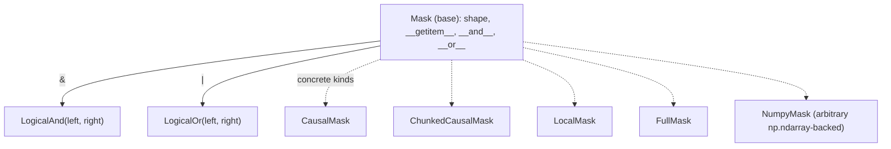

# tokamax._src.ops.experimental.tpu.splash_attention.splash_attention_mask — lazy composable Mask algebra

<!-- connect:up:begin -->
> **Cross-repo concept:** part of [splash-attention](../../../concepts/splash-attention.md) across this wiki's repos.
<!-- connect:up:end -->
## Overview

[`Mask`](../catalog/tokamax/_src/ops/experimental/tpu/splash_attention/splash_attention_mask.md#Mask)
is the base class for splash attention's mask representation: masks compose lazily via bitwise
`&`/`|` operators (
[`__and__`](../catalog/tokamax/_src/ops/experimental/tpu/splash_attention/splash_attention_mask.md#Mask.__and__)/
`__or__`, producing
[`LogicalAnd`](../catalog/tokamax/_src/ops/experimental/tpu/splash_attention/splash_attention_mask.md#LogicalAnd)/
`LogicalOr` composite objects) rather than eagerly materializing a combined boolean array. Concrete
mask kinds include
[`CausalMask`](../catalog/tokamax/_src/ops/experimental/tpu/splash_attention/splash_attention_mask.md#CausalMask),
[`ChunkedCausalMask`](../catalog/tokamax/_src/ops/experimental/tpu/splash_attention/splash_attention_mask.md#ChunkedCausalMask),
[`LocalMask`](../catalog/tokamax/_src/ops/experimental/tpu/splash_attention/splash_attention_mask.md#LocalMask),
[`FullMask`](../catalog/tokamax/_src/ops/experimental/tpu/splash_attention/splash_attention_mask.md#FullMask),
and
[`NumpyMask`](../catalog/tokamax/_src/ops/experimental/tpu/splash_attention/splash_attention_mask.md#NumpyMask)
(a raw-array-backed mask for arbitrary patterns).

## Diagram

## Design rationale (why it's built this way)

**Mask composition (`&`/`|`) is lazy, building composite `LogicalAnd`/`LogicalOr` objects rather
than eagerly computing and storing a combined boolean array.**
[`Mask.__and__`](../catalog/tokamax/_src/ops/experimental/tpu/splash_attention/splash_attention_mask.md#Mask.__and__)/
`__or__` both validate matching shapes then return a
[`LogicalAnd`](../catalog/tokamax/_src/ops/experimental/tpu/splash_attention/splash_attention_mask.md#LogicalAnd)/`LogicalOr`
wrapper holding the two operand masks — since splash attention masks can represent very large
logical shapes (full sequence-length-squared attention matrices) while the actual "on" pattern is
often sparse/structured (causal, local window), materializing every composition eagerly would
waste memory; combining lazily lets the actual boolean values be computed only when a specific
slice is requested via `__getitem__`.

**`Mask.__bool__` is explicitly disabled with a targeted warning message, guarding against a
specific, easy-to-make bug.** It raises `NotImplementedError('Conversion to bool is unsupported.
Could be caused by using logical instead of bitwise operations on masks.')` — since Python's `and`/
`or` keywords (unlike `&`/`|`) cannot be overloaded and instead coerce their operands to `bool`
first, a user accidentally writing `mask1 and mask2` (intending mask composition) would silently
get Python's short-circuit truthiness behavior instead of the intended
[`LogicalAnd`](../catalog/tokamax/_src/ops/experimental/tpu/splash_attention/splash_attention_mask.md#LogicalAnd)
composition; disabling `__bool__` turns this mistake into an immediate, explicit error.

## Entry points

- [`CausalMask`](../catalog/tokamax/_src/ops/experimental/tpu/splash_attention/splash_attention_mask.md#CausalMask) /
  [`ChunkedCausalMask`](../catalog/tokamax/_src/ops/experimental/tpu/splash_attention/splash_attention_mask.md#ChunkedCausalMask) /
  [`LocalMask`](../catalog/tokamax/_src/ops/experimental/tpu/splash_attention/splash_attention_mask.md#LocalMask) /
  [`FullMask`](../catalog/tokamax/_src/ops/experimental/tpu/splash_attention/splash_attention_mask.md#FullMask) —
  concrete mask constructors for common attention patterns.
- [`NumpyMask`](../catalog/tokamax/_src/ops/experimental/tpu/splash_attention/splash_attention_mask.md#NumpyMask) —
  reached to wrap an arbitrary, pre-computed `np.ndarray` mask.
- [`Mask.__and__`](../catalog/tokamax/_src/ops/experimental/tpu/splash_attention/splash_attention_mask.md#Mask.__and__) —
  reached to combine two masks via `&`.

## Mechanism (step-by-step)

1. **A caller constructs one or more concrete masks** (e.g.
   [`CausalMask`](../catalog/tokamax/_src/ops/experimental/tpu/splash_attention/splash_attention_mask.md#CausalMask),
   [`LocalMask`](../catalog/tokamax/_src/ops/experimental/tpu/splash_attention/splash_attention_mask.md#LocalMask)).
2. **Combining masks via `&`/`|` produces a
   [`LogicalAnd`](../catalog/tokamax/_src/ops/experimental/tpu/splash_attention/splash_attention_mask.md#LogicalAnd)/`LogicalOr`
   wrapper** holding references to the operand masks, without computing the combined boolean
   values yet.
3. **`__getitem__` on any mask (concrete or composite, sharing the
   [`Mask.shape`](../catalog/tokamax/_src/ops/experimental/tpu/splash_attention/splash_attention_mask.md#Mask.shape)
   interface) materializes only the requested slice** as an `np.ndarray`, computed on demand from
   the underlying mask definition(s).

## Key data structures

- **[`Mask`](../catalog/tokamax/_src/ops/experimental/tpu/splash_attention/splash_attention_mask.md#Mask)** —
  the base class; abstract `shape` property, `__getitem__`, composable via `&`/`|`.
- **[`LogicalAnd`](../catalog/tokamax/_src/ops/experimental/tpu/splash_attention/splash_attention_mask.md#LogicalAnd)** —
  [`left`](../catalog/tokamax/_src/ops/experimental/tpu/splash_attention/splash_attention_mask.md#LogicalAnd.left)/
  [`right`](../catalog/tokamax/_src/ops/experimental/tpu/splash_attention/splash_attention_mask.md#LogicalAnd.right)
  operand masks.
- **[`NumpyMask`](../catalog/tokamax/_src/ops/experimental/tpu/splash_attention/splash_attention_mask.md#NumpyMask)** —
  wraps an arbitrary precomputed array for patterns not covered by the structured mask kinds.

## Dynamics (design intent)

Because every mask kind (concrete or composite) shares the same `shape`/`__getitem__`/`&`/`|`
interface, splash attention's kernel-side mask consumption code can treat any mask expression
uniformly regardless of how deeply composed it is — the composition tree is invisible to the
consumer beyond the shared interface.

## Edge cases

- [`Mask.__and__`](../catalog/tokamax/_src/ops/experimental/tpu/splash_attention/splash_attention_mask.md#Mask.__and__)/`__or__`
  both raise `ValueError` immediately if the two operand masks' `shape`s differ — there is no
  implicit broadcasting between differently-shaped masks.

## Open questions

- How deeply nested `LogicalAnd`/`LogicalOr` compositions are actually evaluated at
  `__getitem__` time (e.g. whether there's any caching or the whole tree is re-walked per slice
  request) is not addressed by this packet's cited subgraph.

## See also
- [tokamax-_src-ops-attention-base](tokamax-_src-ops-attention-base.md) — `Mask`, the
  compact-range-based mask representation used by tokamax's general (non-splash) attention op —
  a distinct, simpler representation from this module's composable boolean-array algebra.
- [tokamax-_src-ops-experimental-tpu-splash_attention-splash_attention_mask_info](tokamax-_src-ops-experimental-tpu-splash_attention-splash_attention_mask_info.md) —
  `MaskInfo`, which processes masks defined here into the block-sparsity metadata the splash
  attention kernel actually consumes.
