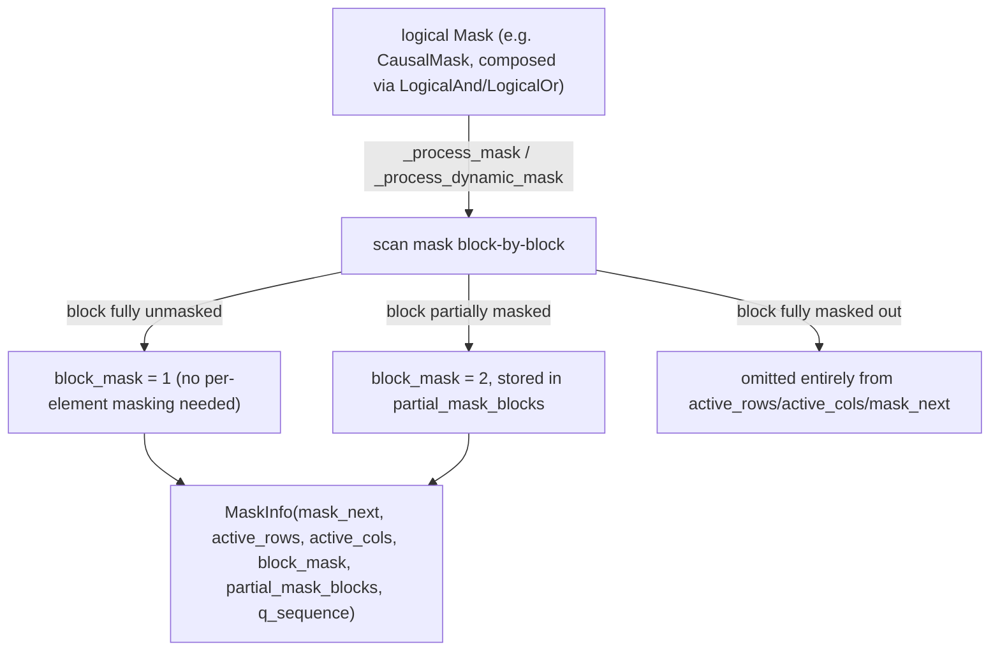

# tokamax._src.ops.experimental.tpu.splash_attention.splash_attention_mask_info — MaskInfo block-sparsity compilation

<!-- connect:up:begin -->
> **Cross-repo concept:** part of [splash-attention](../../../concepts/splash-attention.md) across this wiki's repos.
<!-- connect:up:end -->
## Overview

[`MaskInfo`](../catalog/tokamax/_src/ops/experimental/tpu/splash_attention/splash_attention_mask_info.md#MaskInfo)
is the compiled, block-sparse runtime representation of a logical
[`Mask`](tokamax-_src-ops-experimental-tpu-splash_attention-splash_attention_mask.md) that the
splash attention TPU kernel actually consumes: for each active (not fully masked-out) block, it
records which blocks to prefetch next
([`mask_next`](../catalog/tokamax/_src/ops/experimental/tpu/splash_attention/splash_attention_mask_info.md#MaskInfo.mask_next)),
its position (
[`active_rows`](../catalog/tokamax/_src/ops/experimental/tpu/splash_attention/splash_attention_mask_info.md#MaskInfo.active_rows)/
[`active_cols`](../catalog/tokamax/_src/ops/experimental/tpu/splash_attention/splash_attention_mask_info.md#MaskInfo.active_cols)),
and whether it's fully unmasked or needs per-element masking (
[`block_mask`](../catalog/tokamax/_src/ops/experimental/tpu/splash_attention/splash_attention_mask_info.md#MaskInfo.block_mask)
= 1 vs. 2, with the actual partial-block patterns stored in
[`partial_mask_blocks`](../catalog/tokamax/_src/ops/experimental/tpu/splash_attention/splash_attention_mask_info.md#MaskInfo.partial_mask_blocks)).
Entirely masked-out blocks are simply omitted from these arrays — the kernel never iterates over
them at all.

## Diagram

## Design rationale (why it's built this way)

**Fully masked-out blocks are omitted entirely from the runtime arrays, not represented with a
zero/skip marker — this is what turns a sparse logical mask into actual skipped compute.** The
class docstring describes `active_rows`/`active_cols`/`block_mask` as covering only
`num_active_blocks` entries — a block that is entirely masked out contributes no entry to any of
these arrays, so the kernel's block-iteration loop (driven by these arrays) never visits it at
all; this is the concrete mechanism by which a sparse attention pattern (e.g. local windowed or
causal) saves real TPU compute, not just correctness masking.

**Full vs. partial blocks are distinguished (`block_mask` 1 vs. 2) so the kernel can skip
per-element masking work for fully-unmasked blocks.** A `block_mask` value of 1 means the block is
entirely within the allowed attention pattern (no masking arithmetic needed at all inside the
kernel for that block), while 2 means the block straddles the mask boundary and needs the
corresponding entry from
[`partial_mask_blocks`](../catalog/tokamax/_src/ops/experimental/tpu/splash_attention/splash_attention_mask_info.md#MaskInfo.partial_mask_blocks)
applied — since most blocks in a structured mask (e.g. causal) are typically either fully in or
fully out, only a thin boundary layer of blocks actually needs per-element masking, and this
representation makes that distinction explicit and cheap to check.

**Runtime metadata arrays are downcast to the smallest integer type that fits, because they live in
scarce TPU scalar memory.** The class docstring states `mask_next`/`block_mask` "are placed in TPU
scalar-memory. This is a scarce resource so the mask creation logic attempts to shrink the
data-type of these arrays to the smallest possible one" (`int32`/`int16`/`int8`) — since scalar
memory capacity is limited and these arrays scale with `num_active_blocks`, minimizing per-entry
storage directly reduces the scalar-memory footprint for masks with many active blocks.

## Entry points

- [`_process_mask`](../catalog/tokamax/_src/ops/experimental/tpu/splash_attention/splash_attention_mask_info.md#_process_mask) —
  reached to compile a static (non-dynamic) logical `Mask` into a
  [`MaskInfo`](../catalog/tokamax/_src/ops/experimental/tpu/splash_attention/splash_attention_mask_info.md#MaskInfo).
- [`_process_dynamic_mask`](../catalog/tokamax/_src/ops/experimental/tpu/splash_attention/splash_attention_mask_info.md#_process_dynamic_mask) —
  reached for masks whose pattern depends on runtime values (not purely static shape-derived
  patterns).

## Mechanism (step-by-step)

1. **[`_process_mask`](../catalog/tokamax/_src/ops/experimental/tpu/splash_attention/splash_attention_mask_info.md#_process_mask)
   iterates the logical mask block-by-block**, classifying each block as fully-unmasked,
   partially-masked, or fully-masked-out.
2. **Fully-masked-out blocks are dropped entirely**; the remaining blocks populate
   [`active_rows`](../catalog/tokamax/_src/ops/experimental/tpu/splash_attention/splash_attention_mask_info.md#MaskInfo.active_rows)/
   [`active_cols`](../catalog/tokamax/_src/ops/experimental/tpu/splash_attention/splash_attention_mask_info.md#MaskInfo.active_cols)/
   [`block_mask`](../catalog/tokamax/_src/ops/experimental/tpu/splash_attention/splash_attention_mask_info.md#MaskInfo.block_mask).
3. **Partially-masked blocks' actual boolean patterns are collected into**
   [`partial_mask_blocks`](../catalog/tokamax/_src/ops/experimental/tpu/splash_attention/splash_attention_mask_info.md#MaskInfo.partial_mask_blocks),
   with [`mask_next`](../catalog/tokamax/_src/ops/experimental/tpu/splash_attention/splash_attention_mask_info.md#MaskInfo.mask_next)
   pointing each active block to its prefetch-next index.
4. **`_downcast_to_small_type` shrinks the resulting integer arrays** to the smallest dtype
   (`int32`/`int16`/`int8`) that fits their content before returning the
   [`MaskInfo`](../catalog/tokamax/_src/ops/experimental/tpu/splash_attention/splash_attention_mask_info.md#MaskInfo).

## Key data structures

- **[`MaskInfo`](../catalog/tokamax/_src/ops/experimental/tpu/splash_attention/splash_attention_mask_info.md#MaskInfo)** —
  a `NamedTuple` of
  [`mask_next`](../catalog/tokamax/_src/ops/experimental/tpu/splash_attention/splash_attention_mask_info.md#MaskInfo.mask_next)/
  [`active_rows`](../catalog/tokamax/_src/ops/experimental/tpu/splash_attention/splash_attention_mask_info.md#MaskInfo.active_rows)/
  [`active_cols`](../catalog/tokamax/_src/ops/experimental/tpu/splash_attention/splash_attention_mask_info.md#MaskInfo.active_cols)/
  [`block_mask`](../catalog/tokamax/_src/ops/experimental/tpu/splash_attention/splash_attention_mask_info.md#MaskInfo.block_mask)/
  [`num_active_blocks`](../catalog/tokamax/_src/ops/experimental/tpu/splash_attention/splash_attention_mask_info.md#MaskInfo.num_active_blocks)/
  [`partial_mask_blocks`](../catalog/tokamax/_src/ops/experimental/tpu/splash_attention/splash_attention_mask_info.md#MaskInfo.partial_mask_blocks)/
  [`q_sequence`](../catalog/tokamax/_src/ops/experimental/tpu/splash_attention/splash_attention_mask_info.md#MaskInfo.q_sequence).

## Dynamics (design intent)

Because the kernel's iteration is driven directly by the (dropped-entirely-for-empty-blocks)
active-block arrays, the actual compute cost of a splash-attention call scales with
`num_active_blocks`, not with the full logical `[q_seq_len, kv_seq_len]` block grid — a highly
sparse mask (e.g. a narrow local-attention window over a very long sequence) can have dramatically
fewer active blocks than the full grid, translating the mask's sparsity directly into a
proportional reduction in kernel compute.

## Edge cases

- `q_sequence` is only meaningfully populated "when using causal masking" per the docstring — for
  a plain causal mask it's just `np.arange(q_sequence_length)`, implying other mask kinds may
  leave it unset (`None`) or with different semantics not detailed in this packet's cited
  subgraph.

## Open questions

- The exact criteria (block content threshold) for classifying a block as "partial" vs. "full"
  vs. "empty" — e.g. whether a block with a single masked-out element still counts as
  `block_mask=2` — is not spelled out beyond the docstring's high-level description in this
  packet's cited subgraph.

## See also
- [tokamax-_src-ops-experimental-tpu-splash_attention-splash_attention_mask](tokamax-_src-ops-experimental-tpu-splash_attention-splash_attention_mask.md) —
  `Mask`/`CausalMask`/`LogicalAnd`, the logical mask representation this module compiles into
  block-sparse runtime metadata.
- [tokamax-_src-ops-experimental-tpu-splash_attention-splash_attention_kernel](tokamax-_src-ops-experimental-tpu-splash_attention-splash_attention_kernel.md) —
  the kernel that actually consumes `MaskInfo` to skip masked-out blocks.
