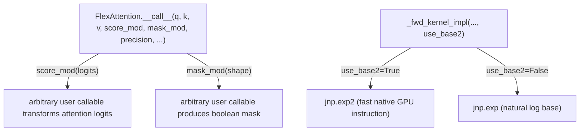

# tokamax._src.ops.flex_attention.pallas_triton — FlexAttention (ScoreMod/MaskMod), base-2 exponential

## Overview

[`FlexAttention`](../catalog/tokamax/_src/ops/flex_attention/base.md#FlexAttention._fwd)
generalizes attention with user-supplied `ScoreMod`/`MaskMod` callables — arbitrary per-position
score transformations and mask predicates fused directly into the Pallas Triton kernel, following
the same pattern as PyTorch's FlexAttention.
[`PallasTritonFlexAttention.use_base2`](../catalog/tokamax/_src/ops/flex_attention/pallas_triton.md#PallasTritonFlexAttention.use_base2)
switches the softmax exponential between `jnp.exp2` and `jnp.exp` — a GPU-hardware-instruction-level
optimization, since base-2 exponentiation typically maps to a faster native GPU instruction than
natural-log-based exponentiation.

## Diagram

## Design rationale (why it's built this way)

**`ScoreMod`/`MaskMod` are typed as plain callables (`Callable[[...], ...]`), letting arbitrary
user logic be fused into the kernel rather than requiring a fixed, closed set of built-in
mask/score variants.** [`ScoreMod`](../catalog/tokamax/_src/ops/flex_attention/pallas_triton.md#ScoreMod)
is `Callable[[Float[Array, "*B H T t"]], Float[Array, "*B H T t"]]` and
[`MaskMod`](../catalog/tokamax/_src/ops/flex_attention/pallas_triton.md#MaskMod) is
`Callable[[tuple[int, ...]], Bool[Array, "*#B #H #T #t"]]` — this is the same
generality-via-callable design as PyTorch's FlexAttention, letting callers express custom
relative-position biases, ALiBi-style penalties, or arbitrary masking patterns without needing a
new kernel variant per pattern.

**`use_base2` exists purely to exploit a GPU hardware instruction, not for any numerical-accuracy
reason.** The kernel selects `jnp.exp2` in place of `jnp.exp` when `use_base2` is set — since GPUs
commonly provide a fast native base-2 exponential instruction, computing softmax via `exp2` (after
appropriately rescaling logits by `log2(e)`) can be measurably cheaper than the natural-log-based
`exp`, purely as an instruction-selection optimization with no change to the mathematical result
(up to floating-point rounding).

## Entry points

- [`FlexAttention.__call__`](../catalog/tokamax/_src/ops/flex_attention/base.md#FlexAttention._fwd) —
  the user-facing entry accepting `score_mod`/`mask_mod` callables alongside the usual q/k/v
  attention arguments.
- [`PallasTritonFlexAttention._fwd`](../catalog/tokamax/_src/ops/flex_attention/pallas_triton.md#PallasTritonFlexAttention._fwd) —
  the Pallas Triton backend's forward implementation.

## Mechanism (step-by-step)

1. **[`FlexAttention.__call__`](../catalog/tokamax/_src/ops/flex_attention/base.md#FlexAttention._fwd)
   accepts optional `score_mod`/`mask_mod` callables** alongside q/k/v and precision settings.
2. **[`PallasTritonFlexAttention._fwd`](../catalog/tokamax/_src/ops/flex_attention/pallas_triton.md#PallasTritonFlexAttention._fwd)
   traces these callables into the Pallas kernel body**, fusing the score transformation and mask
   predicate directly into the attention loop rather than materializing a separate mask/bias
   tensor upfront.
3. **The kernel's softmax computation uses `jnp.exp2` or `jnp.exp`** depending on
   [`use_base2`](../catalog/tokamax/_src/ops/flex_attention/pallas_triton.md#PallasTritonFlexAttention.use_base2),
   with logits pre-scaled accordingly when base-2 is selected.

## Key data structures

- **[`ScoreMod`](../catalog/tokamax/_src/ops/flex_attention/pallas_triton.md#ScoreMod)** —
  `Callable[[Float[Array, "*B H T t"]], Float[Array, "*B H T t"]]`.
- **[`MaskMod`](../catalog/tokamax/_src/ops/flex_attention/pallas_triton.md#MaskMod)** —
  `Callable[[tuple[int, ...]], Bool[Array, "*#B #H #T #t"]]`.
- **[`Config`](../catalog/tokamax/_src/ops/flex_attention/pallas_triton.md#Config)** —
  [`block_q`](../catalog/tokamax/_src/ops/flex_attention/pallas_triton.md#Config.block_q)/
  [`block_k`](../catalog/tokamax/_src/ops/flex_attention/pallas_triton.md#Config.block_k)/
  [`block_d`](../catalog/tokamax/_src/ops/flex_attention/pallas_triton.md#Config.block_d)/
  [`block_d_out`](../catalog/tokamax/_src/ops/flex_attention/pallas_triton.md#Config.block_d_out)/
  [`num_stages`](../catalog/tokamax/_src/ops/flex_attention/pallas_triton.md#Config.num_stages)/
  [`num_warps`](../catalog/tokamax/_src/ops/flex_attention/pallas_triton.md#Config.num_warps) —
  mirroring [tokamax-_src-ops-attention-pallas_triton](tokamax-_src-ops-attention-pallas_triton.md)'s
  own `Config`.

## Dynamics (design intent)

Because `score_mod`/`mask_mod` are traced and fused into the kernel body rather than applied as a
separate pre/post-processing step, custom scoring/masking logic pays no extra memory-materialization
cost relative to the built-in mask handling in
[tokamax-_src-ops-attention-base](tokamax-_src-ops-attention-base.md) — the cost is purely whatever
compute the user's callable itself performs, executed inline in the fused kernel.

## Edge cases

- `FlexAttention.supports_batched_args_capture` is set to `False` (a `ClassVar`) — unlike some
  other tokamax ops, this op does not support the batched-argument-capture mechanism used elsewhere
  for offline autotuning trace recording.

## Open questions

- Whether `use_base2`'s logit rescaling is applied automatically whenever `score_mod`/`mask_mod`
  are also in use, or whether the two features interact in some other way, is not addressed by
  this packet's cited subgraph.

## See also
- [tokamax-_src-ops-attention-pallas_triton](tokamax-_src-ops-attention-pallas_triton.md) — the
  non-Flex Triton attention kernel sharing the same `Config` shape and `use_stable_softmax`
  pattern.
- [tokamax-_src-ops-attention-base](tokamax-_src-ops-attention-base.md) — `DotProductAttention`,
  the more constrained (built-in mask only) sibling op.
