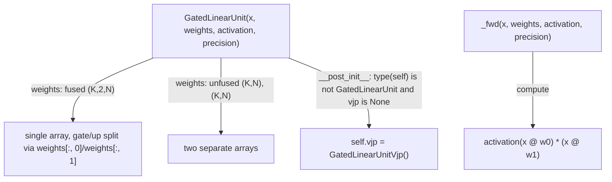

# tokamax._src.ops.gated_linear_unit.base — GatedLinearUnit, auto-assigned default VJP, fused/unfused weight layouts

## Overview

[`GatedLinearUnit`](../catalog/tokamax/_src/ops/gated_linear_unit/base.md#GatedLinearUnit) computes
`activation(x @ weights[:, 0]) * x @ weights[:, 1]` — the standard gated-MLP primitive (SiLU/GELU/
SwiGLU-style gating). Its weights can be either a single fused array of shape `(K, 2, N)` or two
separate `(K, N)` arrays (`FusedWeights`/`UnfusedWeights`). `__post_init__` automatically assigns a
default [`GatedLinearUnitVjp`](../catalog/tokamax/_src/ops/gated_linear_unit/base.md#GatedLinearUnitVjp)
backward implementation to every concrete backend subclass that doesn't already specify one.

## Diagram

## Design rationale (why it's built this way)

**Every concrete backend subclass automatically gets a default VJP unless it opts out, via a
`__post_init__` check that excludes only the base class itself.**
[`GatedLinearUnit.__post_init__`](../catalog/tokamax/_src/ops/gated_linear_unit/base.md#GatedLinearUnit)
sets `self.vjp = GatedLinearUnitVjp()` when `self.vjp is None and type(self) is not
GatedLinearUnit` — using an exact-type check (not `isinstance`) means the check fires for every
subclass but not the abstract base, so a new backend subclass gets working gradients "for free"
the moment it's defined, without needing to explicitly wire up a backward pass unless it wants a
custom one.

**Weights can be supplied either as one fused `(K, 2, N)` array or two separate `(K, N)` arrays**,
letting callers choose whichever memory layout matches how their weights are actually stored
(e.g. a model checkpoint that already concatenates gate/up weights into one tensor vs. one that
keeps them as separate parameters) without requiring a reshape/concatenate step before calling the
op.

## Entry points

- `GatedLinearUnit.bind` (see [`GatedLinearUnit`](../catalog/tokamax/_src/ops/gated_linear_unit/base.md#GatedLinearUnit)) —
  validates/canonicalizes arguments, including resolving `precision` via
  `precision_lib.canonicalize_precision`.
- [`GatedLinearUnit._fwd`](../catalog/tokamax/_src/ops/gated_linear_unit/base.md#GatedLinearUnit._fwd) —
  the reference implementation computing `activation(x @ weights[:, 0]) * x @ weights[:, 1]`.
- [`GatedLinearUnitVjp._fwd`](../catalog/tokamax/_src/ops/gated_linear_unit/base.md#GatedLinearUnitVjp._fwd) —
  the default backward-pass implementation auto-assigned to subclasses.

## Mechanism (step-by-step)

1. **`GatedLinearUnit.bind` (see [`GatedLinearUnit`](../catalog/tokamax/_src/ops/gated_linear_unit/base.md#GatedLinearUnit))
   canonicalizes `precision`** and passes through `x`/`weights`/`activation`/`return_residuals`.
2. **[`GatedLinearUnit._fwd`](../catalog/tokamax/_src/ops/gated_linear_unit/base.md#GatedLinearUnit._fwd)
   computes two matmuls against `x`** (from either the fused or unfused weight layout), applies
   `activation` to the first, and multiplies elementwise by the second.
3. **On construction of any concrete subclass**, `__post_init__` assigns a default
   [`GatedLinearUnitVjp`](../catalog/tokamax/_src/ops/gated_linear_unit/base.md#GatedLinearUnitVjp)
   to `self.vjp` if none was explicitly provided.

## Key data structures

- **`FusedWeights`/`UnfusedWeights`** — type aliases for the two supported weight layouts (one
  `(K, 2, N)` array vs. a tuple of two `(K, N)` arrays).
- **`Residuals`** — `Float[Array, '*B M 2 N']`, the saved intermediate values for the backward
  pass when `return_residuals` is set.
- **[`GatedLinearUnitVjp`](../catalog/tokamax/_src/ops/gated_linear_unit/base.md#GatedLinearUnitVjp)** —
  the default backward-pass `Op`.

## Dynamics (design intent)

Because `__post_init__`'s auto-VJP-assignment only fires when `self.vjp is None`, a subclass that
explicitly sets its own `vjp` (e.g. a Pallas-kernel-fused backward pass) is left untouched — the
default assignment is purely a fallback for subclasses that don't specify one.

## Edge cases

- The `type(self) is not GatedLinearUnit` check means a direct instance of the base
  [`GatedLinearUnit`](../catalog/tokamax/_src/ops/gated_linear_unit/base.md#GatedLinearUnit)
  class (if ever constructed directly, rather than via a subclass) does *not* get an auto-assigned
  VJP — only subclasses do.

## Open questions

- Whether `GatedLinearUnit` itself is ever meant to be instantiated directly (as opposed to always
  being subclassed per backend) is not addressed by this packet's cited subgraph.

## See also
- [tokamax-_src-ops-op](tokamax-_src-ops-op.md) — `Op`, the base class/protocol
  `GatedLinearUnit` implements.
- [tokamax-_src-ops-gated_linear_unit-pallas_mosaic_gpu_common](tokamax-_src-ops-gated_linear_unit-pallas_mosaic_gpu_common.md) —
  `Config`, the tiling configuration for a concrete Pallas Mosaic-GPU backend of this op.
