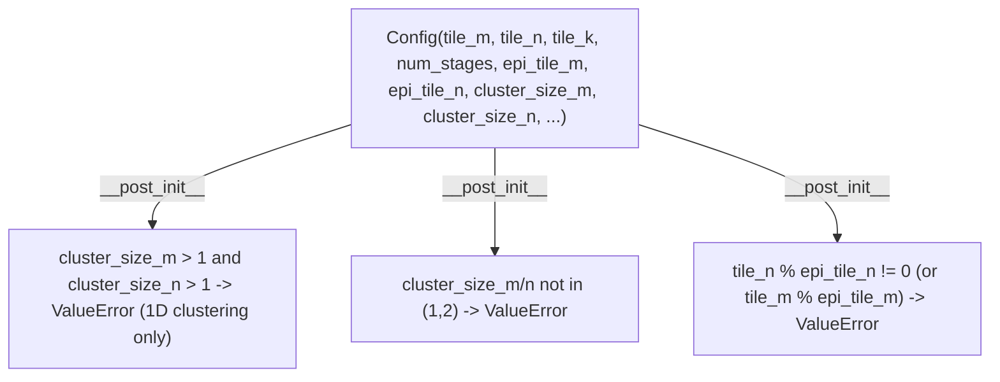

# tokamax._src.ops.gated_linear_unit.pallas_mosaic_gpu_common — GLU tiling Config with 1D-cluster and epilogue-divisibility constraints

## Overview

[`Config`](../catalog/tokamax/_src/ops/gated_linear_unit/pallas_mosaic_gpu_common.md#Config) is the
`pydantic`-validated tiling configuration for tokamax's Pallas Mosaic-GPU Gated Linear Unit kernel:
main-loop tile dimensions (
[`tile_m`](../catalog/tokamax/_src/ops/gated_linear_unit/pallas_mosaic_gpu_common.md#Config.tile_m)/
[`tile_n`](../catalog/tokamax/_src/ops/gated_linear_unit/pallas_mosaic_gpu_common.md#Config.tile_n)/
`tile_k`), epilogue tile sizes (
[`epi_tile_m`](../catalog/tokamax/_src/ops/gated_linear_unit/pallas_mosaic_gpu_common.md#Config.epi_tile_m)/
[`epi_tile_n`](../catalog/tokamax/_src/ops/gated_linear_unit/pallas_mosaic_gpu_common.md#Config.epi_tile_n)),
grid/workgroup distribution axes, and thread-block cluster sizes (
[`cluster_size_m`](../catalog/tokamax/_src/ops/gated_linear_unit/pallas_mosaic_gpu_common.md#Config.cluster_size_m)/
[`cluster_size_n`](../catalog/tokamax/_src/ops/gated_linear_unit/pallas_mosaic_gpu_common.md#Config.cluster_size_n)).
`__post_init__` enforces that clustering is effectively 1D (at most one of `cluster_size_m`/
`cluster_size_n` may exceed 1) and that epilogue tiles evenly divide their corresponding main tile.

## Diagram

## Design rationale (why it's built this way)

**Thread-block clustering is restricted to effectively one dimension — `cluster_size_m` and
`cluster_size_n` cannot both exceed 1 — enforced as a construction-time invariant, not a
documentation note.**
[`Config.__post_init__`](../catalog/tokamax/_src/ops/gated_linear_unit/pallas_mosaic_gpu_common.md#Config)
raises `ValueError("At least one of cluster_size_m or cluster_size_n must be 1.")` — GPU
thread-block cluster hardware (Hopper/Blackwell) has real limits on 2D cluster shapes for this
kernel's tiling strategy, so rather than silently producing an invalid or unsupported launch
configuration, an attempt to set both cluster dimensions above 1 fails immediately when the config
is constructed.

**Epilogue tile sizes must evenly divide their corresponding main tile size, checked explicitly
rather than assumed.**
[`Config.__post_init__`](../catalog/tokamax/_src/ops/gated_linear_unit/pallas_mosaic_gpu_common.md#Config)
raises `ValueError` if `tile_n % epi_tile_n != 0` (and symmetrically for `tile_m`/`epi_tile_m`) —
since the epilogue (final elementwise/activation stage) is tiled separately from the main matmul
loop specifically to allow a different granularity for e.g. better register/shared-memory reuse in
the activation computation, an epilogue tile that doesn't evenly divide the main tile would leave a
partial, harder-to-handle remainder region, so this combination is rejected outright.

**`tile_m`/`tile_n` are constrained to multiples of 64 with a minimum of 64, mirroring the same
tiling-alignment discipline seen in the attention kernel config.**
[`Config.tile_m`](../catalog/tokamax/_src/ops/gated_linear_unit/pallas_mosaic_gpu_common.md#Config.tile_m)/
[`tile_n`](../catalog/tokamax/_src/ops/gated_linear_unit/pallas_mosaic_gpu_common.md#Config.tile_n) use
`pydantic.conint(ge=64, multiple_of=64)` — the same GPU-tiling-alignment reasoning as
[tokamax-_src-ops-attention-pallas_mosaic_gpu_common](tokamax-_src-ops-attention-pallas_mosaic_gpu_common.md)'s
`ConfigBase.block_q`/`block_kv` applies here too, keeping the constraint declarative in the type
annotation.

## Entry points

- [`Config`](../catalog/tokamax/_src/ops/gated_linear_unit/pallas_mosaic_gpu_common.md#Config) —
  the tiling configuration constructed (directly or via autotuning search) for every Pallas
  Mosaic-GPU GLU kernel invocation.
- [`get_autotuning_configs`](../catalog/tokamax/_src/ops/gated_linear_unit/pallas_mosaic_gpu_kernel_sm90.md#get_autotuning_configs) —
  reached to enumerate candidate `Config` values for autotuning.

## Mechanism (step-by-step)

1. **A caller (or the autotuning search via
   [`get_autotuning_configs`](../catalog/tokamax/_src/ops/gated_linear_unit/pallas_mosaic_gpu_kernel_sm90.md#get_autotuning_configs))
   constructs a [`Config`](../catalog/tokamax/_src/ops/gated_linear_unit/pallas_mosaic_gpu_common.md#Config)**
   with tile/epilogue/cluster parameters.
2. **`pydantic` field validators check each field's range/multiple-of constraint** on
   [`Config.tile_m`](../catalog/tokamax/_src/ops/gated_linear_unit/pallas_mosaic_gpu_common.md#Config.tile_m)/
   [`tile_n`](../catalog/tokamax/_src/ops/gated_linear_unit/pallas_mosaic_gpu_common.md#Config.tile_n)
   (≥ 64 and multiples of 64) and
   [`cluster_size_m`](../catalog/tokamax/_src/ops/gated_linear_unit/pallas_mosaic_gpu_common.md#Config.cluster_size_m)/
   [`cluster_size_n`](../catalog/tokamax/_src/ops/gated_linear_unit/pallas_mosaic_gpu_common.md#Config.cluster_size_n)
   (in `[1, 2]`).
3. **`Config.__post_init__` checks the cross-field invariants**: at most one cluster dimension may
   exceed 1, and each
   [`epi_tile_m`](../catalog/tokamax/_src/ops/gated_linear_unit/pallas_mosaic_gpu_common.md#Config.epi_tile_m)/
   [`epi_tile_n`](../catalog/tokamax/_src/ops/gated_linear_unit/pallas_mosaic_gpu_common.md#Config.epi_tile_n)
   (if set) must evenly divide its corresponding main tile size.

## Key data structures

- **[`Config`](../catalog/tokamax/_src/ops/gated_linear_unit/pallas_mosaic_gpu_common.md#Config)** —
  [`tile_m`](../catalog/tokamax/_src/ops/gated_linear_unit/pallas_mosaic_gpu_common.md#Config.tile_m)/
  [`tile_n`](../catalog/tokamax/_src/ops/gated_linear_unit/pallas_mosaic_gpu_common.md#Config.tile_n)/
  `tile_k`/`num_stages`/
  [`epi_tile_m`](../catalog/tokamax/_src/ops/gated_linear_unit/pallas_mosaic_gpu_common.md#Config.epi_tile_m)/
  [`epi_tile_n`](../catalog/tokamax/_src/ops/gated_linear_unit/pallas_mosaic_gpu_common.md#Config.epi_tile_n)/
  `grid_minor_dim`/`grid_tile_width`/`wg_dimension`/
  [`cluster_size_m`](../catalog/tokamax/_src/ops/gated_linear_unit/pallas_mosaic_gpu_common.md#Config.cluster_size_m)/
  [`cluster_size_n`](../catalog/tokamax/_src/ops/gated_linear_unit/pallas_mosaic_gpu_common.md#Config.cluster_size_n).

## Dynamics (design intent)

Because every field constraint is either a `pydantic` type-level check or an explicit
`__post_init__` cross-field check, an autotuning search that generates candidate `Config` values
can rely on construction itself as a validity filter — invalid candidate configs (e.g. a 2D
cluster or a non-dividing epilogue tile) raise immediately rather than needing a separate,
duplicated validity-checking pass before benchmarking each candidate.

## Edge cases

- [`epi_tile_m`](../catalog/tokamax/_src/ops/gated_linear_unit/pallas_mosaic_gpu_common.md#Config.epi_tile_m)/
  [`epi_tile_n`](../catalog/tokamax/_src/ops/gated_linear_unit/pallas_mosaic_gpu_common.md#Config.epi_tile_n)
  are `PositiveInt | None` — when `None`, the divisibility check is skipped entirely (per the
  `epi_tile_n is not None and ...` guard), meaning epilogue tiling is optional and the constraint
  only applies when it's actually configured.
- The cluster-size constraint (`ge=1, le=2`) hardcodes an upper bound of 2 — a hardware
  generation supporting larger cluster sizes would require relaxing this `pydantic` constraint,
  not just the `__post_init__` cross-check.

## Open questions

- Whether the 1D-clustering restriction is a fundamental limitation of the kernel's current tiling
  strategy or a not-yet-implemented generalization is not addressed by this packet's cited
  subgraph.

## See also
- [tokamax-_src-ops-attention-pallas_mosaic_gpu_common](tokamax-_src-ops-attention-pallas_mosaic_gpu_common.md) —
  the analogous config-validation pattern (`pydantic conint`, `__post_init__` invariants) for the
  attention kernel family.
- [tokamax-_src-ops-gated_linear_unit-base](tokamax-_src-ops-gated_linear_unit-base.md) —
  `GatedLinearUnit`, the op this config backs a Pallas Mosaic-GPU implementation of.
