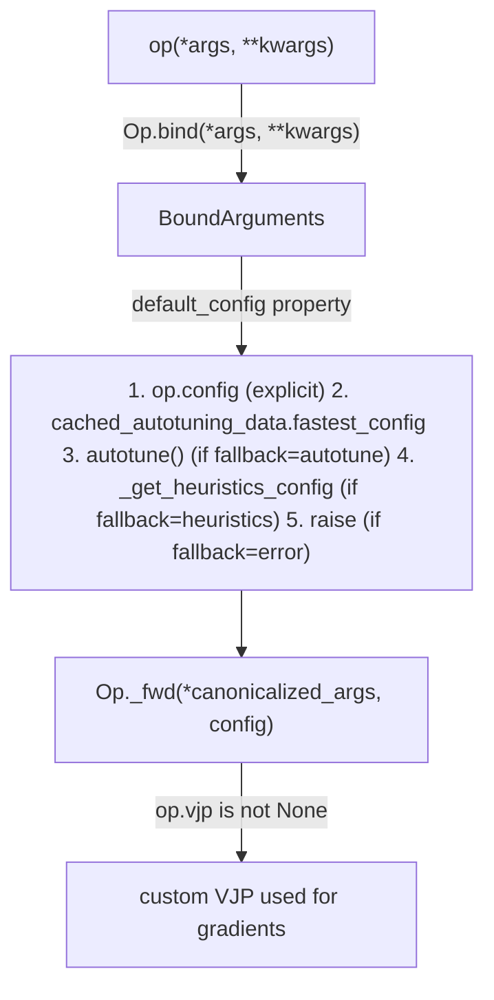

# tokamax._src.ops.op — Op/BoundArguments, the bind-then-configure-then-dispatch base abstraction

## Overview

[`Op`](../catalog/tokamax/_src/ops/op.md#Op) is the abstract base class every tokamax kernel op
(`RaggedDot`, `DotProductAttention`, `GatedLinearUnit`, ...) extends: calling an `Op` first
[`bind`](../catalog/tokamax/_src/ops/op.md#Op.bind)s its arguments (validating/canonicalizing them
into a [`BoundArguments`](../catalog/tokamax/_src/ops/op.md#BoundArguments)), then resolves a
per-call config (explicit → cached autotuning data → live autotune → heuristics → error, in that
priority order, per
[`BoundArguments`](../catalog/tokamax/_src/ops/op.md#BoundArguments)'s `default_config`'s
docstring), then dispatches to
[`_fwd`](../catalog/tokamax/_src/ops/op.md#Op._fwd) with the canonicalized arguments and chosen
config. Backend-specific subclasses (e.g. a Pallas Mosaic-GPU implementation) override `_fwd` and
optionally [`_get_heuristics_config`](../catalog/tokamax/_src/ops/op.md#Op._get_heuristics_config)/
`_get_autotuning_configs`, while the base op class defines the default XLA fallback.

## Diagram

## Design rationale (why it's built this way)

**`Op` is generic over `(_P, _T, _R, _Config, _Key)`, giving every op a uniform interface across
wildly different operations (attention, ragged matmul, GLU) while still letting each specialize its
own argument/config/cache-key types.** [`Op`](../catalog/tokamax/_src/ops/op.md#Op)'s class
docstring lays out an explicit two-tier extension contract: base op classes (e.g. `RaggedDot`)
implement `bind`/`_fwd` with a default XLA implementation, while backend subclasses (e.g.
`PallasMosaicGpuRaggedDot`) override only `_fwd` (and optionally heuristics/autotuning/vjp) — this
means adding a new backend for an existing op never touches the op's own argument-validation logic,
and adding a new op never has to re-derive the bind→configure→dispatch protocol.

**Config resolution follows a strict, documented priority order rather than a single default
strategy — explicit config wins, then cache, then live autotuning or heuristics depending on a
global fallback setting.** [`BoundArguments`](../catalog/tokamax/_src/ops/op.md#BoundArguments)'s `default_config`'s
docstring enumerates exactly five cases in order, gated by the
`tokamax_autotuning_cache_miss_fallback` config option for the last two — this makes the tradeoff
between "always get the best known config" (autotune-on-miss, potentially slow) and "always get a
fast, cheap answer" (heuristics-on-miss) an explicit, callable-wide policy choice rather than
something baked into each op's dispatch logic.

**Arguments and `vmap` axes are recorded in HLO specifically to support *offline* autotuning.**
[`Op`](../catalog/tokamax/_src/ops/op.md#Op)'s docstring states the call captures "the `vmap`
environment for the call (as this may affect the choice of config)" and records it in HLO,
"allowing for offline autotuning" — since the best kernel config can depend on batch/vmap structure
that's only fully known at trace time, recording it lets an offline autotuning pass later analyze
real call sites rather than needing to re-derive vmap context from scratch.

## Entry points

- [`Op.bind`](../catalog/tokamax/_src/ops/op.md#Op.bind) — reached on every call to validate and
  canonicalize arguments into a [`BoundArguments`](../catalog/tokamax/_src/ops/op.md#BoundArguments).
- [`BoundArguments`](../catalog/tokamax/_src/ops/op.md#BoundArguments)'s `default_config` —
  reached to resolve which config to actually run with, following the documented priority chain.
- [`Op._fwd`](../catalog/tokamax/_src/ops/op.md#Op._fwd) — the abstract method every op
  implementation (base or backend-specific) must provide.
- [`Op._get_heuristics_config`](../catalog/tokamax/_src/ops/op.md#Op._get_heuristics_config) —
  the overridable heuristic-config fallback, defaulting to `NotImplementedError` unless the op has
  no config (`NullConfig`).

## Mechanism (step-by-step)

1. **Calling an [`Op`](../catalog/tokamax/_src/ops/op.md#Op) instance first calls
   [`bind`](../catalog/tokamax/_src/ops/op.md#Op.bind)** to validate/canonicalize the arguments,
   producing a [`BoundArguments`](../catalog/tokamax/_src/ops/op.md#BoundArguments).
2. **If the [`Op`](../catalog/tokamax/_src/ops/op.md#Op) is configurable** (its `_Config` type isn't
   `NullConfig`), the call captures the `vmap` environment and records arguments/vmap axes in HLO
   for offline autotuning.
3. **[`BoundArguments`](../catalog/tokamax/_src/ops/op.md#BoundArguments)'s `default_config`
   resolves the config to use**, checking (in order) an explicit `op.config`, cached autotuning
   data's fastest config, a live `autotune()` call, or
   [`_get_heuristics_config`](../catalog/tokamax/_src/ops/op.md#Op._get_heuristics_config) —
   depending on the `tokamax_autotuning_cache_miss_fallback` setting.
4. **[`_fwd`](../catalog/tokamax/_src/ops/op.md#Op._fwd) is called with the canonicalized
   arguments and resolved config**; if `op.vjp` is set, it is used for the backward pass instead of
   autodiff through `_fwd`.

## Key data structures

- **[`Op`](../catalog/tokamax/_src/ops/op.md#Op)** — `config_cls` (`ClassVar`, defaulting to
  `NullConfig`); abstract methods
  [`bind`](../catalog/tokamax/_src/ops/op.md#Op.bind)/[`_fwd`](../catalog/tokamax/_src/ops/op.md#Op._fwd);
  overridable
  [`_get_heuristics_config`](../catalog/tokamax/_src/ops/op.md#Op._get_heuristics_config)/
  `_get_autotuning_cache_key`.
- **[`BoundArguments`](../catalog/tokamax/_src/ops/op.md#BoundArguments)** —
  [`op`](../catalog/tokamax/_src/ops/op.md#BoundArguments.op),
  [`arguments`](../catalog/tokamax/_src/ops/op.md#BoundArguments.arguments)
  (an `immutabledict`); exposes
  [`args`](../catalog/tokamax/_src/ops/op.md#BoundArguments.args)/`kwargs`/`signature`/
  `vmap_axis_sizes`/`default_config`.

## Dynamics (design intent)

Because `_get_autotuning_cache_key` builds its key from `_abstractify`d positional and keyword
arguments (not concrete values), two calls with different concrete tensor values but the same
shapes/dtypes/vmap structure share one autotuning cache entry — the cache generalizes across
distinct runs with structurally identical call shapes.

## Edge cases

- [`Op._get_heuristics_config`](../catalog/tokamax/_src/ops/op.md#Op._get_heuristics_config)
  raises `NotImplementedError` for any op whose `config_cls` is not `NullConfig` and hasn't
  overridden this method — an op with a real config type but no heuristics implementation cannot
  fall back to heuristics; it must rely on the other tiers of `default_config`'s priority chain.
- [`BoundArguments`](../catalog/tokamax/_src/ops/op.md#BoundArguments) construction converts
  `arguments` into an `immutabledict` — a caller cannot mutate a `BoundArguments`' argument mapping
  after construction.

## Open questions

- What determines the `tokamax_autotuning_cache_miss_fallback` global setting's default value
  (autotune vs. heuristics vs. error) in typical usage is not addressed by this packet's cited
  subgraph.

## See also
- [tokamax-_src-benchmarking](tokamax-_src-benchmarking.md) — the benchmarking/runner
  infrastructure used to populate the autotuning cache this module's config resolution consults.
- [tokamax-_src-ops-ragged_dot-base](tokamax-_src-ops-ragged_dot-base.md) — `RaggedDot`, a
  concrete base-op-class implementation of this `Op` contract.
