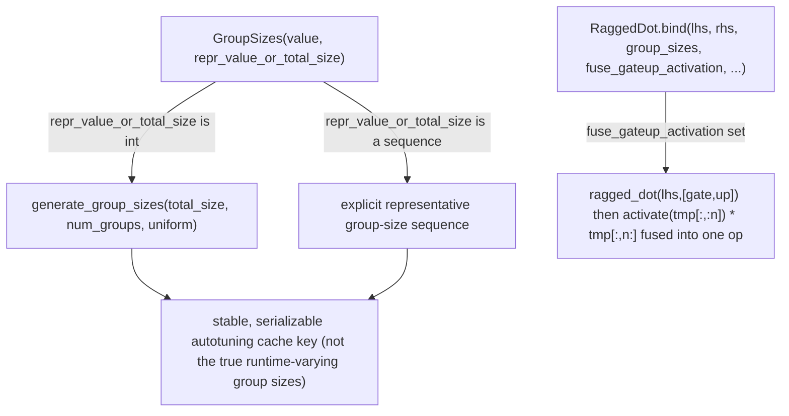

# tokamax._src.ops.ragged_dot.base — RaggedDot (MegaBlocks-style grouped matmul), representative GroupSizes

## Overview

[`RaggedDot`](../catalog/tokamax/_src/ops/ragged_dot/base.md#RaggedDot) is the base
[`Op`](tokamax-_src-ops-op.md) for MegaBlocks-style grouped matrix multiplication (the core MoE
expert-matmul primitive), supporting quantized inputs, a fused gate/up-projection activation path
(`fuse_gateup_activation`), and RHS bias fusion.
[`GroupSizes`](../catalog/tokamax/_src/ops/ragged_dot/base.md#GroupSizes) solves a specific
autotuning-cache problem: since ragged-dot performance depends on the group-size *distribution* but
actual group sizes are runtime-determined (and thus can't be used as a stable, serializable
autotuning cache key), it carries a `repr_value_or_total_size` field standing in for a
representative distribution.

## Diagram

## Design rationale (why it's built this way)

**`GroupSizes` separates the *actual* runtime group-size values from a *representative*
distribution used for autotuning, specifically because the true values can't serve as a stable
cache key.** The class docstring states this directly: "we cannot serialize the actual values (as
they are runtime determined, and will vary from one step to the next). Instead, we serialize a
representative distribution" — since MoE group sizes change every training/inference step
(depending on which tokens route to which expert), using them directly as an autotuning cache key
would defeat caching entirely (every step would look like a cache miss); `repr_value_or_total_size`
lets the same cached config apply across steps with a similar (not identical) group-size
distribution.

**`fuse_gateup_activation` fuses the gate/up-projection-then-activation pattern directly into the
ragged dot, rather than requiring two separate matmuls plus a separate activation step.** The
docstring spells out the fusion explicitly: `tmp = ragged_dot(lhs, [gate, up])` (concatenated on the
N dimension) followed by `activate(tmp[:, :n]) * tmp[:, n:]` — this is the standard gated-MLP
pattern (SiLU/GELU/SwiGLU-gated), and fusing it avoids materializing the full `[.., 2n]`-wide
intermediate `tmp` tensor separately from the activation/multiply step, which for MoE models with
large expert hidden dimensions is a meaningful memory-traffic saving.

## Entry points

- [`RaggedDot.bind`](../catalog/tokamax/_src/ops/ragged_dot/base.md#RaggedDot.bind) — validates and
  canonicalizes ragged-dot call arguments, including converting `group_sizes` into a
  [`GroupSizes`](../catalog/tokamax/_src/ops/ragged_dot/base.md#GroupSizes) if given as a raw
  array/sequence.
- [`RaggedDot._fwd`](../catalog/tokamax/_src/ops/ragged_dot/base.md#RaggedDot._fwd) — the reference
  XLA implementation.

## Mechanism (step-by-step)

1. **[`RaggedDot.bind`](../catalog/tokamax/_src/ops/ragged_dot/base.md#RaggedDot.bind) accepts
   `group_sizes`** as a raw array, sequence, or already-constructed
   [`GroupSizes`](../catalog/tokamax/_src/ops/ragged_dot/base.md#GroupSizes), canonicalizing it and
   validating dtype (must be integer).
2. **If `fuse_gateup_activation` is set** (a parameter of
   [`RaggedDot.bind`](../catalog/tokamax/_src/ops/ragged_dot/base.md#RaggedDot.bind)), the bound
   call signals the backend to fuse the concatenated gate/up ragged dot with its activation and
   elementwise multiply into one kernel invocation.
3. **[`RaggedDot._fwd`](../catalog/tokamax/_src/ops/ragged_dot/base.md#RaggedDot._fwd) computes the
   reference grouped matmul**, honoring `zero_initialize` (default `True`, zeroing unvisited output
   rows) and any RHS scale/bias.

## Key data structures

- **[`GroupSizes`](../catalog/tokamax/_src/ops/ragged_dot/base.md#GroupSizes)** —
  `value` (the actual group
  sizes array), `repr_value_or_total_size` (a representative sequence or total size for autotuning
  cache-key purposes).
- **[`RaggedDot`](../catalog/tokamax/_src/ops/ragged_dot/base.md#RaggedDot)** — `checkify_group_sizes`
  (keyword-only, default `False`); accepts `rhs_scale`/`rhs_bias`/`maybe_quantize_lhs`/
  `zero_initialize`/`fuse_gateup_activation`/`lhs_quantization_dtype`/`rhs_quantization_dtype`.

## Dynamics (design intent)

Because `GroupSizes.repr_value_or_total_size` can be either an explicit representative sequence or
just a total size (from which a representative *uniform* distribution is generated via
`generate_group_sizes`), callers that don't know or care about a specific group-size distribution
shape can still get a usable autotuning cache key just by supplying the total token count.

## Edge cases

- [`GroupSizes.__init__`](../catalog/tokamax/_src/ops/ragged_dot/base.md#GroupSizes) raises
  `ValueError` if `value`'s dtype isn't an integer type — group sizes are counts, and a
  non-integer dtype is rejected immediately.
- When `repr_value_or_total_size` is an explicit sequence, its length must equal `num_groups`
  (derived from `value.shape`) — a representative distribution with the wrong number of groups is
  a construction-time error, not silently truncated/padded.

## Open questions

- How sensitive autotuned configs actually are to the representative vs. true group-size
  distribution in practice (i.e. how much performance is left on the table by using a
  representative rather than exact distribution) is not addressed by this packet's cited subgraph.

## See also
- [tokamax-_src-ops-op](tokamax-_src-ops-op.md) — `Op`/`BoundArguments`, the base protocol
  `RaggedDot` implements, including the autotuning-cache-key mechanism `GroupSizes` supports.
- [tokamax-_src-ops-ragged_dot-pallas_mosaic_tpu_v2_gmm_kernel](tokamax-_src-ops-ragged_dot-pallas_mosaic_tpu_v2_gmm_kernel.md) —
  a concrete TPU Pallas backend implementing this op.
