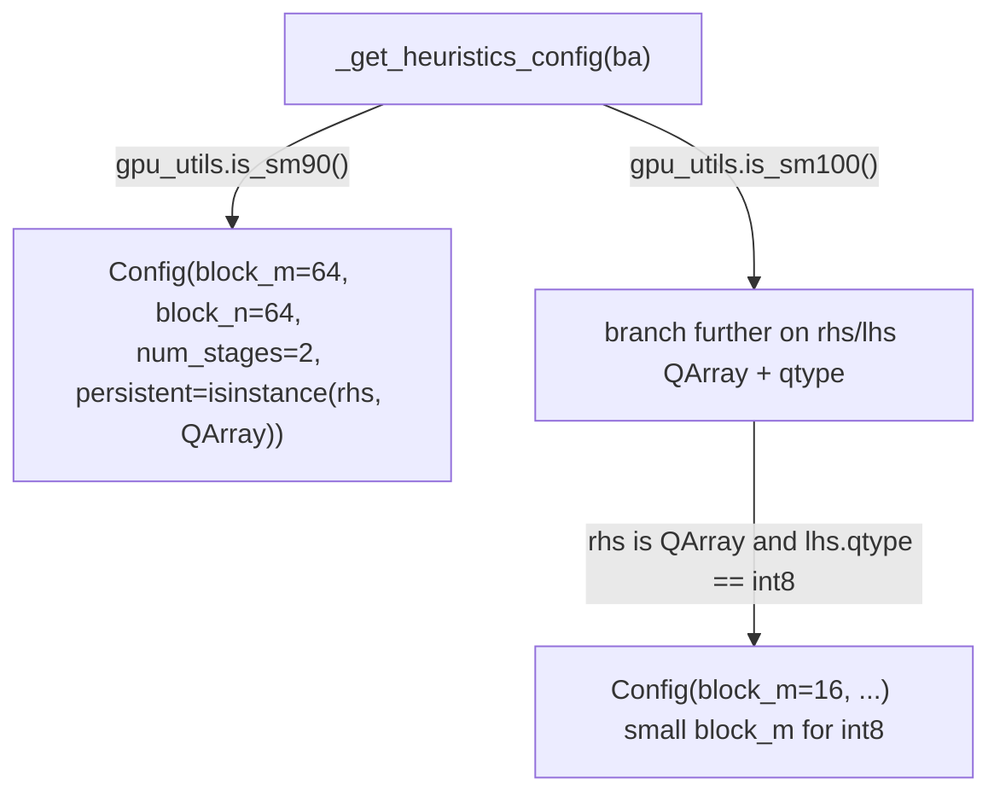

# tokamax._src.ops.ragged_dot.pallas_mosaic_gpu_common — Config with per-(architecture, quantization) heuristics

## Overview

`Config` is the shared
tiling configuration for tokamax's Pallas Mosaic-GPU ragged-dot (grouped matmul) kernels, covering
block sizes (
[`block_m`](../catalog/tokamax/_src/ops/ragged_dot/pallas_mosaic_gpu_common.md#Config.block_m)/
[`block_n`](../catalog/tokamax/_src/ops/ragged_dot/pallas_mosaic_gpu_common.md#Config.block_n)/
[`block_k`](../catalog/tokamax/_src/ops/ragged_dot/pallas_mosaic_gpu_common.md#Config.block_k)),
persistent-kernel and B200 collective-MMA flags. `_get_heuristics_config` derives per-call defaults
that branch on both GPU architecture (SM90 vs. SM100) and quantization type of the operands
(`QArray` int8 vs. default), since the best tiling differs across both axes independently.

## Diagram

## Design rationale (why it's built this way)

**Heuristic config selection branches on GPU architecture and quantization type independently,
not a single combined lookup table.**
[`PallasMosaicGpuRaggedDot._get_heuristics_config`](../catalog/tokamax/_src/ops/ragged_dot/pallas_mosaic_gpu.md#PallasMosaicGpuRaggedDot._get_heuristics_config)
first checks `gpu_utils.is_sm90()`/`is_sm100()`, then within the SM100 branch further checks
`isinstance(rhs, QArray)` and `lhs.qtype` — since both the hardware generation (SM90 vs. SM100's
different MMA/collective capabilities) and the quantization scheme (which changes effective
per-element data size and the arithmetic used) independently shift the optimal tile sizes, the
heuristic must consider both axes rather than picking one fixed config per architecture.

**`block_k` is capped defensively to avoid OOM when the RHS is quantized.** The heuristic computes
`block_k = min(rhs.scale_tile_shape[1], 256) if isinstance(rhs, QArray) else 128` — a quantized
RHS's scale-tile shape can in principle suggest a very large `block_k`, and capping it at 256
prevents the heuristic from picking a block size that would exceed available on-chip memory for a
particular quantization tiling.

## Entry points

- **`Config`** (
  [`block_m`](../catalog/tokamax/_src/ops/ragged_dot/pallas_mosaic_gpu_common.md#Config.block_m)/`block_n`/`block_k`/`num_stages` —
  see below) — the tiling configuration for every Pallas Mosaic-GPU ragged-dot kernel invocation.
- [`PallasMosaicGpuRaggedDot._get_heuristics_config`](../catalog/tokamax/_src/ops/ragged_dot/pallas_mosaic_gpu.md#PallasMosaicGpuRaggedDot._get_heuristics_config) —
  reached to derive a default config from architecture and operand quantization.
- [`PallasMosaicGpuRaggedDot._get_sm90_autotuning_configs`](../catalog/tokamax/_src/ops/ragged_dot/pallas_mosaic_gpu.md#PallasMosaicGpuRaggedDot._get_sm90_autotuning_configs) —
  reached to enumerate SM90-specific candidate configs for autotuning.

## Mechanism (step-by-step)

1. **[`PallasMosaicGpuRaggedDot._get_heuristics_config`](../catalog/tokamax/_src/ops/ragged_dot/pallas_mosaic_gpu.md#PallasMosaicGpuRaggedDot._get_heuristics_config)
   computes a capped `block_k`** based on whether the RHS operand is quantized.
2. **It branches on GPU architecture** (`gpu_utils.is_sm90()`/`is_sm100()`), and within SM100,
   further branches on operand quantization type (`QArray` int8 vs. other), returning an
   architecture-and-dtype-appropriate `Config`, with
   [`block_m`](../catalog/tokamax/_src/ops/ragged_dot/pallas_mosaic_gpu_common.md#Config.block_m)
   set accordingly.
3. **[`PallasMosaicGpuRaggedDot._get_sm90_autotuning_configs`](../catalog/tokamax/_src/ops/ragged_dot/pallas_mosaic_gpu.md#PallasMosaicGpuRaggedDot._get_sm90_autotuning_configs)
   enumerates a broader candidate set** for SM90 autotuning search, generated via
   `_generate_configs`.

## Key data structures

- **`Config`** —
  [`block_m`](../catalog/tokamax/_src/ops/ragged_dot/pallas_mosaic_gpu_common.md#Config.block_m)
  (multiple of 8),
  [`block_n`](../catalog/tokamax/_src/ops/ragged_dot/pallas_mosaic_gpu_common.md#Config.block_n)/
  [`block_k`](../catalog/tokamax/_src/ops/ragged_dot/pallas_mosaic_gpu_common.md#Config.block_k)/
  [`num_stages`](../catalog/tokamax/_src/ops/ragged_dot/pallas_mosaic_gpu_common.md#Config.num_stages),
  `split_k`/`split_m`, `persistent` (persistent-kernel grid), `post_scale`, `collective` (B200
  collective MMA), `grid_minor_dim`.

## Dynamics (design intent)

Because the heuristic function inspects the actual `QArray`/dtype of the bound arguments (not just
their shapes), the same call site with a quantized vs. non-quantized RHS transparently gets a
differently-tuned default config — the quantization decision made elsewhere in the model
automatically propagates into kernel tiling choices here.

## Edge cases

- `persistent=isinstance(rhs, QArray)` on SM90 means the persistent-kernel grid strategy is
  enabled by default specifically (and only) when the RHS is quantized — a non-quantized SM90 call
  gets `persistent=False` by default.

## Open questions

- The full enumeration logic inside `_generate_configs` (which block-size combinations it
  actually tries) is not detailed within this packet's cited subgraph beyond its role as the
  source of SM90 autotuning candidates.

## See also
- [tokamax-_src-ops-ragged_dot-base](tokamax-_src-ops-ragged_dot-base.md) — `RaggedDot`, the op
  this configuration backs a Pallas Mosaic-GPU implementation of.
- [tokamax-_src-ops-attention-pallas_mosaic_gpu_kernel_sm100](tokamax-_src-ops-attention-pallas_mosaic_gpu_kernel_sm100.md) —
  another SM100-specific kernel family with its own `collective`-MMA config flag.
