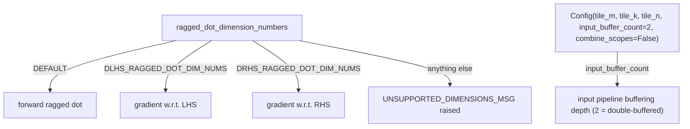

# tokamax._src.ops.ragged_dot.pallas_mosaic_tpu — MegaBlocks TPU ragged dot, forward + DLHS/DRHS gradient dimension-number variants

## Overview

[`PallasMosaicTpuRaggedDot._fwd`](../catalog/tokamax/_src/ops/ragged_dot/pallas_mosaic_tpu.md#PallasMosaicTpuRaggedDot._fwd)
is tokamax's TPU Pallas implementation of the MegaBlocks-paper grouped matmul, supporting three
`RaggedDotDimensionNumbers` variants in one module: the standard forward dot
(`DEFAULT_RAGGED_DOT_DIM_NUMS`), and two gradient-specific layouts,
[`DLHS_RAGGED_DOT_DIM_NUMS`](../catalog/tokamax/_src/ops/ragged_dot/pallas_mosaic_tpu.md#DLHS_RAGGED_DOT_DIM_NUMS)
(gradient w.r.t. the LHS) and
[`DRHS_RAGGED_DOT_DIM_NUMS`](../catalog/tokamax/_src/ops/ragged_dot/pallas_mosaic_tpu.md#DRHS_RAGGED_DOT_DIM_NUMS)
(gradient w.r.t. the RHS).
[`Config`](../catalog/tokamax/_src/ops/ragged_dot/pallas_mosaic_tpu.md#Config) exposes
`tile_m`/`tile_k`/`tile_n`, an `input_buffer_count` (pipeline buffering depth), and a
`combine_scopes` flag.

## Diagram

## Design rationale (why it's built this way)

**One module handles the forward ragged dot and both of its VJP gradient computations by
dispatching on `ragged_dot_dimension_numbers` rather than three separate kernel implementations.**
[`DEFAULT_RAGGED_DOT_DIM_NUMS`](../catalog/tokamax/_src/ops/ragged_dot/pallas_mosaic_tpu.md#DEFAULT_RAGGED_DOT_DIM_NUMS)/
[`DLHS_RAGGED_DOT_DIM_NUMS`](../catalog/tokamax/_src/ops/ragged_dot/pallas_mosaic_tpu.md#DLHS_RAGGED_DOT_DIM_NUMS)/
[`DRHS_RAGGED_DOT_DIM_NUMS`](../catalog/tokamax/_src/ops/ragged_dot/pallas_mosaic_tpu.md#DRHS_RAGGED_DOT_DIM_NUMS)
are three distinct `jax.lax.RaggedDotDimensionNumbers` configurations (differing in which
dimensions are contracting vs. ragged vs. group-indexed) that the same
[`PallasMosaicTpuRaggedDot._fwd`](../catalog/tokamax/_src/ops/ragged_dot/pallas_mosaic_tpu.md#PallasMosaicTpuRaggedDot._fwd)
implementation dispatches on — since the forward and both backward-pass matmuls are all
structurally "grouped matmuls," just with different dimension roles, sharing one kernel
implementation parametrized by dimension numbers avoids duplicating the core tiling/pipelining
logic three times.

**Any dimension-number configuration outside the three supported variants raises with a message
listing exactly which are supported.**
[`UNSUPPORTED_DIMENSIONS_MSG`](../catalog/tokamax/_src/ops/ragged_dot/pallas_mosaic_tpu.md#UNSUPPORTED_DIMENSIONS_MSG)
is a format string embedding the three actually-supported dimension-number values — since
`jax.lax.RaggedDotDimensionNumbers` is a general, flexible structure with many possible
configurations this kernel doesn't implement, failing with an explicit list of what *is* supported
is more actionable than a generic shape-mismatch error deep inside the kernel.

## Entry points

- [`PallasMosaicTpuRaggedDot._fwd`](../catalog/tokamax/_src/ops/ragged_dot/pallas_mosaic_tpu.md#PallasMosaicTpuRaggedDot._fwd) —
  the TPU backend implementation, dispatching on `ragged_dot_dimension_numbers`.
- [`Config`](../catalog/tokamax/_src/ops/ragged_dot/pallas_mosaic_tpu.md#Config) — the tiling/
  pipelining configuration for this backend.

## Mechanism (step-by-step)

1. **[`PallasMosaicTpuRaggedDot._fwd`](../catalog/tokamax/_src/ops/ragged_dot/pallas_mosaic_tpu.md#PallasMosaicTpuRaggedDot._fwd)
   checks the incoming `ragged_dot_dimension_numbers`** against the three supported variants,
   raising with
   [`UNSUPPORTED_DIMENSIONS_MSG`](../catalog/tokamax/_src/ops/ragged_dot/pallas_mosaic_tpu.md#UNSUPPORTED_DIMENSIONS_MSG)
   if it matches none of them.
2. **The kernel tiles the computation** per
   [`Config.tile_m`](../catalog/tokamax/_src/ops/ragged_dot/pallas_mosaic_tpu.md#Config.tile_m)/
   [`tile_k`](../catalog/tokamax/_src/ops/ragged_dot/pallas_mosaic_tpu.md#Config.tile_k)/
   [`tile_n`](../catalog/tokamax/_src/ops/ragged_dot/pallas_mosaic_tpu.md#Config.tile_n), pipelining
   input loads with
   [`input_buffer_count`](../catalog/tokamax/_src/ops/ragged_dot/pallas_mosaic_tpu.md#Config.input_buffer_count)-deep
   buffering.

## Key data structures

- **[`Config`](../catalog/tokamax/_src/ops/ragged_dot/pallas_mosaic_tpu.md#Config)** —
  [`tile_m`](../catalog/tokamax/_src/ops/ragged_dot/pallas_mosaic_tpu.md#Config.tile_m)/
  [`tile_k`](../catalog/tokamax/_src/ops/ragged_dot/pallas_mosaic_tpu.md#Config.tile_k)/
  [`tile_n`](../catalog/tokamax/_src/ops/ragged_dot/pallas_mosaic_tpu.md#Config.tile_n) (default
  128 each),
  [`input_buffer_count`](../catalog/tokamax/_src/ops/ragged_dot/pallas_mosaic_tpu.md#Config.input_buffer_count)
  (default 2, i.e. double-buffered),
  [`combine_scopes`](../catalog/tokamax/_src/ops/ragged_dot/pallas_mosaic_tpu.md#Config.combine_scopes).

## Dynamics (design intent)

Because the forward and both gradient computations reuse one `Config` type and one kernel
implementation (differing only by dimension numbers), an autotuning search or heuristic tuned for
one variant's tile sizes can, at minimum, be reused as a starting point for the other two variants
without needing a wholly separate config schema.

## Edge cases

- A caller supplying a `ragged_dot_dimension_numbers` value that isn't exactly one of the three
  supported constants fails with
  [`UNSUPPORTED_DIMENSIONS_MSG`](../catalog/tokamax/_src/ops/ragged_dot/pallas_mosaic_tpu.md#UNSUPPORTED_DIMENSIONS_MSG) —
  there is no partial/best-effort support for unlisted dimension-number configurations.

## Open questions

- Whether `combine_scopes` measurably affects performance or is primarily a debugging/profiling
  aid (e.g. combining Pallas trace scopes) is not addressed by this packet's cited subgraph.

## See also
- [tokamax-_src-ops-ragged_dot-base](tokamax-_src-ops-ragged_dot-base.md) — `RaggedDot`, the base
  op this module backs, including the forward-pass dispatch and `GroupSizes` used for autotuning.
- [tokamax-_src-ops-ragged_dot-pallas_mosaic_tpu_v2_gmm_kernel](tokamax-_src-ops-ragged_dot-pallas_mosaic_tpu_v2_gmm_kernel.md) —
  a newer ("v2") TPU kernel implementation for the forward grouped matmul.
