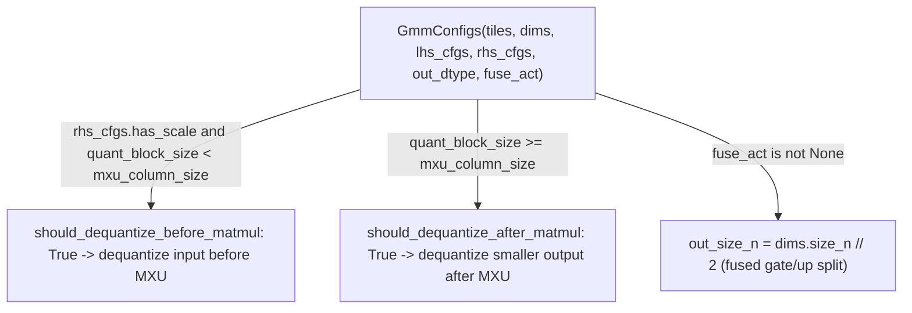

# tokamax._src.ops.ragged_dot.pallas_mosaic_tpu_v2_gmm_kernel — GMM v2, MXU-column-size-gated dequantization timing

<!-- connect:up:begin -->
> **Cross-repo concept:** part of [mosaic-kernel](../../../concepts/mosaic-kernel.md), [pallas-kernel](../../../concepts/pallas-kernel.md) across this wiki's repos.
<!-- connect:up:end -->
## Overview

This module is the "v2" TPU Pallas grouped-matmul (GMM) kernel, generating block specs and index
maps ([`generate_block_specs`](../catalog/tokamax/_src/ops/ragged_dot/pallas_mosaic_tpu_v2_gmm_kernel.md#generate_block_specs))
from a [`GmmConfigs`](../catalog/tokamax/_src/ops/ragged_dot/pallas_mosaic_tpu_v2_gmm_kernel.md#GmmConfigs)
bundle of tile sizes, dimensions, and per-operand quantization configs
([`InputConfigs`](../catalog/tokamax/_src/ops/ragged_dot/pallas_mosaic_tpu_v2_gmm_kernel.md#GmmConfigs.rhs_cfgs)).
`InputConfigs.should_dequantize_before_matmul` decides — by comparing the quantization block size
against the TPU's actual MXU column size — whether dequantization must happen before feeding the
MXU or can be deferred until after the matmul (on the smaller output).

## Diagram

## Design rationale (why it's built this way)

**Dequantization timing (before vs. after the matmul) is decided by comparing the quantization
block size against the TPU's actual MXU column size, not a fixed policy.** `InputConfigs`'s
`should_dequantize_before_matmul` companion property to
[`should_dequantize_after_matmul`](../catalog/tokamax/_src/ops/ragged_dot/pallas_mosaic_tpu_v2_gmm_kernel.md#InputConfigs.should_dequantize_after_matmul)
computes `mxu_size = pltpu.get_tpu_info().mxu_column_size` and returns `quant_block_size <
mxu_size` — if the quantization block is finer-grained than what the MXU natively processes per
column, per-sub-column scale factors can't be applied uniformly inside one MXU pass, forcing
dequantization to happen before the matmul; if the quant block is coarser (≥ MXU column size), the
scale can be applied uniformly per MXU-column-sized chunk, so
[`should_dequantize_after_matmul`](../catalog/tokamax/_src/ops/ragged_dot/pallas_mosaic_tpu_v2_gmm_kernel.md#InputConfigs.should_dequantize_after_matmul)
holds instead, dequantizing the (typically smaller) matmul *output*, which is cheaper.

**`should_bitcast` is a separate property from the dequantization-timing properties, checking
sub-byte dtypes specifically.** `InputConfigs`'s `should_bitcast` property (alongside
[`should_dequantize_after_matmul`](../catalog/tokamax/_src/ops/ragged_dot/pallas_mosaic_tpu_v2_gmm_kernel.md#InputConfigs.should_dequantize_after_matmul))
checks `jax.dtypes.itemsize_bits(self.dtype) < 8` — sub-byte dtypes (e.g. int4) require a bitcast
step to be handled correctly on TPU memory layouts, a distinct hardware concern from the
scale-application timing the dequantization properties address.

**Fused-activation output width is halved to reflect the concatenated gate/up convention.**
[`GmmConfigs.out_size_n`](../catalog/tokamax/_src/ops/ragged_dot/pallas_mosaic_tpu_v2_gmm_kernel.md#GmmConfigs.out_size_n)
returns `dims.size_n // 2` when `fuse_act` is set — mirroring the
[tokamax-_src-ops-ragged_dot-base](tokamax-_src-ops-ragged_dot-base.md) `fuse_gateup_activation`
convention where the RHS concatenates gate and up projections along N, so the true output width
after the fused activation is half the raw matmul's N dimension.

## Entry points

- [`gmm_v2`](../catalog/tokamax/_src/ops/ragged_dot/pallas_mosaic_tpu_v2_gmm_kernel.md#gmm_v2) —
  the top-level entry point for the v2 grouped-matmul kernel.
- [`generate_block_specs`](../catalog/tokamax/_src/ops/ragged_dot/pallas_mosaic_tpu_v2_gmm_kernel.md#generate_block_specs) —
  reached to build the Pallas block specs from a
  [`GmmConfigs`](../catalog/tokamax/_src/ops/ragged_dot/pallas_mosaic_tpu_v2_gmm_kernel.md#GmmConfigs).
- [`kernel_main`](../catalog/tokamax/_src/ops/ragged_dot/pallas_mosaic_tpu_v2_gmm_kernel.md#kernel_main) —
  the Pallas kernel body.

## Mechanism (step-by-step)

1. **A [`GmmConfigs`](../catalog/tokamax/_src/ops/ragged_dot/pallas_mosaic_tpu_v2_gmm_kernel.md#GmmConfigs)
   is assembled** from tile sizes, [`Dimensions`](../catalog/tokamax/_src/ops/ragged_dot/pallas_mosaic_tpu_v2_gmm_kernel.md#Dimensions.size_m),
   and per-operand `InputConfigs` (quantization dtype/block size, bias/scale presence).
2. **For each quantized operand, `should_dequantize_before_matmul`/**
   [`should_dequantize_after_matmul`](../catalog/tokamax/_src/ops/ragged_dot/pallas_mosaic_tpu_v2_gmm_kernel.md#InputConfigs.should_dequantize_after_matmul)
   **determine where dequantization happens** relative to the MXU matmul, based on the quant block
   size vs. `pltpu.get_tpu_info().mxu_column_size`.
3. **[`generate_block_specs`](../catalog/tokamax/_src/ops/ragged_dot/pallas_mosaic_tpu_v2_gmm_kernel.md#generate_block_specs)
   builds the Pallas `BlockSpec`s** consistent with these tiling/quantization decisions, and
   [`kernel_main`](../catalog/tokamax/_src/ops/ragged_dot/pallas_mosaic_tpu_v2_gmm_kernel.md#kernel_main)
   executes the tiled, grouped matmul.

## Key data structures

- **[`GmmConfigs`](../catalog/tokamax/_src/ops/ragged_dot/pallas_mosaic_tpu_v2_gmm_kernel.md#GmmConfigs)** —
  [`tiles`](../catalog/tokamax/_src/ops/ragged_dot/pallas_mosaic_tpu_v2_gmm_kernel.md#GmmConfigs.tiles)/
  [`dims`](../catalog/tokamax/_src/ops/ragged_dot/pallas_mosaic_tpu_v2_gmm_kernel.md#GmmConfigs.dims)/
  [`lhs_cfgs`](../catalog/tokamax/_src/ops/ragged_dot/pallas_mosaic_tpu_v2_gmm_kernel.md#GmmConfigs.lhs_cfgs)/
  [`rhs_cfgs`](../catalog/tokamax/_src/ops/ragged_dot/pallas_mosaic_tpu_v2_gmm_kernel.md#GmmConfigs.rhs_cfgs)/
  `out_dtype`/`acc_dtype`/`zero_init`/
  [`fuse_act`](../catalog/tokamax/_src/ops/ragged_dot/pallas_mosaic_tpu_v2_gmm_kernel.md#GmmConfigs.fuse_act);
  computed properties
  [`num_quant_blocks_per_tile_k`](../catalog/tokamax/_src/ops/ragged_dot/pallas_mosaic_tpu_v2_gmm_kernel.md#GmmConfigs.num_quant_blocks_per_tile_k)/
  [`out_size_n`](../catalog/tokamax/_src/ops/ragged_dot/pallas_mosaic_tpu_v2_gmm_kernel.md#GmmConfigs.out_size_n).
- **`Dimensions`** —
  [`size_m`](../catalog/tokamax/_src/ops/ragged_dot/pallas_mosaic_tpu_v2_gmm_kernel.md#Dimensions.size_m)/
  `size_k`/
  [`size_n`](../catalog/tokamax/_src/ops/ragged_dot/pallas_mosaic_tpu_v2_gmm_kernel.md#Dimensions.size_n)/
  [`size_group`](../catalog/tokamax/_src/ops/ragged_dot/pallas_mosaic_tpu_v2_gmm_kernel.md#Dimensions.size_group)/
  `size_lhs_group`/
  [`size_lhs_sublane`](../catalog/tokamax/_src/ops/ragged_dot/pallas_mosaic_tpu_v2_gmm_kernel.md#Dimensions.size_lhs_sublane).

## Dynamics (design intent)

Because dequantization timing is derived from `pltpu.get_tpu_info().mxu_column_size` at
config-construction time (not hardcoded), the same `GmmConfigs` logic automatically adapts its
dequantize-before-vs-after choice across TPU generations with different MXU dimensions, without
needing per-generation special-casing in the kernel body itself.

## Edge cases

- `InputConfigs`'s `should_dequantize_before_matmul` property asserts `quant_block_size is not
  None` before comparing it to the MXU size — calling this property on an
  [`InputConfigs`](../catalog/tokamax/_src/ops/ragged_dot/pallas_mosaic_tpu_v2_gmm_kernel.md#GmmConfigs.rhs_cfgs)
  with `has_scale=True` but `quant_block_size=None` fails an assertion rather than silently
  returning a default.

## Open questions

- The precise cost difference between dequantize-before vs. dequantize-after paths (how large the
  performance gap actually is at typical quant block sizes) is not addressed by this packet's
  cited subgraph.

## See also
- [tokamax-_src-ops-ragged_dot-base](tokamax-_src-ops-ragged_dot-base.md) — `RaggedDot`, the base
  op this v2 kernel implements, including the `fuse_gateup_activation` convention `out_size_n`
  reflects.
- [tokamax-_src-ops-ragged_dot-pallas_mosaic_tpu_v2_tgmm_kernel](tokamax-_src-ops-ragged_dot-pallas_mosaic_tpu_v2_tgmm_kernel.md) —
  the companion "v2" transposed-GMM kernel (used for one of the gradient computations).
