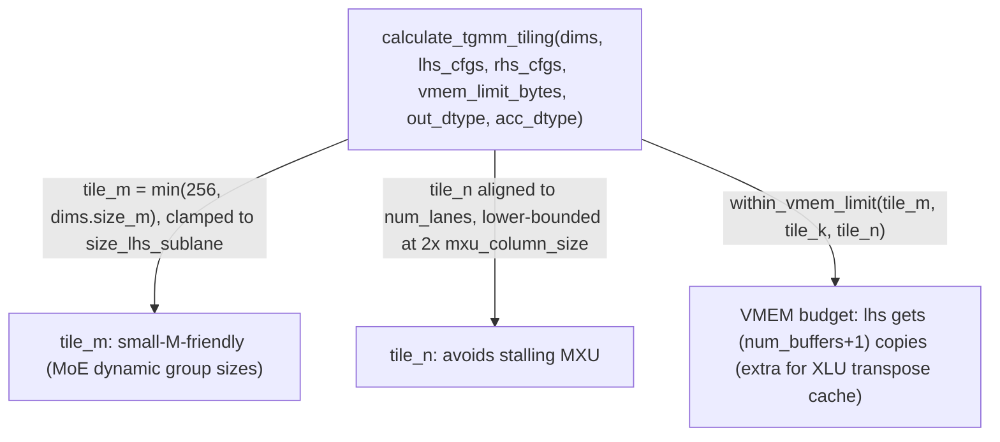

# tokamax._src.ops.ragged_dot.pallas_mosaic_tpu_v2_tgmm_kernel — TGMM (lhs.T @ dout) tiling, VMEM-budget-aware, XLU-transpose-cache-aware

## Overview

[`tgmm_v2`](../catalog/tokamax/_src/ops/ragged_dot/pallas_mosaic_tpu_v2_tgmm_kernel.md#tgmm_v2)
computes `lhs.T @ dout` (the transposed grouped matmul used for one of the MoE weight-gradient
computations — no quantization needed since it operates on activations/gradients, not weights).
[`calculate_tgmm_tiling`](../catalog/tokamax/_src/ops/ragged_dot/pallas_mosaic_tpu_v2_tgmm_kernel.md#calculate_tgmm_tiling)
derives tile sizes from a VMEM byte budget, with an extra buffer reserved specifically because
feeding `lhs` transposed into the MXU requires caching an XLU-transposed copy in VMEM.

## Diagram

## Design rationale (why it's built this way)

**`tile_m` is capped at 256 (not larger) specifically because MoE group sizes (`M`) are dynamic and
often small — going larger than 256 buys no additional throughput.** The code comment states: "the
mxu size is 256... any size less than 256 will have the same perf as using 256" — since this kernel
serves MoE's transposed gradient matmul where the per-group row count is runtime-determined and
often small, over-provisioning `tile_m` beyond the MXU's natural row-tile size would waste VMEM
without any compute benefit.

**The VMEM budget calculation reserves an extra buffer specifically for `lhs`, because computing
`lhs.T @ rhs` requires transposing `lhs` through the XLU (transpose unit) and caching that
transposed copy.** The code comment explains: "lhs cannot be fed directly into MXU and has to go
through XLU's transpose... in order to reduce redundant XLU computation... it caches the
transposed value into VMEM" — so the budget formula uses `(num_buffers + 1)` copies for `lhs` but
only `num_buffers` for `rhs`, reflecting this transpose-caching cost that's specific to computing
`lhs.T @ dout` rather than an ordinary (non-transposed) grouped matmul.

**`tile_n` has an explicit lower bound of twice the MXU column size, to avoid stalling the MXU.**
`tile_n_lower_bound = pltpu.get_tpu_info().mxu_column_size * 2` (clamped to `dims.size_n`) — the
comment frames this as adding "buffer room" so `tile_n` never shrinks small enough to leave the
MXU pipeline under-fed between tiles, trading some VMEM headroom for keeping the matmul unit
consistently busy.

## Entry points

- [`tgmm_v2`](../catalog/tokamax/_src/ops/ragged_dot/pallas_mosaic_tpu_v2_tgmm_kernel.md#tgmm_v2) —
  the top-level TGMM kernel entry point.
- [`calculate_tgmm_tiling`](../catalog/tokamax/_src/ops/ragged_dot/pallas_mosaic_tpu_v2_tgmm_kernel.md#calculate_tgmm_tiling) —
  reached to derive tile sizes from the VMEM budget and problem dimensions.
- [`make_tgmm_configs`](../catalog/tokamax/_src/ops/ragged_dot/pallas_mosaic_tpu_v2_tgmm_kernel.md#make_tgmm_configs) —
  reached to assemble full kernel configs (tiling plus other parameters) for a given call.
- [`generate_tgmm_block_specs`](../catalog/tokamax/_src/ops/ragged_dot/pallas_mosaic_tpu_v2_tgmm_kernel.md#generate_tgmm_block_specs) —
  reached to build the Pallas `BlockSpec`s from a resolved tiling.

## Mechanism (step-by-step)

1. **[`calculate_tgmm_tiling`](../catalog/tokamax/_src/ops/ragged_dot/pallas_mosaic_tpu_v2_tgmm_kernel.md#calculate_tgmm_tiling)
   computes `tile_m`** capped at 256 and floored at `dims.size_lhs_sublane`, and `tile_n`/`tile_k`
   aligned to the TPU's lane count.
2. **[`calculate_tgmm_tiling`](../catalog/tokamax/_src/ops/ragged_dot/pallas_mosaic_tpu_v2_tgmm_kernel.md#calculate_tgmm_tiling)
   searches for tile sizes satisfying `within_vmem_limit`**, whose budget formula gives `lhs` an
   extra buffer (`num_buffers + 1`) to account for XLU-transpose caching, plus reserved space for
   the zero-initialization reference.
3. **[`make_tgmm_configs`](../catalog/tokamax/_src/ops/ragged_dot/pallas_mosaic_tpu_v2_tgmm_kernel.md#make_tgmm_configs)/
   [`generate_tgmm_block_specs`](../catalog/tokamax/_src/ops/ragged_dot/pallas_mosaic_tpu_v2_tgmm_kernel.md#generate_tgmm_block_specs)
   turn the resolved tiling into concrete Pallas kernel configuration and block specs**, and
   [`tgmm_v2`](../catalog/tokamax/_src/ops/ragged_dot/pallas_mosaic_tpu_v2_tgmm_kernel.md#tgmm_v2)
   executes the kernel.

## Key data structures

- **`gmm_v2.Dimensions`/`gmm_v2.InputConfigs`/`gmm_v2.TileSizes`** — reused from
  [tokamax-_src-ops-ragged_dot-pallas_mosaic_tpu_v2_gmm_kernel](tokamax-_src-ops-ragged_dot-pallas_mosaic_tpu_v2_gmm_kernel.md),
  since TGMM shares its dimension/config vocabulary with the forward GMM kernel.

## Dynamics (design intent)

Because `tile_m` is bounded above by the MXU's natural row-tile size (256) regardless of how large
the actual (dynamic) group size `M` might be, larger MoE groups do not force this kernel into
progressively larger tiles — instead they simply iterate more `tile_m`-sized chunks, keeping VMEM
usage bounded independent of the runtime group-size distribution.

## Edge cases

- The VMEM budget calculation explicitly reserves `target_zero_ref_bytes` as an *upper bound* even
  though "the actual zero_ref size depends on out_dtype/size_k and is always ≤ this value" — the
  tiling search is conservative, potentially leaving some VMEM headroom unused in exchange for a
  simpler, safe budget calculation.

## Open questions

- How much VMEM headroom is typically left unused due to the conservative `target_zero_ref_bytes`
  upper-bound reservation (vs. computing the exact zero-ref size) is not addressed by this packet's
  cited subgraph.

## See also
- [tokamax-_src-ops-ragged_dot-pallas_mosaic_tpu_v2_gmm_kernel](tokamax-_src-ops-ragged_dot-pallas_mosaic_tpu_v2_gmm_kernel.md) —
  the forward GMM kernel this module's TGMM (transposed gradient) kernel complements, sharing
  `Dimensions`/`InputConfigs` types.
- [tokamax-_src-ops-ragged_dot-base](tokamax-_src-ops-ragged_dot-base.md) — `RaggedDot`, the base
  op whose backward pass this kernel helps implement.
