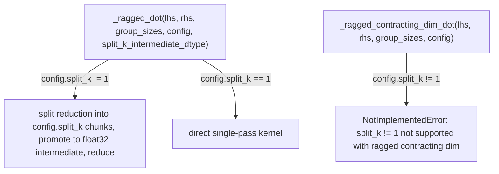

# tokamax._src.ops.ragged_dot.pallas_triton — two ragged-dot variants (ragged-M vs ragged-contracting-dim), split_k precision promotion

## Overview

This module provides two distinct Pallas-Triton ragged-dot kernels:
[`_ragged_dot`](../catalog/tokamax/_src/ops/ragged_dot/pallas_triton.md#_ragged_dot) handles the
standard case (groups along the output M dimension,
`base.DEFAULT_RAGGED_DOT_DIM_NUMS`), supporting `split_k` (splitting the reduction dimension across
multiple kernel calls with intermediate-dtype precision promotion before the final reduce), while
[`_ragged_contracting_dim_dot`](../catalog/tokamax/_src/ops/ragged_dot/pallas_triton.md#_ragged_contracting_dim_dot)
handles the case where the ragged/grouped dimension is itself the contracting (K) dimension
(`base.RAGGED_CONTRACTING_DOT_DIM_NUMS`), which explicitly does not support `split_k != 1`.

## Diagram

## Design rationale (why it's built this way)

**`_ragged_contracting_dim_dot` explicitly forbids `split_k != 1`, unlike `_ragged_dot`, because
splitting the reduction dimension conflicts with that same dimension already being ragged.**
[`_ragged_contracting_dim_dot`](../catalog/tokamax/_src/ops/ragged_dot/pallas_triton.md#_ragged_contracting_dim_dot)
raises `NotImplementedError("split_k != 1 not supported with ragged contracting dim.")` — when the
contracting (K) dimension is itself the ragged/grouped axis, further sub-splitting it for
parallelism would need to interact with group boundaries in a way this kernel doesn't implement, so
the combination is rejected outright rather than silently producing incorrect results.

**`_ragged_dot`'s `split_k` path promotes the intermediate accumulation dtype to at least float32
by default, to avoid precision loss when reducing the split partial sums.**
[`_ragged_dot`](../catalog/tokamax/_src/ops/ragged_dot/pallas_triton.md#_ragged_dot) computes
`split_k_out_dtype = jnp.result_type(out_dtype, jnp.float32)` when no explicit
`split_k_intermediate_dtype` is given — summing several partial products computed in a
lower-precision dtype (e.g. bf16) can lose precision faster than one direct low-precision
accumulation, so the default behavior deliberately widens the intermediate dtype for the final
reduce step, while still letting a caller override this via `split_k_intermediate_dtype` if a
different tradeoff is wanted.

## Entry points

- [`_ragged_dot`](../catalog/tokamax/_src/ops/ragged_dot/pallas_triton.md#_ragged_dot) — reached
  for the standard ragged-M-dimension grouped matmul.
- [`_ragged_contracting_dim_dot`](../catalog/tokamax/_src/ops/ragged_dot/pallas_triton.md#_ragged_contracting_dim_dot) —
  reached when the ragged/grouped dimension is the contracting dimension instead.

## Mechanism (step-by-step)

1. **[`_ragged_dot`](../catalog/tokamax/_src/ops/ragged_dot/pallas_triton.md#_ragged_dot) asserts
   `ragged_dot_dimension_numbers == base.DEFAULT_RAGGED_DOT_DIM_NUMS`**, then checks
   `config.split_k`.
2. **If `split_k != 1`,**
   [`_ragged_dot`](../catalog/tokamax/_src/ops/ragged_dot/pallas_triton.md#_ragged_dot) **resolves a
   widened `split_k_out_dtype`** (defaulting to at least float32) and recursively invokes itself
   per split before combining.
3. **[`_ragged_contracting_dim_dot`](../catalog/tokamax/_src/ops/ragged_dot/pallas_triton.md#_ragged_contracting_dim_dot)
   asserts `ragged_dot_dimension_numbers == base.RAGGED_CONTRACTING_DOT_DIM_NUMS`** and raises
   immediately if `config.split_k != 1`, then computes cumulative group-row offsets
   (`jnp.cumulative_sum(group_sizes, include_initial=True)`) to drive the kernel's block indexing.

## Key data structures

- **[`Config`](../catalog/tokamax/_src/ops/ragged_dot/pallas_triton.md#Config)** —
  [`block_m`](../catalog/tokamax/_src/ops/ragged_dot/pallas_triton.md#Config.block_m)/
  [`block_n`](../catalog/tokamax/_src/ops/ragged_dot/pallas_triton.md#Config.block_n)/
  [`block_k`](../catalog/tokamax/_src/ops/ragged_dot/pallas_triton.md#Config.block_k)/
  [`num_stages`](../catalog/tokamax/_src/ops/ragged_dot/pallas_triton.md#Config.num_stages)/
  [`num_warps`](../catalog/tokamax/_src/ops/ragged_dot/pallas_triton.md#Config.num_warps)/
  [`split_k`](../catalog/tokamax/_src/ops/ragged_dot/pallas_triton.md#Config.split_k).

## Dynamics (design intent)

Because the two kernels assert on mutually exclusive `ragged_dot_dimension_numbers` values, the
caller-facing dispatch (in [tokamax-_src-ops-ragged_dot-base](tokamax-_src-ops-ragged_dot-base.md))
must select the correct one based on which dimension is actually ragged — the two kernels are not
interchangeable fallbacks for each other.

## Edge cases

- [`_ragged_dot`](../catalog/tokamax/_src/ops/ragged_dot/pallas_triton.md#_ragged_dot)'s assertion
  on `ragged_dot_dimension_numbers` means passing the wrong dimension-numbers value (e.g. the
  contracting-dim variant's) to this function fails an assertion rather than silently computing an
  incorrect result.

## Open questions

- Whether the `split_k` restriction on `_ragged_contracting_dim_dot` is a fundamental limitation
  or could be lifted with additional kernel logic is not addressed by this packet's cited
  subgraph.

## See also
- [tokamax-_src-ops-ragged_dot-base](tokamax-_src-ops-ragged_dot-base.md) — `RaggedDot`, the base
  op these two kernel variants implement backends for.
