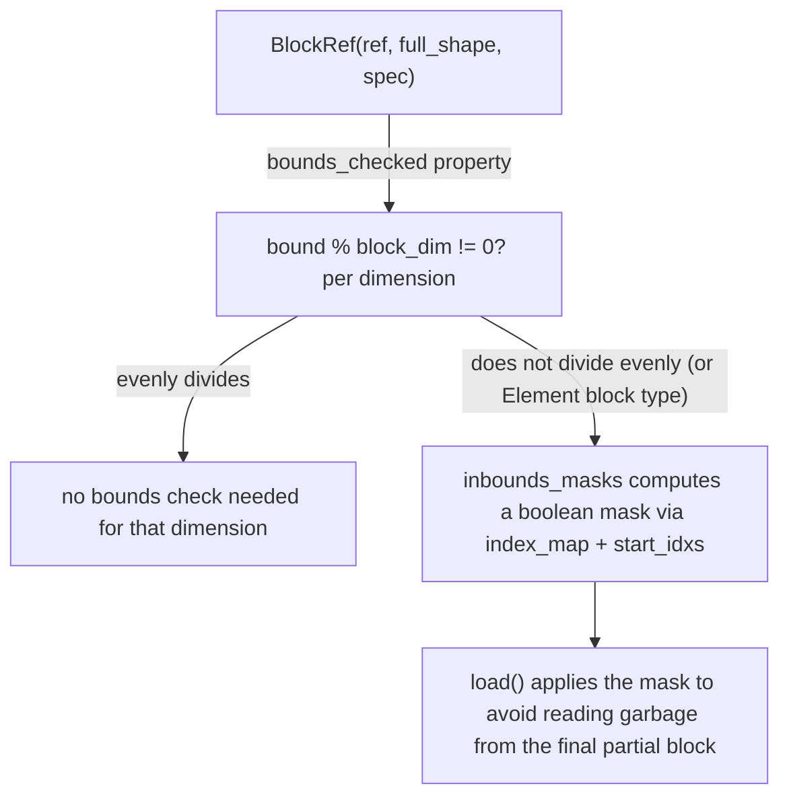

# tokamax._src.pallas.block — BlockRef, per-dimension bounds-checking skipped when block size divides evenly

## Overview

[`BlockRef`](../catalog/tokamax/_src/pallas/block.md#BlockRef) wraps a Pallas ref together with its
`BlockSpec` (via [`BlockRef.spec`](../catalog/tokamax/_src/pallas/block.md#BlockRef.spec)) and the full (unblocked) array shape,
computing per-dimension whether bounds-checking is actually needed
([`bounds_checked`](../catalog/tokamax/_src/pallas/block.md#BlockRef.bounds_checked)) and, if so,
producing in-bounds boolean masks
([`inbounds_masks`](../catalog/tokamax/_src/pallas/block.md#BlockRef.inbounds_masks)) for
[`load`](../catalog/tokamax/_src/pallas/block.md#BlockRef.load) to apply. The class's own docstring
notes a specific invariant it relies on: "the block may go out of the bounds of the referenced
array, but any user-supplied indexes are within the bounds of the block."

## Diagram

## Design rationale (why it's built this way)

**Bounds-checking is skipped entirely, per dimension, whenever the block size evenly divides the
array's bound in that dimension.**
[`BlockRef.bounds_checked`](../catalog/tokamax/_src/pallas/block.md#BlockRef.bounds_checked)
returns `(bound % dim != 0)` per dimension (or unconditionally `True` for every dimension if any
block dimension uses `pl.Element`) — when a dimension's size is an exact multiple of the block
size, every grid step's block is fully within bounds by construction, so computing and applying an
in-bounds mask would be pure overhead; the check is a compile-time (Python-level) decision based on
static shapes, so this optimization costs nothing at trace time.

**`inbounds_masks` is computed from the block spec's `index_map` applied to the *current* grid
program IDs, not derived once for the whole kernel.**
[`BlockRef.inbounds_masks`](../catalog/tokamax/_src/pallas/block.md#BlockRef.inbounds_masks) calls
`self.spec.index_map(*_pids())` to get the current block's start indices, then compares against
`full_shape` — since which grid step corresponds to the "last, partial" block depends on the
specific grid position, the mask must be recomputed relative to the current program IDs, not
cached statically.

## Entry points

- [`BlockRef.load`](../catalog/tokamax/_src/pallas/block.md#BlockRef.load) — reached to read from a
  block-mapped ref, applying in-bounds masking automatically when needed.
- [`BlockRef.inbounds_mask`](../catalog/tokamax/_src/pallas/block.md#BlockRef.inbounds_mask) /
  [`inbounds_masks`](../catalog/tokamax/_src/pallas/block.md#BlockRef.inbounds_masks) — reached to
  obtain the boolean in-bounds mask(s) directly, for callers doing custom masked operations.

## Mechanism (step-by-step)

1. **[`BlockRef.bounds_checked`](../catalog/tokamax/_src/pallas/block.md#BlockRef.bounds_checked)
   determines, per dimension, whether the array bound is evenly divisible by the block size** (or
   forces `True` for every dimension if any `pl.Element`-typed block dimension is present).
2. **[`BlockRef.inbounds_masks`](../catalog/tokamax/_src/pallas/block.md#BlockRef.inbounds_masks)
   computes the current block's start indices** via `self.spec.index_map(*_pids())`, then builds a
   boolean mask per dimension that needs checking (skipping dimensions where `dim is None` or the
   indexer is scalar).
3. **[`BlockRef.load`](../catalog/tokamax/_src/pallas/block.md#BlockRef.load) applies the computed
   mask(s)** when reading, ensuring out-of-bounds elements (from a partial final block) don't
   contribute garbage values to the result.

## Key data structures

- **[`BlockRef`](../catalog/tokamax/_src/pallas/block.md#BlockRef)** —
  [`ref`](../catalog/tokamax/_src/pallas/block.md#BlockRef.ref),
  [`full_shape`](../catalog/tokamax/_src/pallas/block.md#BlockRef.full_shape),
  [`spec`](../catalog/tokamax/_src/pallas/block.md#BlockRef.spec); exposes
  [`bounds`](../catalog/tokamax/_src/pallas/block.md#BlockRef.bounds) (visible-axes-only shape,
  distinct from `full_shape`).

## Dynamics (design intent)

Because `bounds_checked` is a static (shape-derived) property, a kernel whose block sizes evenly
divide every input's shape compiles with zero masking overhead — the exact same
[`BlockRef`](../catalog/tokamax/_src/pallas/block.md#BlockRef) API handles both the
evenly-divisible and not-evenly-divisible cases, so kernel authors don't need separate code paths
for the two situations.

## Edge cases

- [`BlockRef.bounds_checked`](../catalog/tokamax/_src/pallas/block.md#BlockRef.bounds_checked)
  asserts `self.spec.block_shape is not None` — a `BlockRef` whose spec has no explicit block
  shape cannot have its bounds-checking-necessity queried this way.
- Any [`pl.Element`](tokamax-_src-pallas-block.md)-typed block dimension forces bounds-checking
  `True` unconditionally for *every* dimension, not just the `Element`-typed one — the class
  doesn't attempt per-dimension-type-specific skipping in that case.

## Open questions

- Whether `bounds`'s distinction from `full_shape` (excluding `None`-block and `at`-sliced-out
  dimensions) has further implications for how masks combine across those excluded dimensions is
  not addressed by this packet's cited subgraph.

## See also
- [tokamax-_src-ops-attention-base](tokamax-_src-ops-attention-base.md) — `Mask`, a different
  (logical attention) masking concept, distinct from this module's physical block-boundary masking.
