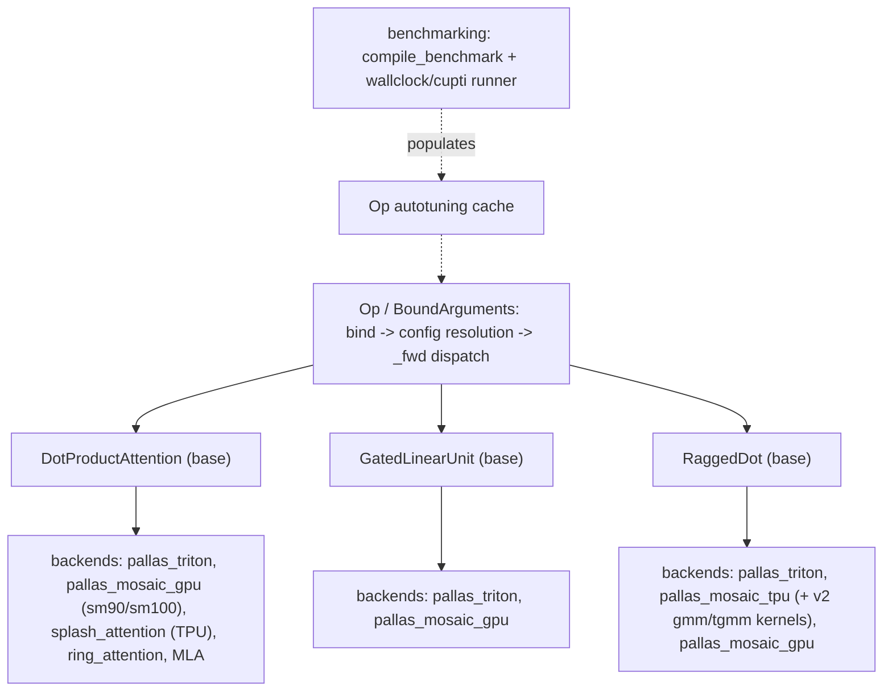

# tokamax — what it is and how it fits together

## In one paragraph

tokamax is a kernel library providing tuned Pallas (TPU/GPU/Triton) implementations of the core
transformer/MoE primitives — attention (including MLA, splash, ring, flex variants), gated linear
units, and ragged (grouped) matmul — behind one uniform [`Op`](concepts/tokamax-_src-ops-op.md)
abstraction: bind arguments, resolve a config (explicit → cached autotuning data → live autotune →
heuristics → error, in that priority order), then dispatch to a backend-specific `_fwd`. Every
kernel family repeats the same shape: a base op defining the reference XLA implementation and
argument contract, one or more backend subclasses per hardware/lowering path (TPU Mosaic, GPU
Mosaic, Triton), and a `pydantic`-validated `Config` dataclass whose constructor enforces the
tiling/hardware invariants (block-size alignment, cluster-shape limits, VMEM budgets) that would
otherwise surface as opaque compilation or runtime failures.

## Core architecture

## Main concepts

**One `Op` protocol for every kernel: bind → configure → dispatch.**
[tokamax-_src-ops-op](concepts/tokamax-_src-ops-op.md) defines the shared contract every op
(attention, GLU, ragged dot) implements — a documented, five-tier config-resolution priority chain
(explicit config, cached autotuning data, live autotune, heuristics, error) that makes the
speed-vs-correctness-vs-freshness tradeoff of config selection an explicit, callable-wide policy
rather than ad hoc per-op logic.

**`pydantic`-validated `Config` dataclasses enforce hardware invariants at construction time.**
Across [tokamax-_src-ops-attention-pallas_mosaic_gpu_common](concepts/tokamax-_src-ops-attention-pallas_mosaic_gpu_common.md),
[gated_linear_unit-pallas_mosaic_gpu_common](concepts/tokamax-_src-ops-gated_linear_unit-pallas_mosaic_gpu_common.md),
and the SM100 attention/VJP configs, block sizes must be multiples of 64, cluster dimensions are
capped and mutually constrained (at most one axis > 1), and epilogue tiles must evenly divide main
tiles — every invalid combination fails immediately at config construction, not deep inside kernel
compilation.

**Backend proliferation follows hardware generations and lowering targets, not one universal
kernel.** Attention alone has distinct kernels for SM90 (Hopper, warpgroup-fan-out via
`compute_wgs`) vs. SM100 (Blackwell, collective 2-CTA MMA via `collective`/`num_tma_splits`) vs.
Triton (base-2 `exp2` softmax) vs. TPU splash attention (block-sparse, `MaskInfo`-driven) vs. ring
attention (KV-sharded across a device ring) vs. MLA (DeepSeek-style compressed KV, ragged+paged).
Each backend shares the base op's argument contract but implements hardware-specific tiling and
pipelining.

**Splash attention compiles a lazy, composable `Mask` algebra into block-sparse `MaskInfo` runtime
metadata.** [tokamax-_src-ops-experimental-tpu-splash_attention-splash_attention_mask](concepts/tokamax-_src-ops-experimental-tpu-splash_attention-splash_attention_mask.md)'s
masks compose via `&`/`|` without materializing arrays;
[splash_attention_mask_info](concepts/tokamax-_src-ops-experimental-tpu-splash_attention-splash_attention_mask_info.md)
compiles a concrete mask into per-block metadata that lets the kernel skip fully-masked-out blocks
entirely — sparsity in the logical mask becomes a proportional reduction in actual kernel compute.
[ring_attention_kernel](concepts/tokamax-_src-ops-experimental-tpu-splash_attention-ring_attention_kernel.md)
re-slices this same `MaskInfo` per ring step for KV-sharded sequence parallelism.

**Ragged (grouped) matmul solves MoE's core kernel needs, including an autotuning-cache-key problem
unique to dynamic group sizes.** [tokamax-_src-ops-ragged_dot-base](concepts/tokamax-_src-ops-ragged_dot-base.md)'s
`GroupSizes` carries a representative (not the true, runtime-varying) group-size distribution
specifically so autotuned configs can be cached and reused across steps despite the actual group
sizes changing every step. The TPU "v2" kernels
([gmm](concepts/tokamax-_src-ops-ragged_dot-pallas_mosaic_tpu_v2_gmm_kernel.md)/
[tgmm](concepts/tokamax-_src-ops-ragged_dot-pallas_mosaic_tpu_v2_tgmm_kernel.md)) further gate
dequantization timing on the TPU's actual MXU column size, and account for XLU-transpose-caching
VMEM cost specific to the transposed-gradient kernel.

**Hardware-instruction-level micro-optimizations recur across backends: base-2 softmax
exponentials.** Both [flex_attention-pallas_triton](concepts/tokamax-_src-ops-flex_attention-pallas_triton.md)
(`use_base2`) and TPU
[splash_attention_kernel](concepts/tokamax-_src-ops-experimental-tpu-splash_attention-splash_attention_kernel.md)
(`LOG2E`) scale logits to use a faster base-2 exponential instruction instead of natural-log `exp`,
converting statistics back to natural-log units before returning them as residuals.

**Benchmarking distinguishes compile time from steady-state execution time, and offers two timing
methods with different overhead/precision tradeoffs.**
[tokamax-_src-benchmarking](concepts/tokamax-_src-benchmarking.md)'s `compile_benchmark` measures
lowering/compile time once, separately from the repeatedly-timed `runner`, which supports
`'wallclock'` (portable, Python-overhead-inclusive) and `'cupti'` (device-precise) timing.

## How a request flows

A caller invokes an op (e.g. `DotProductAttention()(q, k, v, ...)`), which binds arguments,
resolves a config via the `Op` priority chain (querying the autotuning cache, populated by
[`compile_benchmark`](concepts/tokamax-_src-benchmarking.md)-driven benchmarking runs), and
dispatches to whichever backend `_fwd` matches the current op instance (its concrete subclass
determines the hardware/lowering target). For attention specifically, this may further route
through [tokamax-_src-pallas-block](concepts/tokamax-_src-pallas-block.md)'s `BlockRef` for
partial-block boundary handling, and — for TPU splash/ring attention — through the `Mask`/
`MaskInfo` compilation pipeline for block-sparse execution.

## Map of the wiki

- **"How does config/autotuning resolution work for any op?"** →
  [tokamax-_src-ops-op](concepts/tokamax-_src-ops-op.md).
- **"Which attention backend handles which hardware/pattern?"** →
  [tokamax-_src-ops-attention-base](concepts/tokamax-_src-ops-attention-base.md) and its
  `pallas_mosaic_gpu_kernel_sm100`/`pallas_mosaic_gpu_vjp_kernel_sm90`/`pallas_triton`/
  `splash_attention_kernel`/`ring_attention_kernel`/experimental MLA sibling pages.
- **"How does MoE grouped matmul handle dynamic group sizes and quantization?"** →
  [tokamax-_src-ops-ragged_dot-base](concepts/tokamax-_src-ops-ragged_dot-base.md) and its
  `pallas_mosaic_tpu_v2_gmm_kernel`/`v2_tgmm_kernel` siblings.
- For exhaustive per-symbol lookup (signatures, call sites), see `catalog/`; for the full concept
  list with one-line summaries, see `../index.md`.
