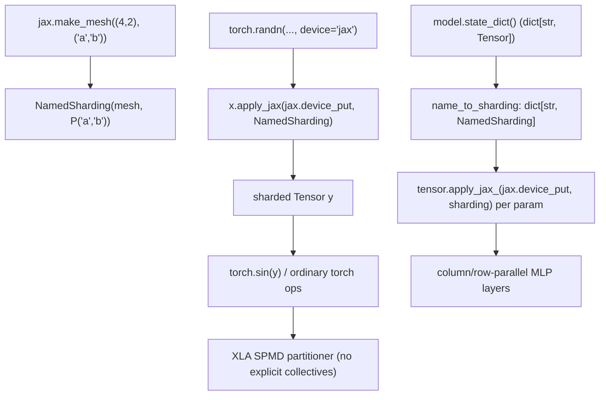

# Tutorial: distributed arrays and automatic parallelization under torchax

## Overview

`docs/docs/tutorials/distributed_array.py` is a jupytext-format worked example (adapted
line-for-line from JAX's own "Distributed arrays and automatic parallelization" tutorial) that
demonstrates torchax's core sharding story: a torchax `Tensor` (see
[torchax-tensor](torchax-tensor.md)) is, underneath, a `jax.Array`, so every JAX sharding
primitive (`Mesh`, `NamedSharding`, `PartitionSpec`, `jax.device_put`) applies to it directly,
and ordinary `torch`-level computation over a sharded tensor such as
[`y`](../catalog/docs/docs/tutorials/distributed_array.md#y) is automatically parallelized by
XLA's SPMD partitioner — no explicit collective ops need to appear in the model code. The
tutorial progressively builds up from single-axis batch parallelism to a genuine 2D (batch ×
model/tensor) mesh applied per-parameter to an MLP.

> [!inferred] `Tensor.apply_jax`/`apply_jax_` (defined in [torchax-tensor](torchax-tensor.md),
> outside this tutorial file's own symbol table) are the mechanism this tutorial relies on to
> call `jax.device_put` on a torchax tensor's inner array — not a symbol this packet's subgraph
> covers directly, so it is not cited as a catalog link here.

## Diagram

## Design rationale (why it's built this way)

**Sharding is applied via `.apply_jax`/`.apply_jax_`, not a torchax-specific sharding API.**
The tutorial repeatedly calls `.apply_jax`/`.apply_jax_` on values like
[`y`](../catalog/docs/docs/tutorials/distributed_array.md#y) and
[`w`](../catalog/docs/docs/tutorials/distributed_array.md#w) to invoke `jax.device_put` directly
on the tensor's inner array (see [torchax-tensor](torchax-tensor.md) for that method's
definition). This is a deliberate minimalism: torchax does not wrap `NamedSharding`/`Mesh`/
`PartitionSpec` in torch-flavored equivalents — it exposes the raw JAX primitives and lets
`Tensor.apply_jax` be the single seam where any JAX transform (sharding or otherwise) can be
applied to the wrapped array without a bespoke torchax API surface per JAX feature.

**`torch_view` lifts a JAX debug/visualization utility into a torch-callable for free.** The
tutorial does `visualize_array_sharding = tx.interop.torch_view(jax.debug.visualize_array_sharding)`
— a direct, unremarkable-looking application of
[`torch_view`](torchax-interop.md)'s tree-map machinery, but notable because it shows
`torch_view`/`jax_view` are meant to be applied to *arbitrary* JAX functions, not just ones
defined inside torchax itself — any JAX ecosystem function becomes usable from torch-land this
way.

**Per-parameter sharding dicts are the natural tensor-parallel pattern.** In the 4×2 mesh section,
`name_to_sharding` maps each `state_dict()` key (`'layers.0.weight'`, `'layers.1.weight'`, ...)
to a distinct `NamedSharding` — column-parallel for one layer (`P('model')` on the output dim),
row-parallel for the next (`P(None, 'model')` on the input dim), replicated for the rest — the
classic alternating column/row tensor-parallel MLP pattern, expressed purely as a per-name
sharding assignment loop (`tensor.apply_jax_(jax.device_put, name_to_sharding[name])`) with zero
changes to the model's forward-pass code.

## Entry points

- [`y`](../catalog/docs/docs/tutorials/distributed_array.md#y) — the first sharded tensor,
  built from `mesh` and `x` via `x.apply_jax(jax.device_put, NamedSharding(mesh, P('x', 'y')))`;
  every subsequent sharding demonstration follows this same shape.
- [`visualize_array_sharding`](../catalog/docs/docs/tutorials/distributed_array.md#visualize_array_sharding) —
  the `torch_view`-wrapped JAX debug utility; called repeatedly throughout as the way to *see*
  what a sharding decision actually did to data placement.
- [`params`](../catalog/docs/docs/tutorials/distributed_array.md#params) — the model's
  `state_dict()`; the entry point for the per-parameter tensor-parallel sharding assignment
  (via [`name_to_sharding`](../catalog/docs/docs/tutorials/distributed_array.md#name_to_sharding))
  later in the tutorial.
- [`grad_fn_jit`](../catalog/docs/docs/tutorials/distributed_array.md#grad_fn_jit) /
  [`opt_state`](../catalog/docs/docs/tutorials/distributed_array.md#opt_state) /
  [`updates`](../catalog/docs/docs/tutorials/distributed_array.md#updates) — where the
  tutorial's closing training loop runs an actual `optax` step over sharded `params`/`batch`,
  showing gradient computation and optimizer update also respect mesh sharding transparently.

## Mechanism (step-by-step)

1. **Single-device baseline.** [`x`](../catalog/docs/docs/tutorials/distributed_array.md#x) is a
   `torch.randn((8192, 8192), device='jax')` — an unsharded tensor (all data on one device);
   [`visualize_array_sharding`](../catalog/docs/docs/tutorials/distributed_array.md#visualize_array_sharding)
   shows this visually as one solid block.
2. **Explicit 2D sharding.** [`mesh`](../catalog/docs/docs/tutorials/distributed_array.md#mesh)
   (`jax.make_mesh((4, 2), ('x', 'y'))`) declares a hardware mesh with two named axes;
   [`y`](../catalog/docs/docs/tutorials/distributed_array.md#y)`.apply_jax(jax.device_put,
   NamedSharding(mesh, P('x', 'y')))` shards `x`'s two array dimensions across the two mesh axes
   respectively, and [`sharding2`](../catalog/docs/docs/tutorials/distributed_array.md#sharding2)/
   `z` repeat the pattern with `P('a', None)` / `P(None, 'b')` variants to show partial-axis and
   replicated sharding.
3. **Automatic parallel compute.** [`z`](../catalog/docs/docs/tutorials/distributed_array.md#z)
   `= torch.sin(y)` — an ordinary torch elementwise op — runs with no explicit sharding
   annotation on the output; JAX/XLA infers that the output should keep the same sharding as the
   input for an elementwise op and executes locally per-shard with no cross-device communication,
   which the tutorial demonstrates by timing `torch.sin(x)` (single-device) against `torch.sin(y)`
   (8-way sharded).
4. **Data-parallel training loop.** With a `(8,)`-shaped
   [`mesh`](../catalog/docs/docs/tutorials/distributed_array.md#mesh) over axis `'batch'`,
   the batch is sharded along that axis while
   [`params`](../catalog/docs/docs/tutorials/distributed_array.md#params) is fully replicated
   via [`replicated_sharding`](../catalog/docs/docs/tutorials/distributed_array.md#replicated_sharding)
   (both applied through the same `torch_view`-wrapped `jax.device_put`, which accepts whole
   pytrees of tensors at once). [`grad_fn_jit`](../catalog/docs/docs/tutorials/distributed_array.md#grad_fn_jit)
   (built from [`loss_fun`](../catalog/docs/docs/tutorials/distributed_array.md#loss_fun)) is
   then called in a plain Python loop together with `optax.sgd`, updating
   [`opt_state`](../catalog/docs/docs/tutorials/distributed_array.md#opt_state) and producing
   [`grads`](../catalog/docs/docs/tutorials/distributed_array.md#grads)/
   [`loss`](../catalog/docs/docs/tutorials/distributed_array.md#loss) every
   [`i`](../catalog/docs/docs/tutorials/distributed_array.md#i)-th step, all sharded
   automatically.
5. **Tensor-parallel extension.** Moving to a `(4, 2)` mesh with axes `('batch', 'model')`, the
   tutorial builds [`name_to_sharding`](../catalog/docs/docs/tutorials/distributed_array.md#name_to_sharding)
   per parameter name and applies it per-tensor, demonstrating 2D parallelism (data-parallel
   across `'batch'`, tensor/model-parallel across `'model'`) composed on top of the same
   unmodified [`model`](../catalog/docs/docs/tutorials/distributed_array.md#model) forward pass
   and training-loop code from the 1D case — including a single-device comparison via
   [`params_single`](../catalog/docs/docs/tutorials/distributed_array.md#params_single) for
   baseline timing.

## Key data structures

- **`Mesh` / `NamedSharding` / `PartitionSpec` (`P`)** — pure JAX types, used completely
  unmodified; torchax contributes no sharding-specific types of its own.
- **`name_to_sharding: dict[str, NamedSharding]`** — the tutorial's own convention for
  expressing a full tensor-parallel sharding plan as a flat mapping keyed by `state_dict()` name
  — a pattern directly transferable to any real torchax model's parallelism plan.

## Dynamics (design intent)

The tutorial's `%timeit` comparisons (`torch.sin(x)` vs `torch.sin(y)`) are the intended
performance takeaway: sharding a value across devices lets a subsequent elementwise op execute
in parallel across those devices, and the whole point of the exercise is that *no torchax-level
code changes* are needed to go from single-device to N-way sharded execution — only the
`jax.device_put`/`NamedSharding` call at data-construction time changes.

## Edge cases

- The notebook explicitly requires ≥8 devices to run for real (`if len(jax.local_devices()) < 8:
  raise Exception(...)`), or simulated CPU devices via `jax.config.update('jax_num_cpu_devices',
  8)` — a reader trying to replay this on a single-accelerator machine needs the CPU-simulation
  path.
- `P('a', None)` and `P('a')` are documented as equivalent (trailing `None`s can be omitted) —
  a notational subtlety worth remembering when reading or writing sharding specs.

## Open questions

- The tutorial does not show what happens under `jax.jit` tracing when a sharding assignment
  changes between calls (e.g. re-sharding params mid-training) — whether that forces
  recompilation is left to the reader's assumed JAX background knowledge.

## See also
- [torchax-tensor](torchax-tensor.md) — `Tensor.apply_jax`, the
  mechanism this entire tutorial is built on.
- [torchax-interop](torchax-interop.md) — `torch_view`/`jax_view`/
  `jax_value_and_grad`/`jax_jit`, used throughout the training-loop portion.
- [Tutorial: training a PyTorch model with a JAX train loop](docs-docs-tutorials-trainingyt.md) —
  the companion tutorial this one's closing training loop mirrors.
