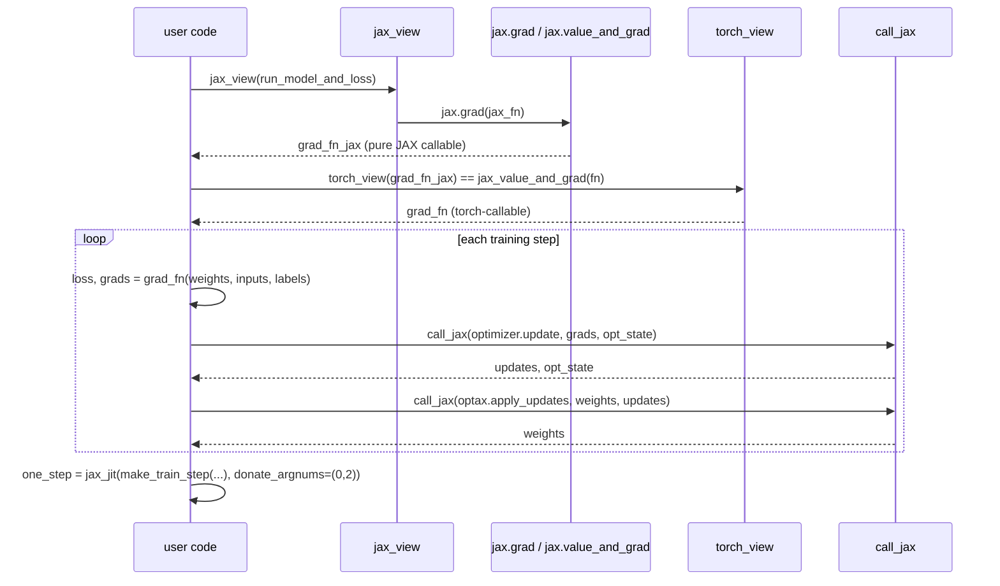

# Tutorial: training a PyTorch model with a JAX train loop

## Overview

`docs/docs/tutorials/trainingyt.py` (adapted from PyTorch's own "Training with PyTorch"
tutorial) keeps an ordinary PyTorch model definition and data pipeline unchanged, but replaces
the `loss.backward()` + `optimizer.step()` idiom with a JAX-native train step:
`jax.grad`/`jax.value_and_grad` for the gradient and `optax` for the update. It is the clearest
worked example in the repo of *why* [torchax-interop](torchax-interop.md) exists — it walks the
reader from "manually call `jax_view` and `jax.grad`" up to the two production shortcuts
[`jax_value_and_grad`](../catalog/torchax/interop.md#jax_value_and_grad) and
[`make_train_step`](../catalog/torchax/train.md#make_train_step), ending with a fully-`jax.jit`'d
step function with buffer donation enabled.

## Diagram

## Design rationale (why it's built this way)

**The model definition is untouched; only the training step changes.** The
[`GarmentClassifier`](../catalog/docs/docs/tutorials/trainingyt.md#GarmentClassifier) (a small
CNN) is written as an ordinary `torch.nn.Module` and moved to the JAX device the standard
torchax way; [`model`](../catalog/docs/docs/tutorials/trainingyt.md#model) is called directly to
sanity-check a forward pass before any JAX transform enters the picture. This isolates the
tutorial's teaching point — swapping the *optimizer loop*, not the *model* — mirroring the
project's actual porting story: existing PyTorch model code should not need rewriting to benefit
from JAX's transforms.

**The tutorial deliberately walks a three-rung ladder of abstraction, not straight to the final
form.** Rung 1: raw `jax_view`+`jax.grad`+manual `torch_view` on
[`run_model_and_loss`](../catalog/docs/docs/tutorials/trainingyt.md#run_model_and_loss). Rung 2:
the same pattern packaged as [`jax_value_and_grad`](../catalog/torchax/interop.md#jax_value_and_grad),
used to build [`grad_fn`](../catalog/docs/docs/tutorials/trainingyt.md#grad_fn) directly from the
torch-level loss function. Rung 3: the whole grad+update+apply sequence replaced by
[`make_train_step`](../catalog/torchax/train.md#make_train_step), itself wrapped in
[`jax_jit`](../catalog/torchax/interop.md#jax_view) with `donate_argnums=(0, 2)`. Each rung
removes boilerplate the previous rung made visible — a deliberate pedagogical progression from
"see the mechanism" to "use the production shortcut".

**`make_train_step` separates trainable weights from buffers so `jax.jit`'s gradient argument
convention lines up.** The tutorial's `model_fn(weights, buffers, data)` signature (calling
`torch.func.functional_call(model, (weights, buffers), data)`) exists specifically because — per
the tutorial's own comment — "`jax.jit` will compute gradients wrt the first arg", so trainable
and non-trainable state must be separated *before* handing the function to
[`make_train_step`](../catalog/torchax/train.md#make_train_step), which itself builds
`grad_fn = interop.jax_value_and_grad(loss)` and differentiates only through `weights`.

**Buffer donation is opt-in and explicit.** The final
[`one_step`](../catalog/docs/docs/tutorials/trainingyt.md#one_step) is built via
`torchax.interop.jax_jit(one_step, kwargs_for_jax_jit={'donate_argnums': (0, 2)})` — donating
argument positions 0 (`weights`) and 2 (`opt_state`) so XLA can perform in-place buffer reuse
for the two large, every-step-mutated pytrees instead of allocating fresh output buffers each
step. This is a direct, tutorial-demonstrated TPU memory/perf lever available to any torchax
training loop built on [`make_train_step`](../catalog/torchax/train.md#make_train_step).

> [!inferred] `torchax/train.py`'s `remat = torch_view(jax.remat)` and `ScannedModule` (which
> wraps `jax.lax.scan` over stacked per-layer weights with `interop.gradient_checkpoint` applied
> per-layer) are not exercised by this specific tutorial file but live in the same module as
> `make_train_step`, cited here for context — they are the natural next step for a
> transformer-stack model wanting scan-over-layers with rematerialization, both built from the
> same `torch_view`/`jax_value_and_grad`/`call_jax` primitives this tutorial teaches.

## Entry points

- [`model`](../catalog/docs/docs/tutorials/trainingyt.md#model) — the plain
  [`GarmentClassifier`](../catalog/docs/docs/tutorials/trainingyt.md#GarmentClassifier)
  instance; where the tutorial's "keep the model unchanged" claim is demonstrated.
- [`run_model_and_loss`](../catalog/docs/docs/tutorials/trainingyt.md#run_model_and_loss) — the
  torch-level pure function first passed through
  [`jax_view`](../catalog/torchax/interop.md#jax_view) then `jax.grad`, showing the manual
  version of the bridge before [`jax_value_and_grad`](../catalog/torchax/interop.md#jax_value_and_grad)
  is introduced.
- [`train_one_epoch`](../catalog/docs/docs/tutorials/trainingyt.md#train_one_epoch) — the
  actual training loop body; iterates `training_loader`, moves each batch `.to('jax')`, and
  calls [`grad_fn`](../catalog/docs/docs/tutorials/trainingyt.md#grad_fn) then
  [`call_jax`](../catalog/torchax/interop.md#call_jax) for the optimizer update/apply steps.
- [`make_train_step`](../catalog/torchax/train.md#make_train_step) — the library-provided
  shortcut the tutorial graduates to; called with `model_fn`, `loss_fn`, and the `optax`
  optimizer to produce a single `step` closure.
- [`one_step`](../catalog/docs/docs/tutorials/trainingyt.md#one_step) — the final,
  `jax.jit`-wrapped, donation-enabled training step the tutorial ends on.

## Mechanism (step-by-step)

1. **Model and data stay in torch/torchvision idiom.** [`training_loader`](../catalog/docs/docs/tutorials/trainingyt.md#training_loader)
   yields ordinary batches; [`images`](../catalog/docs/docs/tutorials/trainingyt.md#images)/
   [`dummy_labels`](../catalog/docs/docs/tutorials/trainingyt.md#dummy_labels) are moved onto the
   JAX device only where needed, after [`enable_globally`](../catalog/torchax/__init__.md#enable_globally)
   has been called once at setup.
2. **Manual bridge.** `grad_fn_jax = jax.grad(jax_view(run_model_and_loss))` converts the
   torch-callable [`run_model_and_loss`](../catalog/docs/docs/tutorials/trainingyt.md#run_model_and_loss)
   into a JAX-callable via [`jax_view`](../catalog/torchax/interop.md#jax_view) (which itself
   uses [`_jax_view`](../catalog/torchax/interop.md#_jax_view)'s tree-map, wrapping tensor leaves
   via [`Tensor`](../catalog/torchax/tensor.md#Tensor)'s underlying array), then differentiates
   with plain `jax.grad`.
3. **Packaged bridge.** [`grad_fn`](../catalog/docs/docs/tutorials/trainingyt.md#grad_fn) is
   built directly as `torchax.interop.jax_value_and_grad(run_model_and_loss)` — the same
   `jax_view`→transform→`torch_view` sandwich, but as one call.
4. **The loop body.** [`train_one_epoch`](../catalog/docs/docs/tutorials/trainingyt.md#train_one_epoch)
   calls `loss, gradients = grad_fn(weights, inputs, labels)`, then
   [`call_jax`](../catalog/torchax/interop.md#call_jax)`(optimizer.update, gradients,
   opt_state)` and `call_jax(optax.apply_updates, weights, updates)` — each `call_jax` invocation
   converts its torch-land arguments to JAX via [`jax_view`](../catalog/torchax/interop.md#jax_view),
   calls the (pure-JAX) `optax` function, and converts the result back via
   [`torch_view`](../catalog/torchax/interop.md#torch_view).
5. **Graduating to `make_train_step`.** The tutorial redefines the model call as
   `model_fn(weights, buffers, data)` and passes it, together with `loss_fn` and the `optax`
   optimizer object, to [`make_train_step`](../catalog/torchax/train.md#make_train_step), which
   internally builds its own `grad_fn` via `interop.jax_value_and_grad` and returns a `step`
   closure computing `(loss, weights, opt_state)` in one call — collapsing steps 3-4 above into a
   single library-provided function.
6. **Final compilation with donation.** `one_step = torchax.interop.jax_jit(one_step,
   kwargs_for_jax_jit={'donate_argnums': (0, 2)})` wraps the whole step in `jax.jit`
   (via [`wrap_jax_jit`](../catalog/torchax/interop.md#wrap_jax_jit)), marking the `weights` and
   `opt_state` arguments as donatable so XLA can reuse their buffers in place across the
   `training_loader` iteration instead of allocating fresh outputs every step.

## Key data structures

- **[`Environment`](../catalog/torchax/tensor.md#Environment)** — implicitly underlies every
  torch op in this tutorial once [`enable_globally`](../catalog/torchax/__init__.md#enable_globally)
  is called; its [`_dispatch_mode`](../catalog/torchax/tensor.md#Environment._dispatch_mode)/
  [`_function_mode`](../catalog/torchax/tensor.md#Environment._function_mode)
  ([`XLADispatchMode`](../catalog/torchax/tensor.md#XLADispatchMode)/
  [`XLAFunctionMode`](../catalog/torchax/tensor.md#XLAFunctionMode)) are what actually intercept
  every `torch.*` call the tutorial makes and route it through torchax.
- **`opt_state`** — the `optax` optimizer state pytree, threaded through
  [`train_one_epoch`](../catalog/docs/docs/tutorials/trainingyt.md#train_one_epoch) as a global,
  updated every step by `call_jax(optimizer.update, ...)`.
- **`weights` vs. `buffers`** — the tutorial's split of trainable vs. non-trainable state,
  required by [`make_train_step`](../catalog/torchax/train.md#make_train_step)'s calling
  convention so gradient-taking differentiates only through the intended argument.

## Dynamics (design intent)

The progression from step 2 to step 6 above is entirely about *compilation boundary placement*:
step 2's `jax.grad` is not jitted at all (every call re-traces), step 4's loop calls `grad_fn`
un-jitted each iteration, and only step 6 wraps the *entire* step (gradient + optimizer update +
apply) in one `jax.jit` call with donation — the tutorial's implicit performance argument is that
collapsing more of the step into one jitted, donation-aware call is strictly better for a real
training loop, and the manual/un-jitted forms exist purely to build intuition first.

## Edge cases

- `train_one_epoch`'s early-exit `if i > 2000: break` is explicitly commented "NOTE: make it run
  faster for CI" — this tutorial's loop bound is a CI-speed accommodation, not a meaningful
  epoch-length choice to imitate.
- `make_train_step`'s own docstring documents that `weights`/`buffers` inputs are pytrees and
  `model_fn`'s calling convention must match exactly `Callable[weights, buffers, args] ->
  result`, or [`jax_value_and_grad`](../catalog/torchax/interop.md#jax_value_and_grad)
  differentiates the wrong argument.
- `torchax.train`'s own `# TODO: apply jax.jit so the user don't have to` (on `make_train_step`
  itself, in the source) confirms the tutorial's final manual `jax_jit(...)` wrapping step is
  presently required — `make_train_step`'s returned `step` is not pre-jitted.

## Open questions

- The tutorial does not profile or compare step time/memory before vs. after adding
  `donate_argnums` — the perf claim is asserted, not measured, in this file.
- Whether `remat`/`ScannedModule` from the same `torchax.train` module are meant to compose
  directly with `make_train_step`'s `step` function (e.g. scanned-layer models needing a
  different `model_fn` shape) is not demonstrated by this tutorial.

## See also
- [torchax-interop](torchax-interop.md) — `jax_view`/`torch_view`/`call_jax`/`jax_value_and_grad`/
  `jax_jit`, the full bridge this tutorial exercises end to end.
- [torchax-tensor](torchax-tensor.md) — `Environment`, `Tensor`, and the dispatch-mode machinery
  underlying every torch op call in the tutorial.
- [Tutorial: distributed arrays and automatic parallelization](docs-docs-tutorials-distributed_array.md) —
  the companion tutorial whose closing training loop mirrors this one's rungs 2-4.
