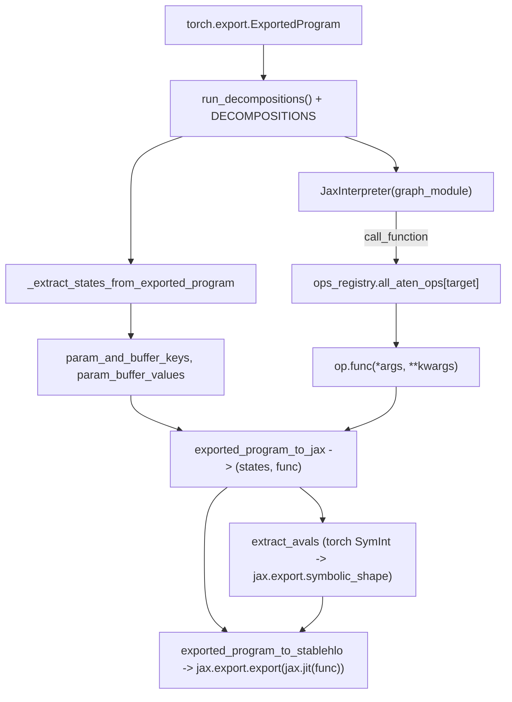

# torchax.export — torch.export to JAX and StableHLO

## Overview

This module is a *second*, independent bridge from torch to JAX — distinct from the live
dispatch-mode bridge in [torchax-tensor](torchax-tensor.md)/[torchax-interop](torchax-interop.md).
It consumes an already-`torch.export`-traced `ExportedProgram` (an FX graph, not live eager
execution) and replays that graph's nodes through the *same* op registry
([`ops_registry.all_aten_ops`](torchax-ops-ops_registry.md#all_aten_ops)) via a custom
[`torch.fx.Interpreter`](../catalog/torchax/export.md#JaxInterpreter) subclass, then optionally
uses `jax.export` to lower the resulting JAX function all the way to StableHLO. This is the
ahead-of-time / graph-capture path (used for serialization, cross-framework export, or dynamic
shape handling), as opposed to the online JIT-on-every-call path in
[torchax-interop](torchax-interop.md).

## Diagram

## Design rationale (why it's built this way)

**Reuses the live-dispatch op registry rather than a separate export-specific lowering table.**
[`JaxInterpreter.call_function`](../catalog/torchax/export.md#JaxInterpreter.call_function)
looks the FX node's `target` up directly in `ops_registry.all_aten_ops` (falling back to
`target.overloadpacket` if the exact overload isn't registered) and asserts `op.is_jax_function`
before calling `op.func(*args, **kwargs)` — the same lowering functions from
[torchax-ops-jaten](torchax-ops-jaten.md) that live dispatch uses are replayed here directly on
plain values (no `Tensor`/`View` wrapper involved, since FX interpretation operates on the
traced graph's plain tensor/array values). This means any correctness fix or perf change to a
`jaten` lowering automatically applies to both the live-eager path and the export path — there is
exactly one lowering per op, reused by two different execution engines.

**Decompositions are applied twice, deliberately.** [`exported_program_to_jax`](../catalog/torchax/export.md#exported_program_to_jax)
calls `exported_program.run_decompositions()` (torch's own default decomposition set) *and then*
`run_decompositions(decompositions.DECOMPOSITIONS)` (torchax's own decomposition table) — the
first pass gets the graph into a canonical ATen form torch itself considers "core", the second
pass further decomposes any op torchax specifically chooses not to lower directly (mirroring the
`self._decomps` fallback in [`Environment._get_op_or_decomp`](torchax-tensor.md#Environment._get_op_or_decomp)).
This two-tier decomposition strategy keeps [torchax-ops-jaten](torchax-ops-jaten.md)'s
op-coverage surface smaller than the full ATen opset.

**Symbolic shapes are threaded through by name, not by SymInt identity.**
[`extract_avals`](../catalog/torchax/export.md#extract_avals) builds a `symbolic_shapes` dict
keyed by the *string name* of each torch `SymInt` (`str(sym)`), separately handling free
symbol-variables before symbol-expressions (`s0*2` derived from `s0`) so that expressions can
share the same `jax.export.symbolic_shape` scope as their underlying variable — the code
comments explicitly flag this ordering constraint ("Populate symbol variables before
expressions... Expressions can only be integer computations on symbol variables"). This is the
one place in torchax that has to reconcile two different dynamic-shape representations
(`torch.export`'s `ValueRanges`/`SymInt` vs. JAX's `symbolic_shape` + scope).

## Entry points

- [`exported_program_to_jax`](../catalog/torchax/export.md#exported_program_to_jax) — the
  primary entry point; takes a `torch.export`-produced `ExportedProgram` and returns
  `(states, func)` where `func(states, inputs)` is a plain JAX-callable.
- [`exported_program_to_stablehlo`](../catalog/torchax/export.md#exported_program_to_stablehlo) —
  builds on the above; documented as "Replacement for
  `torch_xla.stablehlo.exported_program_to_stablehlo`" — the explicit design goal of drop-in
  compatibility with the `torch_xla` StableHLO-export API, but implemented via JAX's own export
  machinery instead of XLA's PjRt client directly.
- [`extract_avals`](../catalog/torchax/export.md#extract_avals) — reached whenever dynamic
  (symbolic) input shapes need to be converted into `jax.ShapeDtypeStruct`/`symbolic_shape`
  form before calling `jax.export.export`.
- [`JaxInterpreter.call_function`](../catalog/torchax/export.md#JaxInterpreter.call_function) —
  where control reaches for *every* FX graph node during interpretation; the actual per-op
  execution point.

## Mechanism (step-by-step)

1. **Decomposition.** [`exported_program_to_jax`](../catalog/torchax/export.md#exported_program_to_jax)
   runs the exported program's default decompositions, then torchax's own
   [`DECOMPOSITIONS`](../catalog/torchax/decompositions.md#DECOMPOSITIONS) table, canonicalizing
   the FX graph to ops `jaten` actually covers.
2. **State extraction.** [`_extract_states_from_exported_program`](../catalog/torchax/export.md#_extract_states_from_exported_program)
   reads `graph_signature.parameters`/`.buffers` (plus `constants` and, if present,
   `lifted_tensor_constants`) to build the ordered list of weight *keys* and *values* the graph
   expects as its first N inputs.
3. **Interpretation setup.** A [`JaxInterpreter`](../catalog/torchax/export.md#JaxInterpreter)
   wraps `exported_program.graph_module`; its overridden
   [`call_function`](../catalog/torchax/export.md#JaxInterpreter.call_function) intercepts every
   ATen call node, looks it up in the shared registry, and executes the corresponding `jaten`/
   `jtorch` lowering directly on the (already-JAX) values flowing through the FX graph.
4. **The returned [`func`](../catalog/torchax/export.md#exported_program_to_jax.func)`(states,
   inputs)`** flattens `inputs` via `pytree.tree_flatten`, runs the interpreter over `*states,
   *args`, and strips off the leading `num_mutations` outputs (buffer-mutation results the ATen
   calling convention prepends) before returning the real outputs.
5. **For StableHLO export**, [`extract_avals`](../catalog/torchax/export.md#extract_avals)
   converts each graph placeholder's metadata (`tensor_meta.shape`/`.dtype`, resolving any
   `SymInt` through the `symbolic_shapes` map built from `range_constraints`) into a
   `jax.ShapeDtypeStruct`, and
   [`exported_program_to_stablehlo`](../catalog/torchax/export.md#exported_program_to_stablehlo)
   calls `jax.export.export(jax.jit(func))(weights, (jax_avals,))` to produce the final
   StableHLO module.

## Key data structures

- **[`JaxInterpreter`](../catalog/torchax/export.md#JaxInterpreter)** — an `Experimental.`
  (per its own docstring) `torch.fx.Interpreter` subclass; the only stateful object in this
  module, and only for the duration of one interpretation pass.
- **`symbolic_shapes: dict[str, jax.export.SymbolicScope-bound shape]`** — the name-keyed map
  bridging torch `SymInt` names to JAX symbolic shape objects, built once per
  `extract_avals` call.

## Dynamics (design intent)

Because `call_function` asserts `op.is_jax_function` (`assert op.is_jax_function, op`), any ATen
op registered in `jaten`/`jtorch` with `is_jax_function=False` (e.g. ops that need to re-enter
torch dispatch, like `_sdpa_reference`-backed [`scaled_dot_product_attention`](torchax-ops-jtorch.md#scaled_dot_product_attention))
would fail this assertion if hit via the export/FX-interpretation path rather than the live
dispatch path — the two execution engines are not fully interchangeable for every registered op.

## Edge cases

- `_extract_states_from_exported_program` only appends `lifted_tensor_constants` values if
  `hasattr(exported_program.graph_signature, "lifted_tensor_constants")` — a version-compatibility
  guard for older `torch.export` outputs that don't have this field.
- `exported_program_to_jax` only runs `run_decompositions()` `if torch.__version__ >= "2.2"` —
  the module explicitly documents that "torch version 2.1 didn't expose this yet", so behavior
  differs across torch versions in a way not visible from the export API surface alone.
- `DEBUG` is a plain module-level constant (not a config flag threaded from
  [`Environment`](torchax-tensor.md#Environment)) — toggling verbose interpreter tracing requires
  editing this file directly, not a runtime configuration call.

## Open questions

- Whether `JaxInterpreter`'s "Experimental." docstring signals it is not yet recommended for
  production export use, or is simply an artifact of an earlier development stage, is not stated
  further in this file.
- The relationship between this export path and torchax's `compile(..., options.mode="export")`
  (declared but raising `RuntimeError("dynamo mode is not supported yet")`/`"export mode is not
  supported yet"` in [torchax](torchax.md#Edge%20cases)) is unclear — this module's
  functionality appears to be the intended implementation behind that unfinished `compile` mode,
  but they are not wired together in the code seen here.

## See also
- [torchax](torchax.md) — `compile`'s stubbed `mode="export"`, which this module plausibly backs.
- [torchax-ops-ops_registry](torchax-ops-ops_registry.md) — the shared `all_aten_ops` registry
  this module's interpreter reads from.
- [torchax-interop](torchax-interop.md) — the live, jit-per-call bridge this module contrasts
  with (ahead-of-time graph capture vs. online dispatch).
