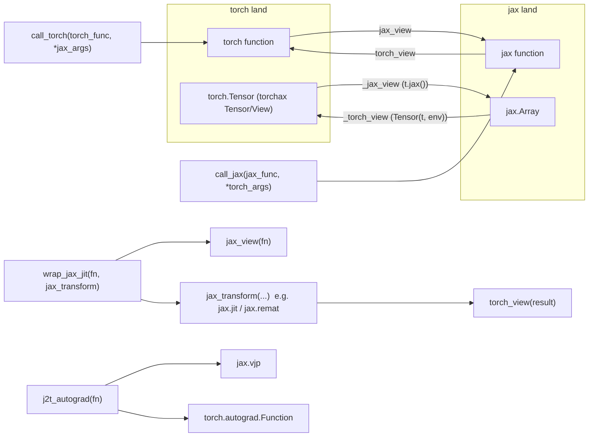

# torchax.interop — the torch↔JAX calling-convention bridge

## Overview

If [torchax-tensor](torchax-tensor.md) is *how* an op executes as JAX under the hood, this
module is *how a user crosses the boundary on purpose*: taking a `torch.nn.Module`/function and
handing it, or a piece of it, to `jax.jit`/`jax.grad`/`jax.checkpoint`/`shard_map` as if it were
a native JAX function, and vice versa. The two symmetric tree-map transforms
[`torch_view`](../catalog/torchax/interop.md#torch_view) and
[`jax_view`](../catalog/torchax/interop.md#jax_view) do the actual value/callable rewriting;
[`call_jax`](../catalog/torchax/interop.md#call_jax)/[`call_torch`](../catalog/torchax/interop.md#call_torch)
are their one-shot, immediate-call counterparts; [`wrap_jax_jit`](../catalog/torchax/interop.md#wrap_jax_jit)
is the generic "apply any JAX transform to torch code" primitive that
[`remat`](../catalog/torchax/train.md#remat)/[`mark_sharding`](../catalog/torchax/train.md#mark_sharding)
in `torchax.train` are built from; and [`j2t_autograd`](../catalog/torchax/interop.md#j2t_autograd)
is the one non-trivial piece — bridging JAX's `vjp`-based autodiff into PyTorch's
`torch.autograd.Function` protocol.

## Diagram

## Design rationale (why it's built this way)

**A tree-map, not a per-call wrapper, is the unit of translation.** Both
[`torch_view`](../catalog/torchax/interop.md#torch_view) and
[`jax_view`](../catalog/torchax/interop.md#jax_view) recurse through arbitrary nested containers
via pytree, converting `jax.Array`↔`torch.Tensor` leaves (through
[`_jax_view`](../catalog/torchax/interop.md#_jax_view)/[`_torch_view`](../catalog/torchax/interop.md#_torch_view))
and, critically, also converting *callables* — wrapping them in
[`call_jax`](../catalog/torchax/interop.md#call_jax)/[`call_torch`](../catalog/torchax/interop.md#call_torch).
Treating a callable as a tree leaf that itself needs conversion is what makes
`torch_view(jax.debug.visualize_array_sharding)` (used directly in the
[distributed_array tutorial](docs-docs-tutorials-distributed_array.md)) just work as a drop-in
torch-callable — the same primitive handles "convert a value" and "convert a function" uniformly.

**`wrap_jax_jit` is the one generic seam every JAX-transform wrapper in the codebase reuses.**
[`wrap_jax_jit`](../catalog/torchax/interop.md#wrap_jax_jit) converts a torch function to JAX via
`jax_view`, applies a caller-supplied JAX transform (default `jax.jit`), and converts the result
back via `torch_view`. `torchax.train`'s own
[`remat`](../catalog/torchax/train.md#remat) (`= torch_view(jax.remat)`) and
[`mark_sharding`](../catalog/torchax/train.md#mark_sharding) (`= torch_view(jax.lax.with_sharding_constraint)`)
are simpler direct applications of the same `torch_view`/`jax_view` primitives rather than going
through `wrap_jax_jit` itself, showing the pattern is reused at more than one level of
abstraction across the codebase.

**`j2t_autograd` bridges two different autodiff models.** JAX's `jax.vjp` returns `(primal_out,
vjp_fn)` where `vjp_fn` closes over residual JAX values; PyTorch's `torch.autograd.Function`
wants a static-method `forward`/`backward` pair with residuals stashed via
`ctx.save_for_backward`. [`j2t_autograd`](../catalog/torchax/interop.md#j2t_autograd) flattens
`vjp_fn` itself via `jax.tree_util.tree_flatten` (`vjp_spec` + `residuals` tensors) so the
backward pass can be re-hydrated from `ctx.saved_tensors` — this is what lets a JAX-only
function participate correctly in a torch model's `.backward()` call, gradient included, and is
exercised directly by tutorial/example code such as
[`grad_fn_jax`](../catalog/docs/docs/tutorials/trainingyt.md#grad_fn_jax) and
[`grad_fn`](../catalog/docs/docs/tutorials/trainingyt.md#grad_fn) in the training tutorial.

> [!inferred] The comment in `j2t_autograd`'s inner forward helper — that it cannot be inlined
> from its callsite or it won't hit the compilation cache for `call_jax` — documents a
> load-bearing but non-obvious caching contract: `call_jax`'s cache key is the Python function's
> `id()`, so closures must be defined once (at `j2t_autograd`'s definition site) rather than
> freshly per invocation, or every call becomes a fresh JAX trace.

> [!inferred] This module also defines a `JittableModule` wrapper (near-transparent `nn.Module`
> proxy that lazily jits per method, with parameter deduplication for tied/shared weights) — its
> internals are documented on the [torchax](torchax.md) page, whose packet's subgraph is the one
> that actually covers those symbols; this page focuses on the lower-level `torch_view`/
> `jax_view`/`call_jax`/`wrap_jax_jit`/`j2t_autograd` primitives `JittableModule` itself is built
> from.

## Entry points

- [`torch_view`](../catalog/torchax/interop.md#torch_view) / [`jax_view`](../catalog/torchax/interop.md#jax_view) —
  the tree-map entry points every other function in this module composes; reached whenever a
  whole pytree of values/callables needs conversion, e.g. in the
  [distributed_array tutorial](docs-docs-tutorials-distributed_array.md)'s
  `jax_device_put = torch_view(jax.device_put)`.
- [`call_jax`](../catalog/torchax/interop.md#call_jax) / [`call_torch`](../catalog/torchax/interop.md#call_torch) —
  the one-shot (non-tree, immediate-call) versions; `call_torch` additionally enters the default
  [`Environment`](../catalog/torchax/tensor.md#Environment) so the torch call actually dispatches
  through torchax. Used pervasively in training loops, e.g.
  [`train_one_epoch`](../catalog/docs/docs/tutorials/trainingyt.md#train_one_epoch)'s
  `call_jax(optimizer.update, ...)`/`call_jax(optax.apply_updates, ...)` calls.
- [`wrap_jax_jit`](../catalog/torchax/interop.md#wrap_jax_jit) — the entry point for applying any
  JAX transform to torch code; [`remat`](../catalog/torchax/train.md#remat) and
  [`mark_sharding`](../catalog/torchax/train.md#mark_sharding) in `torchax.train` are built on the
  same underlying `torch_view`/`jax_view` conversion this function performs.
- [`j2t_autograd`](../catalog/torchax/interop.md#j2t_autograd) — entry point when a JAX function
  needs to participate in a torch autograd graph with correct gradients, rather than being jitted
  as an opaque forward-only black box.
- [`fori_loop`](../catalog/torchax/interop.md#fori_loop) (`= torch_view(jax.lax.fori_loop)`) —
  the simplest possible illustration of the whole module's philosophy: lifting a JAX
  control-flow primitive into a torch-callable by direct application of `torch_view`, no bespoke
  wrapper code required.

## Mechanism (step-by-step)

1. **A torch-side function is converted for JAX consumption.** `jax_view(some_torch_fn)` walks
   the function through [`_jax_view`](../catalog/torchax/interop.md#_jax_view), which for a
   callable wraps it via [`call_torch`](../catalog/torchax/interop.md#call_torch) — so calling
   the "jax_view'd" function actually converts its JAX-land arguments to torch, runs the real
   torch function inside the [`Environment`](../catalog/torchax/tensor.md#Environment), and
   converts the torch result back to JAX.
2. **The reverse direction mirrors it.** `torch_view(some_jax_fn)` walks through
   [`_torch_view`](../catalog/torchax/interop.md#_torch_view), wrapping the callable via
   [`call_jax`](../catalog/torchax/interop.md#call_jax) — converting torch-land arguments to JAX,
   calling the real JAX function, and converting the JAX result back to torch (e.g. a
   [`Tensor`](../catalog/torchax/tensor.md#Tensor)).
3. **[`wrap_jax_jit`](../catalog/torchax/interop.md#wrap_jax_jit) composes both directions around
   one JAX transform.** It calls `jax_view` on the input torch function, applies the requested
   transform (`jax.jit` by default), and `torch_view`s the transformed result — so from the
   caller's side the returned object is still
   a torch-callable, but every call executes the underlying JAX transform.
4. **Training-loop usage exercises this chain end to end.** The training tutorial's
   [`grad_fn`](../catalog/docs/docs/tutorials/trainingyt.md#grad_fn) (built via this bridge) is
   called inside [`train_one_epoch`](../catalog/docs/docs/tutorials/trainingyt.md#train_one_epoch)
   to produce a loss and gradients from [`weights`](../catalog/examples/_grad_of_attention.md#weights)-shaped
   input, after which [`call_jax`](../catalog/torchax/interop.md#call_jax) invokes the `optax`
   optimizer's `update`/`apply_updates` functions directly on the resulting
   [`opt_state`](../catalog/docs/docs/tutorials/trainingyt.md#opt_state).
5. **Autograd bridge on demand.** [`j2t_autograd`](../catalog/torchax/interop.md#j2t_autograd)'s
   returned wrapper flattens `(args, kwargs)` and calls a custom `torch.autograd.Function.apply`:
   `forward` partitions flattened inputs into tensor/non-tensor, runs the JAX forward pass under
   [`call_jax`](../catalog/torchax/interop.md#call_jax) (which internally calls `jax.vjp` on a
   reconstructed pure function), and flattens the resulting `vjp` closure into saved tensors;
   `backward` rehydrates that closure and applies it to the incoming gradient.

## Key data structures

- **[`torchax.types.JaxCallable`](../catalog/torchax/types.md#JaxCallable.JaxCallable) /
  [`JaxValue`](../catalog/torchax/types.md#JaxValue.JaxValue) /
  [`TorchCallable`](../catalog/torchax/types.md#TorchCallable.TorchCallable) /
  [`TorchValue`](../catalog/torchax/types.md#TorchValue.TorchValue)** — the type aliases naming
  the two "universes" this whole module translates between.
- **`vjp_spec` / `residuals`** inside [`j2t_autograd`](../catalog/torchax/interop.md#j2t_autograd) —
  the flattened representation of a JAX `vjp` closure, round-tripped through PyTorch's
  `ctx.save_for_backward` (which only accepts tensors) by flattening the closure itself into
  tensor leaves plus a reconstructable spec.

## Dynamics (design intent)

[`fori_loop`](../catalog/torchax/interop.md#fori_loop)`= torch_view(jax.lax.fori_loop)` at module
scope is a one-line illustration of the whole module's philosophy: rather than reimplementing
`fori_loop` semantics for torch tensors, `torch_view` is powerful enough to lift *any* JAX
higher-order function (loop/control-flow primitives included) into a torch-callable by
construction, with no bespoke code required per primitive — the same reasoning that lets
[`remat`](../catalog/torchax/train.md#remat) and
[`mark_sharding`](../catalog/torchax/train.md#mark_sharding) be one-liners in `torchax.train`.

## Edge cases

- [`_jax_view`](../catalog/torchax/interop.md#_jax_view)'s callable branch explicitly excludes
  `torch.nn.Module` — a bare `nn.Module` passed through `jax_view` is *not* auto-wrapped as a
  callable; it falls through to the "regular types unchanged" branch, which does not do what a
  caller intending to treat the module itself as a callable would expect.
- [`call_torch`](../catalog/torchax/interop.md#call_torch) enters the default
  [`Environment`](../catalog/torchax/tensor.md#Environment) on every call — repeatedly calling a
  `torch_view`'d JAX function in a hot loop re-enters this context manager every time, which is
  worth checking under profiling for loops that call it at high frequency.
- [`Tensor.data`](../catalog/torchax/tensor.md#Tensor.data) is one of the few attributes `_torch_view`/
  `_jax_view` touch indirectly (through the `jax`/`torch` accessors) rather than as a leaf type
  itself.

## Open questions

- The exact conditions under which [`call_jax`](../catalog/torchax/interop.md#call_jax)'s
  function-identity cache (referenced in the `j2t_autograd` comment) is invalidated are not
  visible in this packet's subgraph — presumably `jax.jit`'s own trace cache keyed by the wrapped
  function object.
- Whether `JittableModule`'s parameter-deduplication logic (documented on [torchax](torchax.md))
  interacts with `j2t_autograd`'s tensor-flattening path for tied weights is not addressed by
  either page's cited symbols.

## See also
- [torchax](torchax.md) — `extract_jax`/`compile`/`JittableModule`, built directly on this
  module's `torch_view`/`jax_view`/`jax_jit` primitives.
- [torchax-tensor](torchax-tensor.md) — `Tensor`/`Environment` that `_jax_view`/`_torch_view`
  convert to/from.
- [torchax-export](torchax-export.md) — a different torch→JAX bridge (via `torch.export` +
  decomposition) for the ahead-of-time/StableHLO case, contrasted with this module's
  jit-at-call-time approach.
