# torchax.ops.jaten — the ATen op lowering table (the bulk of torchax)

## Overview

`jaten.py` is ~6000 lines and is where the vast majority of ATen operators — the ops
[torchax-tensor](torchax-tensor.md)'s dispatch loop actually intercepts — get a concrete JAX
implementation. Structurally it is a flat sequence of small functions, each registered against
one or more `torch.ops.aten.*` overloads via the local [`op`](../catalog/torchax/ops/jaten.md#op)
decorator-factory. There is no dispatch-by-shape cleverness at the module level: each function is
a direct, usually one-line-to-thirty-line, translation of one ATen semantic into `jnp`/`jax.lax`
calls, occasionally reusing a shared helper (like
[`_with_reduction_scalar`](../catalog/torchax/ops/jaten.md#_with_reduction_scalar)) for a whole
family of similarly-shaped ops. This file is the ground truth for "what does `torch.foo` actually
compute on TPU under torchax" — the first place to check before assuming any given op gets a
specific fusion or layout from XLA, since the *torchax* lowering determines what HLO XLA even
sees.

## Diagram

```mermaid
flowchart TD
  DEC["op(*aten_overloads, **kwargs)"] --> REG["register_torch_dispatch_op (per overload)"]
  DEC --> ALLOPS["all_aten_ops dict"]
  RED["reduction family (_aten_sum/_aten_prod/_aten_median/...)"] --> HELPER["_with_reduction_scalar"]
  SPEC["special-function family (bessel/chebyshev/hermite/laguerre)"] --> POLY["polynomial/series expansions in jnp"]
  EMB["_aten_embedding / _aten__embedding_bag"] --> LOOKUP["jnp take + sum/mean/max reduction over bags"]
  BN["_aten_native_batch_norm"] --> BNLEGIT["_aten__native_batch_norm_legit / _no_training variants"]
  SCATTER["_aten_scatter_reduce / _aten_index_put"] --> ATIDX["jax .at[...] indexed update family"]
  CONV["_aten_convolution"] --> LAX["jax.lax convolution primitive (via reshape/padding prep)"]
  LINALG["_aten__linalg_svd / _aten__linalg_solve_ex"] --> JLA["jnp.linalg / jax.lax.linalg"]
```

## Design rationale (why it's built this way)

**Flat function-per-overload, not a shape-polymorphic op class.** Every op is a plain function
registered by exact ATen overload via [`op`](../catalog/torchax/ops/jaten.md#op) and
[`register_torch_dispatch_op`](../catalog/torchax/ops/ops_registry.md#register_torch_dispatch_op).
This keeps each lowering readable and independently testable, at the cost of real duplication
across near-identical variants — the large family of special functions
([`_aten_special_bessel_j0`](../catalog/torchax/ops/jaten.md#_aten_special_bessel_j0)/`j1`/`y0`/`y1`,
[`_aten_special_chebyshev_polynomial_t`](../catalog/torchax/ops/jaten.md#_aten_special_chebyshev_polynomial_t)/`u`,
[`_aten_special_hermite_polynomial_h`](../catalog/torchax/ops/jaten.md#_aten_special_hermite_polynomial_h)/`he`,
[`_aten_special_laguerre_polynomial_l`](../catalog/torchax/ops/jaten.md#_aten_special_laguerre_polynomial_l),
the modified-Bessel `i0`/`i1`/`k0`/`k1` family) each get their own explicit series/recurrence
implementation rather than a shared special-function dispatcher, and several use a nested
[`vectorized`](../catalog/torchax/ops/jaten.md#_aten_special_chebyshev_polynomial_t.vectorized)
helper decorated with `@jnp.vectorize` to broadcast a scalar recurrence across array inputs.

**Reductions share one tiny, focused helper instead of a generic op-table.**
[`_with_reduction_scalar`](../catalog/torchax/ops/jaten.md#_with_reduction_scalar) exists purely
to paper over one specific torch/JAX mismatch: for a rank-0 input, several torch reductions
accept `dim=0`/`dim=-1` but not `dim=1`, matching how a *rank-1* jnp array would behave — so the
helper temporarily expands rank-0 inputs to rank-1, runs the reduction, and squeezes back. This
pattern recurs across the file wherever torch's more permissive scalar/rank-0 handling diverges
from JAX's, without needing a fully generic reduction abstraction.

**`_aten__embedding_bag` is layered directly on `_aten_embedding`, not reimplemented.**
[`_aten__embedding_bag`](../catalog/torchax/ops/jaten.md#_aten__embedding_bag) first calls
[`_aten_embedding`](../catalog/torchax/ops/jaten.md#_aten_embedding) to gather the raw per-index
embedding vectors, then applies the bag-mode reduction (`sum`/`mean`/`max`, encoded as the
integer `mode` argument per ATen's own convention) directly with `jnp.sum`/`jnp.mean`/`jnp.max`
over axis 1 in the no-`offsets` case. This keeps the two ops' logic from diverging while
avoiding a second full gather implementation.

**`_aten_native_batch_norm` is a thin dispatcher over a training/inference split, not a single
formula.** [`_aten_native_batch_norm`](../catalog/torchax/ops/jaten.md#_aten_native_batch_norm)
lazily materializes `running_mean`/`running_var` with `jnp.zeros`/`jnp.ones` if `None`, then
branches on the `training` flag to call either the "legit" training-mode variant or
[`_aten__native_batch_norm_legit_no_training`](../catalog/torchax/ops/jaten.md#_aten__native_batch_norm_legit_no_training) —
mirroring ATen's own split between the two underlying ops rather than folding both code paths
into one function with an `if` in the middle of the math.

**Scatter-reduce and index-put share the same `.at[...]` indexed-update idiom.**
[`_aten_scatter_reduce`](../catalog/torchax/ops/jaten.md#_aten_scatter_reduce) and
[`_aten_index_put`](../catalog/torchax/ops/jaten.md#_aten_index_put) both lower to JAX's
functional indexed-update API (`array.at[idx].set/add/multiply/max/min(...)`), the natural JAX
analogue of an in-place scatter on an immutable array; `_aten_scatter_reduce` additionally
special-cases `include_self=False` by first zeroing/one-ing/±inf-ing the target elements
according to the reduction kind (`sum`/`mean` → zero, `prod` → one, `amax`/`amin` → ∓inf) before
applying the actual reduction, so the "don't include the original value" semantics are correct
per reduction type rather than uniformly zero-filled.

**Convolution is implemented via manual shape surgery, not a JAX conv "port".**
[`_aten_convolution`](../catalog/torchax/ops/jaten.md#_aten_convolution) reshapes arbitrary
leading batch dimensions into a single batch axis, manually builds JAX-style padding pairs from
torch's single-padding-per-side convention (including a distinct code path for transposed/
deconvolution), and only then calls into JAX's convolution primitive — one of the more involved
lowerings in the file and a natural place to look for correctness edge cases when porting a
conv-heavy model to torchax.

## Entry points

- [`op(*aten, **kwargs)`](../catalog/torchax/ops/jaten.md#op) — the local decorator-factory every
  lowering in this file uses to register itself; thin wrapper over
  [`register_torch_dispatch_op`](../catalog/torchax/ops/ops_registry.md#register_torch_dispatch_op).
- [`_aten_native_batch_norm`](../catalog/torchax/ops/jaten.md#_aten_native_batch_norm) — control
  reaches this for every `BatchNorm` forward pass in a torchax-ported CNN/vision model.
- [`_aten_convolution`](../catalog/torchax/ops/jaten.md#_aten_convolution) — reached for every
  convolution-family call; the shared implementation behind torchax's conv support.
- [`_aten_embedding`](../catalog/torchax/ops/jaten.md#_aten_embedding) /
  [`_aten__embedding_bag`](../catalog/torchax/ops/jaten.md#_aten__embedding_bag) — reached for
  embedding-table lookups, directly relevant to any transformer's token-embedding layer.
- [`_with_reduction_scalar`](../catalog/torchax/ops/jaten.md#_with_reduction_scalar) — the shared
  helper called by simple full/partial reductions across the file — the one place rank-0
  reduction semantics are fixed for the whole family.

## Mechanism (step-by-step)

1. **Registration.** At import (triggered transitively when
   `Environment.load_ops` imports this module), every
   [`op(...)`](../catalog/torchax/ops/jaten.md#op)-decorated function in this file registers
   itself into [`all_aten_ops`](../catalog/torchax/ops/ops_registry.md#all_aten_ops.all_aten_ops)
   against one or more ATen overloads.
2. **An embedding-bag op is dispatched.**
   [`_aten__embedding_bag`](../catalog/torchax/ops/jaten.md#_aten__embedding_bag) first calls
   [`_aten_embedding`](../catalog/torchax/ops/jaten.md#_aten_embedding) to gather raw vectors,
   then (when `offsets is None`, i.e. `indices.ndim > 1`) reduces over axis 1 according to
   `mode`; the `offsets`-based ragged-bag path builds `num_bags` from the offsets array instead.
3. **A batch-norm op is dispatched.**
   [`_aten_native_batch_norm`](../catalog/torchax/ops/jaten.md#_aten_native_batch_norm) fills in
   missing running stats, then branches on `training` to call the appropriate ATen-mirroring
   sub-lowering — [`_aten__native_batch_norm_legit_no_training`](../catalog/torchax/ops/jaten.md#_aten__native_batch_norm_legit_no_training)
   for the inference path.
4. **A scatter-reduce op is dispatched.**
   [`_aten_scatter_reduce`](../catalog/torchax/ops/jaten.md#_aten_scatter_reduce) computes
   `input_indexes`/`source_indexes` from `dim`/`index`, optionally pre-fills excluded target
   positions per reduction kind, then applies the matching `.at[...]` indexed update
   (`add`/`multiply`/`max`/`min`/`set`) to produce the result — no Python-level loop over
   scattered elements.
5. **A convolution is dispatched.**
   [`_aten_convolution`](../catalog/torchax/ops/jaten.md#_aten_convolution) flattens all leading
   batch dims into one, computes JAX-style symmetric or asymmetric padding pairs (with a
   dedicated formula for the transposed/deconvolution case), and hands off to JAX's actual
   convolution primitive — the reshape-in/reshape-out wrapping is invisible to the caller but is
   exactly the kind of extra reshape that shows up in an HLO dump around every conv call.

## Key data structures

- **`all_ops`** (file-local dict, distinct from
  [`ops_registry.all_aten_ops`](../catalog/torchax/ops/ops_registry.md#all_aten_ops.all_aten_ops)) —
  appears to be local bookkeeping rather than the dispatch source of truth (the actual lookup
  dispatch uses `ops_registry`'s dict via `Environment.load_ops`).
- No persistent state beyond the registration dicts — every lowering function is a pure
  transformation of its arguments; any PRNG state needed (e.g. for
  [`_aten_randn`](../catalog/torchax/ops/jaten.md#_aten_randn)/[`_rand`](../catalog/torchax/ops/jaten.md#_rand)/
  [`_aten_randint`](../catalog/torchax/ops/jaten.md#_aten_randint)) is threaded in via an `env`
  parameter rather than held in this module.

## Dynamics (design intent)

Because every op here is a plain Python function operating on (already-converted) `jax.Array`
values, the entire file is naturally `jax.jit`-traceable: nothing here does its own
control-flow-on-*traced-value* decisions that would break under tracing — the branches visible in
[`_aten_native_batch_norm`](../catalog/torchax/ops/jaten.md#_aten_native_batch_norm) (on
`training`) and [`_aten_scatter_reduce`](../catalog/torchax/ops/jaten.md#_aten_scatter_reduce)
(on `reduce`/`include_self`) are all over *static* Python configuration, not traced tensor
values, which is exactly the discipline `jax.jit` requires from traced code.

## Edge cases

- [`_aten_scatter_reduce`](../catalog/torchax/ops/jaten.md#_aten_scatter_reduce)'s `mean`
  reduction path divides with integer floor-division (`mean // count`) when the input dtype is
  integral, versus true division otherwise — a correctness-relevant branch worth checking if a
  model's scatter-mean output looks truncated.
- [`_aten_native_batch_norm`](../catalog/torchax/ops/jaten.md#_aten_native_batch_norm) silently
  materializes `running_mean`/`running_var` as zeros/ones when `None` is passed, matching torch's
  own default-stat behavior but doing so via an explicit `jnp.zeros`/`jnp.ones` allocation on
  every call rather than caching the default.
- The special-function family's [`vectorized`](../catalog/torchax/ops/jaten.md#_aten_special_chebyshev_polynomial_t.vectorized)
  helper is defined *inside* its parent function and decorated with `@jnp.vectorize` — meaning a
  fresh vectorized closure is constructed on every call to the outer special function, rather
  than being hoisted to module scope.

## Open questions

- No fused attention, flash-attention, or Pallas-kernel lowering is visible anywhere in this
  packet's subgraph — attention (via `scaled_dot_product_attention`, documented on
  [torchax-ops-jtorch](torchax-ops-jtorch.md)) is a reference math implementation one file over,
  and this file's own primitives are the pieces XLA would need to fuse on its own — exactly the
  kind of question the SCHEMA's HLO-pre-filter step is for before proposing a custom kernel
  replacement hypothesis.
- Whether the duplicate `all_ops` dict in this file (distinct from `ops_registry.all_aten_ops`)
  is dead code or serves some other purpose (e.g. reflection/testing) isn't resolved by the cited
  subgraph.

## See also
- [torchax-ops-jtorch](torchax-ops-jtorch.md) — the public-API-level sibling; where
  `scaled_dot_product_attention`'s reference math lives.
- [torchax-ops-ops_registry](torchax-ops-ops_registry.md) — the registry `op(...)` writes into.
- [torchax-ops-op_base](torchax-ops-op_base.md) — `promote_int_input`/`InplaceOp` decorators
  used throughout this file's special-function and in-place lowerings.
- [torchax-view](torchax-view.md) — the `View` type that view-adjacent ops in this file interact
  with but do not themselves implement.
