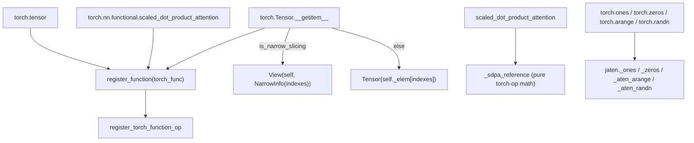

# torchax.ops.jtorch — lowerings for the public torch.* function API

## Overview

Where [torchax-ops-jaten](torchax-ops-jaten.md) lowers the *ATen* dispatcher-level ops (what
[`XLADispatchMode`](torchax-tensor.md#XLADispatchMode) intercepts), this module lowers the
public, Python-facing `torch.*`/`torch.nn.functional.*` functions that
[`XLAFunctionMode`](torchax-tensor.md#XLAFunctionMode) intercepts — things like `torch.tensor`,
`torch.einsum`, `torch.nn.functional.scaled_dot_product_attention`,
`torch.nn.functional.pad`, and tensor-constructor functions (`torch.ones`, `torch.arange`,
`torch.randn`). A recurring pattern here is a Python-level convenience wrapper that normalizes
arguments (e.g. flattening a size tuple) before delegating to a lower-level JAX primitive or to
an [torchax-ops-jaten](torchax-ops-jaten.md) helper.

## Diagram

## Design rationale (why it's built this way)

**`scaled_dot_product_attention` is a reference implementation, not a fused kernel.**
[`scaled_dot_product_attention`](../catalog/torchax/ops/jtorch.md#scaled_dot_product_attention)
is registered with `is_jax_function=False, needs_env=True` and simply delegates to a private
reference helper — an explicit, unfused `q @ k.T` → mask/bias → softmax → `@ v` implementation
using plain torch ops (which themselves recursively dispatch through torchax). This is the
single most consequential
TPU-performance-relevant fact in this module: any model calling
`F.scaled_dot_product_attention` under torchax gets the naive O(seq²)-materialized attention
matrix, not a fused/Flash-style kernel — a first-class target for a kernel-replacement
hypothesis (subject to the HLO pre-filter rule of checking whether XLA already fuses this
pattern before proposing a Pallas kernel).

**`getitem` decides View-vs-materialize per call, not per op.**
[`getitem`](../catalog/torchax/ops/jtorch.md#getitem) (registered for
`torch.Tensor.__getitem__` with `is_view_op=True`) inspects the actual index expression via
`is_narrow_slicing()`: if the index is tensor-free and list-free (pure slice/int indexing), it
returns a lazy [`View`](torchax-view.md#View) wrapping a
[`NarrowInfo`](torchax-view.md#NarrowInfo); otherwise (fancy/boolean/tensor indexing) it converts
the index via `self._env.t2j_iso` and eagerly computes `self._elem[indexes]` into a concrete
`Tensor`. This means the *cost profile* of indexing a torchax tensor is bimodal: simple slices
are free until read/written, while any tensor-based indexing pays immediately.

**Constructors normalize torch's flexible calling convention before delegating.** Functions like
[`_ones`](../catalog/torchax/ops/jtorch.md#_ones), `_zeros`, `empty`, `rand`, `randn` all handle
the same torch quirk — `torch.ones(3, 4)` and `torch.ones((3, 4))` and `torch.ones(size=(3, 4))`
must all mean the same thing — via the repeated `if len(size) == 1 and
isinstance(size[0], collections.abc.Iterable): size = size[0]` pattern, before calling through
to the actual JAX-backed implementation in [torchax-ops-jaten](torchax-ops-jaten.md) (e.g.
`jaten._ones`, `jaten._aten_arange`). This module is largely an argument-normalization layer over
that lower level, not where the numerics live for constructors.

**`functional_interpolate` explicitly enumerates unsupported modes rather than silently
degrading.** [`functional_interpolate`](../catalog/torchax/ops/jtorch.md#functional_interpolate)
raises `torchax.tensor.OperatorNotFound` with the requested `mode` named in the message for any
mode outside its `supported_methods` tuple, and even for supported cubic/bicubic modes only
handles the `antialias=False` case explicitly (falling to the same `OperatorNotFound` otherwise)
— unimplemented interpolation configurations fail loud, not silently wrong.

## Entry points

- [`register_function`](../catalog/torchax/ops/jtorch.md#register_function) — the
  decorator-factory every lowering in this file uses; a thin `functools.partial` over
  [`ops_registry.register_torch_function_op`](torchax-ops-ops_registry.md#register_torch_function_op).
- [`scaled_dot_product_attention`](../catalog/torchax/ops/jtorch.md#scaled_dot_product_attention) —
  control reaches this for every `F.scaled_dot_product_attention`/`aten.scaled_dot_product_attention`
  call under torchax — a direct hit for any attention-kernel optimization hypothesis.
- [`getitem`](../catalog/torchax/ops/jtorch.md#getitem) — reached on every
  `tensor[index]` expression; the fork point between the lazy-view and eager-materialize paths.
- [`_einsum`](../catalog/torchax/ops/jtorch.md#_einsum) — reached for `torch.einsum`/
  `torch.ops.aten.einsum`; matters for any model expressing attention or MoE routing via einsum
  rather than explicit matmuls, since it becomes `jnp.einsum` and inherits XLA's einsum fusion
  behavior directly.

## Mechanism (step-by-step)

1. **Registration at import.** Every [`register_function`](../catalog/torchax/ops/jtorch.md#register_function)-decorated
   function in this file registers into
   [`all_torch_functions`](../catalog/torchax/ops/ops_registry.md#all_torch_functions.all_torch_functions)
   (via [`register_torch_function_op`](../catalog/torchax/ops/ops_registry.md#register_torch_function_op))
   when `Environment.load_ops` imports this module.
2. **A call arrives** at whichever torch interception layer catches it, which finds the
   [`Operator`](../catalog/torchax/ops/ops_registry.md#Operator) wrapping this module's function
   in the registry and reads its [`is_jax_function`](../catalog/torchax/ops/ops_registry.md#Operator.is_jax_function)/
   [`needs_env`](../catalog/torchax/ops/ops_registry.md#Operator.needs_env)/
   [`is_view_op`](../catalog/torchax/ops/ops_registry.md#Operator.is_view_op) flags to decide how
   to call it.
3. **`needs_env=True` functions** (e.g. [`_as_tensor`](../catalog/torchax/ops/jtorch.md#_as_tensor),
   [`rand`](../catalog/torchax/ops/jtorch.md#rand), [`randn`](../catalog/torchax/ops/jtorch.md#randn),
   [`randint`](../catalog/torchax/ops/jtorch.md#randint),
   [`scaled_dot_product_attention`](../catalog/torchax/ops/jtorch.md#scaled_dot_product_attention))
   receive `env=` injected into kwargs before the call — used for PRNG-key rotation or
   device-aware construction.
4. **`is_jax_function=False` functions** ([`_as_tensor`](../catalog/torchax/ops/jtorch.md#_as_tensor),
   [`scaled_dot_product_attention`](../catalog/torchax/ops/jtorch.md#scaled_dot_product_attention),
   [`_sparse_mm`](../catalog/torchax/ops/jtorch.md#_sparse_mm),
   [`randint`](../catalog/torchax/ops/jtorch.md#randint)) run directly on torch-land values —
   their internal calls (e.g. the attention reference helper's `query @ key.transpose(...)`)
   re-enter the dispatch loop as ordinary torch ops rather than being handed raw JAX arrays.
5. **`is_jax_function=True` functions** ([`_zeros`](../catalog/torchax/ops/jtorch.md#_zeros),
   [`arange`](../catalog/torchax/ops/jtorch.md#arange),
   [`empty_strided`](../catalog/torchax/ops/jtorch.md#empty_strided),
   [`_pad_sequence`](../catalog/torchax/ops/jtorch.md#_pad_sequence)) get their args
   pre-converted to JAX by the dispatch loop before the function body runs, and operate purely in
   `jnp`/`jax` terms.

## Key data structures

- No new data structures are defined here — this module is purely a collection of registered
  functions; the structure that matters is the *registration metadata* (`is_jax_function`,
  `needs_env`, `is_view_op`) passed to `register_function` at each call site.

## Dynamics (design intent)

The mode/dispatch split means a single logical operation (e.g. `torch.ones(...)`) is fully
resolved through this module's registration *before* [torchax-ops-jaten](torchax-ops-jaten.md)'s
lower-level constructors ever run — `jtorch.py` owns "what did the user actually call and what
did they mean by it", `jaten.py` owns "how do I actually build/compute that in JAX".

## Edge cases

- `_pad_sequence` builds its padding list per-sequence with a Python loop over `sequences` and
  calls `jaten._aten_constant_pad_nd` once per element before stacking — for large batches of
  variable-length sequences this is a per-item op sequence, not a single vectorized pad; worth
  checking under `jax.jit` whether XLA fuses this into one op or leaves it as N separate pad
  ops in the trace.
- `getitem`'s `is_narrow_slicing` check treats *any* list argument as disqualifying the
  narrow-slice fast path, even `x[[True, False, ...]]` boolean-list-style indexing that a user
  might expect to be "simple" — it is not; it always materializes.

## Open questions

- Whether [`scaled_dot_product_attention`](../catalog/torchax/ops/jtorch.md#scaled_dot_product_attention)'s
  reference-math implementation is ever intended to be a temporary placeholder pending a fused
  kernel path, or whether TPU users are expected to route around it entirely into Splash/
  Flash-attention Pallas kernels from another codebase — this file gives no signal either way
  beyond the naming of its private helper.

## See also
- [torchax-ops-jaten](torchax-ops-jaten.md) — the ATen-level lowerings this module frequently
  delegates to for constructors and low-level math.
- [torchax-ops-ops_registry](torchax-ops-ops_registry.md) — the registry `register_function`
  writes into.
- [torchax-view](torchax-view.md) — `View`/`NarrowInfo`, constructed directly by `getitem`.
