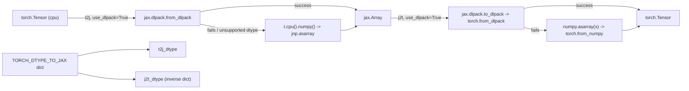

# torchax.ops.mappings — dtype tables and tensor transfer between torch and JAX

## Overview

Every value that crosses the torch/JAX boundary in [torchax-tensor](torchax-tensor.md) and
[torchax-interop](torchax-interop.md) passes through this module's four functions:
[`t2j`](../catalog/torchax/ops/mappings.md#t2j) and [`j2t`](../catalog/torchax/ops/mappings.md#j2t)
move actual tensor data, while [`t2j_dtype`](../catalog/torchax/ops/mappings.md#t2j_dtype) and
[`j2t_dtype`](../catalog/torchax/ops/mappings.md#j2t_dtype) translate dtype *objects*. It is a
small, dependency-light module, but it is on the hot path of essentially every op dispatch, so
its choices about DLPack vs. numpy fallback directly determine whether a given tensor transfer
is zero-copy or not.

## Diagram

## Design rationale (why it's built this way)

**DLPack first, numpy as the universal fallback.** Both [`t2j`](../catalog/torchax/ops/mappings.md#t2j)
and [`j2t`](../catalog/torchax/ops/mappings.md#j2t) try the DLPack zero-copy path first (wrapped
in a bare `try/except Exception: pass`), and only fall back to a numpy round-trip
(`t.cpu().detach().numpy()` → `jnp.asarray`, or the reverse) if that fails. DLPack sharing only
works for dtypes and memory layouts both frameworks agree on; the broad except is a pragmatic
acknowledgment that DLPack failures come in many forms (unsupported dtype, non-contiguous
layout, device mismatch) that aren't worth enumerating — any failure just means "pay the copy".

**A hand-maintained dtype table, not runtime introspection.** `TORCH_DTYPE_TO_JAX` is an
explicit literal dict covering standard float/int/complex types plus the low-precision/
quantization dtypes relevant to TPU work (`bfloat16`, the `float8_e4m3fn`/`float8_e5m2` family,
`float4_e2m1fn_x2`). `JAX_DTYPE_TO_TORCH` is derived by dict-inversion
(`{value: key for key, value in TORCH_DTYPE_TO_JAX.items()}`) and then patched with two
imprecise extra entries for `int4`/`uint4` (JAX types with no torch equivalent, mapped down to
`int8`/`uint8`). The explicit `None: None` entry lets dtype-less code paths pass `None` through
both directions without special-casing.

**Bool and bf16 need extra round-trip handling because numpy doesn't support them uniformly.**
`t2j` special-cases `torch.bool` by casting to `int8` before the numpy fallback and casting the
result back to `jnp.bool_` afterward — plain numpy has historically had friction with bool
buffer interop in this exact path. Symmetrically, `j2t`'s numpy fallback special-cases
`jnp.bfloat16`, upcasting to `float32` before `numpy.asarray` (since numpy has no native bf16)
and downcasting the resulting torch tensor back to bf16 afterward via `j2t_dtype`.

## Entry points

- [`t2j`](../catalog/torchax/ops/mappings.md#t2j) — called from
  [`Environment.t2j_copy`](torchax-tensor.md#Environment.t2j_copy) (bulk state transfer, e.g.
  in [`extract_jax`](torchax.md#extract_jax)) and anywhere a plain CPU `torch.Tensor` needs to
  become a `jax.Array`.
- [`j2t`](../catalog/torchax/ops/mappings.md#j2t) — the inverse, called from
  [`Environment.j2t_copy`](torchax-tensor.md#Environment.j2t_copy) and
  [`Tensor.torch`](torchax-tensor.md#Tensor.torch)'s underlying copy path.
- [`t2j_dtype`](../catalog/torchax/ops/mappings.md#t2j_dtype) /
  [`j2t_dtype`](../catalog/torchax/ops/mappings.md#j2t_dtype) — called throughout
  [torchax-tensor](torchax-tensor.md) (e.g. `Tensor.__new__`'s dtype computation,
  `Tensor.dtype` property) and every op lowering that needs to convert a `dtype=` kwarg.

## Mechanism (step-by-step)

1. **[`t2j`](../catalog/torchax/ops/mappings.md#t2j)`(t, use_dlpack=True)`**: normalizes `t`
   first — converts bool to int8, calls `.to_dense()` (handles sparse tensors) and forces
   `.contiguous()` if needed — *before* attempting DLPack, since DLPack sharing requires a
   dense, contiguous buffer.
2. Tries `jaxdl.from_dlpack(t)`; on any exception, falls through to the numpy path, checking
   [`NUMPY_UNSUPPORTED_DTYPES`](../catalog/torchax/ops/mappings.md#NUMPY_UNSUPPORTED_DTYPES)
   (`bfloat16`, the fp8 variants) to decide whether an intermediate `float32` cast is needed
   before `.numpy()`, then restoring the true dtype on the JAX side with `.astype(...)`.
3. Restores `bool` at the very end if `is_bool` was set at the start, using the same
   [`TORCH_DTYPE_TO_JAX`](../catalog/torchax/ops/mappings.md#TORCH_DTYPE_TO_JAX)-derived dtype
   bookkeeping [`t2j_dtype`](../catalog/torchax/ops/mappings.md#t2j_dtype) relies on elsewhere.
4. **[`j2t`](../catalog/torchax/ops/mappings.md#j2t)`(x, use_dlpack=True)`** is the mirror: tries
   `jaxdl.to_dlpack(x)` → `torchdl.from_dlpack`, wrapped in `mode_utils.no_dispatch()` +
   `torch._C.DisableTorchFunction()` so the resulting plain torch tensor construction doesn't
   itself get intercepted by torchax's own dispatch modes (which would be a re-entrancy bug).
5. Falls back to `torch.from_numpy(numpy.asarray(x))` with the same bf16 upcast/downcast
   two-step (restoring the true dtype via
   [`j2t_dtype`](../catalog/torchax/ops/mappings.md#j2t_dtype)), and restores `bool` dtype at
   the end if needed.

## Key data structures

- **`NUMPY_UNSUPPORTED_DTYPES`** — the small set of dtypes needing a `float32` bounce through
  numpy (bf16 and the fp8 family) — directly relevant to any TPU-precision hypothesis since
  these are exactly the low-precision formats used for TPU matmul/attention.
- **`TORCH_DTYPE_TO_JAX` / `JAX_DTYPE_TO_TORCH`** — the canonical, hand-authored dtype
  crosswalk; any new torch or JAX dtype support requires an explicit new entry here.

## Dynamics (design intent)

The DLPack-first design means the *actual* runtime cost of a torch↔JAX tensor crossing is
data-dependent: contiguous, DLPack-supported dtypes are (near-)zero-copy, while bf16/fp8/bool or
non-contiguous inputs silently pay a full host-side numpy round-trip (device→host→device for a
TPU-resident tensor, in the worst case). This module is a natural place to look when profiling
shows unexpected host-side copy time around a torchax boundary crossing.

## Edge cases

- `t2j`'s DLPack attempt is wrapped in a bare `except Exception: pass` — any DLPack failure
  (including ones unrelated to dtype, e.g. a genuine bug) is silently swallowed and masked by
  the numpy fallback succeeding, which could hide performance regressions rather than surface
  them as errors.
- `float4_e2m1fn_x2`/`float8_e4m3fn`/`float8_e5m2` dtypes are declared in `TORCH_DTYPE_TO_JAX`
  but several natural JAX counterparts (`float8_e4m3b11fnuz`, `float8_e4m3fnuz`,
  `float8_e5m2fnuz`) are explicitly commented as `NO_MAPPING` — not every fp8 variant has a
  round-trip.

## Open questions

- Whether the DLPack path actually succeeds in practice for bf16 tensors on TPU (vs. always
  falling back to the numpy bounce) is not determinable from this file — this is exactly the
  kind of thing a profile of a real torchax run on TPU would need to confirm before treating
  DLPack as "the fast path" in an optimization hypothesis.

## See also
- [torchax-tensor](torchax-tensor.md) — `Environment.t2j_copy`/`j2t_copy`/`t2j_iso`/`j2t_iso`,
  the primary callers.
- [torchax-ops-op_base](torchax-ops-op_base.md) — `convert_dtype`, which calls `t2j_dtype` to
  translate a lowering's `dtype=` kwarg.
