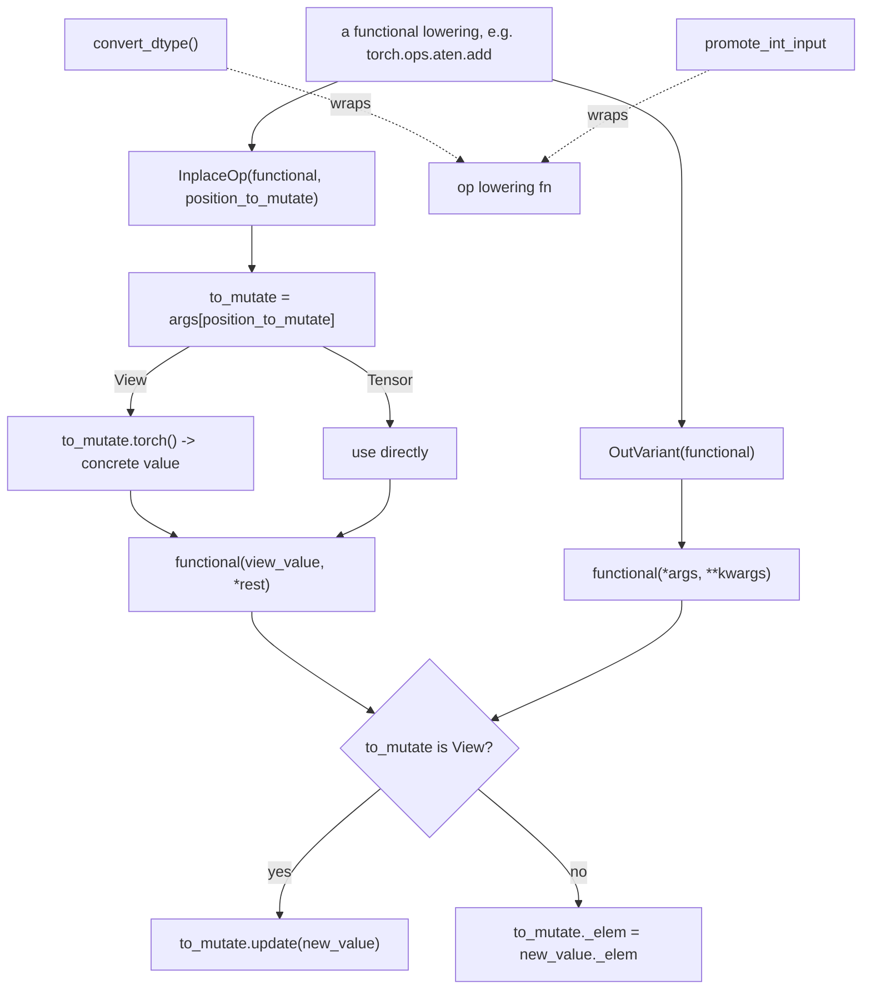

# torchax.ops.op_base — shared decorators and mutation helpers for op lowerings

## Overview

Every op lowering in [torchax-ops-jaten](torchax-ops-jaten.md) and
[torchax-ops-jtorch](torchax-ops-jtorch.md) needs the same handful of cross-cutting concerns
solved once: converting a torch `dtype` kwarg to its JAX equivalent, promoting integer inputs
before a float-only JAX primitive, and — the hardest one — making an *in-place* torch op
(`add_`, `relu_`, ...) or an *out-parameter* op (`torch.add(x, y, out=z)`) behave correctly when
the mutated target may be a lazy [`View`](torchax-view.md) rather than a concrete `Tensor`.
This module is the shared toolbox those lowerings pull from, not a lowering itself.

## Diagram

## Design rationale (why it's built this way)

**In-place ops are implemented as a wrapper over the functional op, not duplicated.**
[`InplaceOp`](../catalog/torchax/ops/op_base.md#InplaceOp) does not reimplement e.g. `add_`;
it wraps the *functional* `add` lowering and, after computing the new value, writes it back into
`args[position_to_mutate]` (default index 0, i.e. `self` for methods like `x.add_(y)`). This
keeps the actual math in one place per op and turns "does this op have an in-place variant"
into a purely mechanical registration decision.

**View-awareness is threaded through explicitly, not hidden.** Both
[`InplaceOp`](../catalog/torchax/ops/op_base.md#InplaceOp) and
[`OutVariant`](../catalog/torchax/ops/op_base.md#OutVariant)'s call logic check
`isinstance(to_mutate, View)` and branch: a `View`'s mutation (see [torchax-view](torchax-view.md))
goes through its `update` method (replaying the transformation chain back to the true source),
while a concrete torchax `Tensor`'s mutation (see [torchax-tensor](torchax-tensor.md)) is either
a full replace (`to_mutate._elem = new_value._elem`, used when `replace=True`) or a `copy_` call.
This
mirrors, at the op-registration layer, the same view/no-view branching
[torchax-tensor](torchax-tensor.md)'s dispatch loop does at the dispatch layer — the two modules
agree on how aliasing is modeled.

**A sibling `convert_dtype` decorator (defined in this same module, outside this packet's own
cited subgraph) centralizes torch's implicit-default-dtype behavior** — a decorator *factory*
so a lowering can opt in or out of torch's rule that an unspecified `dtype=None` for a
tensor-constructor should fall back to `torch.get_default_dtype()` rather than staying `None`.
See [torchax-ops-jtorch](torchax-ops-jtorch.md) for its call sites.

**`promote_int_input` targets a real JAX/torch numerics gap.** Many torch math functions accept
integer tensors and implicitly promote to float; the corresponding JAX primitive often does not.
[`promote_int_input`](../catalog/torchax/ops/op_base.md#promote_int_input) is a decorator that
inspects the first positional arg's dtype and upcasts int8/16/32/64 to the current default float
dtype before calling through — used pervasively across the special-function lowerings (Bessel,
Chebyshev polynomial families) in [torchax-ops-jaten](torchax-ops-jaten.md).

## Entry points

- [`InplaceOp`](../catalog/torchax/ops/op_base.md#InplaceOp) — instantiated at registration time
  for every in-place op (e.g. `aten.add_`); its call logic is what actually runs when such an op
  is dispatched.
- [`OutVariant`](../catalog/torchax/ops/op_base.md#OutVariant) — the `out=`-parameter
  counterpart; pulls the mutation target out of `kwargs["out"]` rather than a positional arg.
- [`promote_int_input`](../catalog/torchax/ops/op_base.md#promote_int_input) — applied as a
  decorator directly at each lowering's definition site (e.g.
  [`_aten_special_bessel_y0`](../catalog/torchax/ops/jaten.md#_aten_special_bessel_y0),
  [`_aten_sqrt`](../catalog/torchax/ops/jaten.md#_aten_sqrt),
  [`_aten_tanh`](../catalog/torchax/ops/jaten.md#_aten_tanh) and many other special-function/
  trig lowerings in [torchax-ops-jaten](torchax-ops-jaten.md)); control reaches its `wrapper` on
  every call to a so-decorated lowering, before the wrapped function body runs.
- [`foreach_loop`](../catalog/torchax/ops/op_base.md#foreach_loop) — a small `jax.lax.fori_loop`
  convenience for per-element sequential reduction, available to any lowering that needs a
  `functools.reduce`-like scan over a 1D array's elements.

## Mechanism (step-by-step)

1. **A lowering is decorated**, e.g. `@op_base.promote_int_input` above
   [`_aten_special_bessel_y0`](../catalog/torchax/ops/jaten.md#_aten_special_bessel_y0) in
   [torchax-ops-jaten](torchax-ops-jaten.md) — this happens once, at module import, not per call.
2. **On call**, [`promote_int_input`](../catalog/torchax/ops/op_base.md#promote_int_input)'s
   [`wrapper`](../catalog/torchax/ops/op_base.md#promote_int_input.wrapper) checks the first
   argument's dtype and conditionally casts to the current default float dtype before delegating
   to the wrapped function — a per-call dtype check, but a cheap one (no data movement unless the
   promotion actually fires).
3. **For [`InplaceOp`](../catalog/torchax/ops/op_base.md#InplaceOp)**, at op-registration time an
   instance is built with `functional_op` bound to the underlying pure implementation; at call
   time it extracts the mutation target, optionally converts a `View` (see
   [torchax-view](torchax-view.md)) to a concrete tensor for the functional call, runs the
   functional op, and writes the result back according to whether the original target was a
   `View` or a plain torchax `Tensor`.
4. **For [`OutVariant`](../catalog/torchax/ops/op_base.md#OutVariant)**, the same write-back
   logic runs, but the mutation target always comes from the `out` kwarg rather than a
   positional argument, and `kwargs["out"]` is deleted before calling the functional op (since
   the functional op's own signature doesn't know about `out`).

## Key data structures

- **`InplaceOp`** (`functional`, `replace`, `position_to_mutate`, `is_jax_func`) — a callable
  object (not a function) so it can carry per-registration configuration; instantiated once per
  in-place op at registration time.
- **`OutVariant`** (`functional`) — simpler; the mutation target is always keyword-based
  (`out=`), so no `position_to_mutate` is needed.

## Dynamics (design intent)

The `replace` flag on `InplaceOp` (`to_mutate._elem = new_value._elem` vs. `to_mutate.copy_(new_value)`)
lets individual op registrations choose between a hard identity swap of the backing array and a
softer torch-level `copy_` (which itself would re-enter dispatch and go through dtype/shape
coercion) — a deliberate escape hatch for ops where the semantics of the two differ (e.g. dtype
must be preserved by `copy_`'s coercion vs. `replace`'s raw substitution).

## Edge cases

- `InplaceOp.__call__` reads `env = view_value._env` — this assumes the mutation target always
  carries a valid `_env` reference (true for both `Tensor` and `View` by construction), so a
  bare non-torchax value reaching this path would fail with an `AttributeError`, not a
  graceful error.
- `maybe_convert_constant_dtype` special-cases a `jax.Array` scalar input by calling
  `.item()` and recursing — i.e. it forces a device-to-host sync to read a Python scalar out of
  a traced/concrete array, which is a real (if usually small) cost when used in a hot lowering.

## Open questions

- Whether `is_jax_func=False` `InplaceOp`s (functional op operates directly on torch tensors)
  are used anywhere in practice, or if the `is_jax_func=True` path dominates in current
  registrations — not resolvable from this file alone.

## See also
- [torchax-tensor](torchax-tensor.md) — `Environment.dispatch`'s `is_view_op` branch, which this
  module's view-awareness mirrors.
- [torchax-ops-ops_registry](torchax-ops-ops_registry.md) — where `InplaceOp`/`OutVariant`
  instances get attached to an `Operator` entry.
- [torchax-ops-jaten](torchax-ops-jaten.md) — the primary consumer of `promote_int_input` and
  `InplaceOp`.
