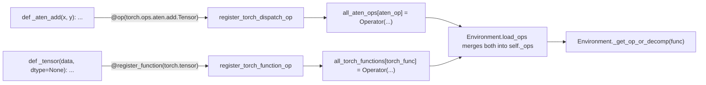

# torchax.ops.ops_registry — the op lowering table

## Overview

This is the smallest and most structurally important module in torchax: it defines the
[`Operator`](../catalog/torchax/ops/ops_registry.md#Operator) record type and the two global
dicts ([`all_aten_ops`](../catalog/torchax/ops/ops_registry.md#all_aten_ops.all_aten_ops),
[`all_torch_functions`](../catalog/torchax/ops/ops_registry.md#all_torch_functions.all_torch_functions)) that every
lowering in [torchax-ops-jaten](torchax-ops-jaten.md) and
[torchax-ops-jtorch](torchax-ops-jtorch.md) registers into via a decorator call at import time.
[`Environment.load_ops`](torchax-tensor.md#Environment.load_ops) merges both dicts into
`Environment._ops` at construction, and
[`Environment._get_op_or_decomp`](torchax-tensor.md#Environment._get_op_or_decomp) is the sole
reader. Everything else in torchax's op-lowering story is a producer or consumer of this table.

## Diagram

## Design rationale (why it's built this way)

**Two parallel tables for two different interception layers.** `all_aten_ops` is keyed by ATen
overload objects (what [`XLADispatchMode`](torchax-tensor.md#XLADispatchMode) sees) while
`all_torch_functions` is keyed by public torch-API callables like `torch.tensor`, `torch.eye`
(what [`XLAFunctionMode`](torchax-tensor.md#XLAFunctionMode) sees). Keeping them as separate
dicts rather than one merged table lets each registration decorator
([`register_torch_dispatch_op`](../catalog/torchax/ops/ops_registry.md#register_torch_dispatch_op)
vs [`register_torch_function_op`](../catalog/torchax/ops/ops_registry.md#register_torch_function_op))
stay a thin, single-purpose function, while `Environment.load_ops` is the one place that
flattens both into the unified lookup dict actually used at dispatch time.

**`Operator` is a flag bundle, not just a function pointer.** Every registration carries four
booleans (`is_jax_function`, `is_user_defined`, `needs_env`, `is_view_op`) alongside the
callable — these flags are read directly by
[`Environment.dispatch`](torchax-tensor.md#Environment.dispatch) to decide, per call: whether to
convert args to JAX before calling (`is_jax_function`), whether to inject `env=self` into
kwargs (`needs_env`), and whether to skip the view-materialization step (`is_view_op`). Putting
these as data on the registration rather than inferring them (e.g. via signature inspection)
makes the dispatch hot path a handful of `if` checks on plain booleans instead of reflection.

**Duplicate registration is a warning, not an error.**
[`register_torch_dispatch_op`](../catalog/torchax/ops/ops_registry.md#register_torch_dispatch_op)
logs `logging.warning(f"Duplicate op registration for {aten_op}")` and then overwrites — the
last registration for a given aten op wins. This is a deliberate "last writer wins, but tell
someone" policy, which matters when reading [torchax-ops-jaten](torchax-ops-jaten.md) for a
specific op: a `@op(...)` decorator earlier in the file can be silently shadowed by a later one
registering the same aten overload.

## Entry points

- [`register_torch_dispatch_op`](../catalog/torchax/ops/ops_registry.md#register_torch_dispatch_op) —
  called (usually via the `op(*aten, **kwargs)` decorator-factory defined in
  [torchax-ops-jaten](torchax-ops-jaten.md)) once per aten overload at module import time.
- [`register_torch_function_op`](../catalog/torchax/ops/ops_registry.md#register_torch_function_op) —
  the `all_torch_functions` counterpart, invoked via `register_function` in
  [torchax-ops-jtorch](torchax-ops-jtorch.md).
- [`all_aten_ops`](../catalog/torchax/ops/ops_registry.md#all_aten_ops.all_aten_ops) /
  [`all_torch_functions`](../catalog/torchax/ops/ops_registry.md#all_torch_functions.all_torch_functions) —
  read once, in bulk, by [`Environment.load_ops`](torchax-tensor.md#Environment.load_ops); not
  intended to be read piecemeal elsewhere.

## Mechanism (step-by-step)

1. At import time (triggered by `Environment.load_ops`'s `from torchax.ops import jaten, jc10d,
   jtorch, jtorchvision_nms`), every `@op(...)`/`@register_function(...)`-decorated function in
   those modules executes its decorator, which calls
   [`register_torch_dispatch_op`](../catalog/torchax/ops/ops_registry.md#register_torch_dispatch_op)
   or [`register_torch_function_op`](../catalog/torchax/ops/ops_registry.md#register_torch_function_op).
2. Each registration constructs one [`Operator`](../catalog/torchax/ops/ops_registry.md#Operator)
   dataclass instance and stores it in the corresponding global dict keyed by the raw torch
   callable/overload object — a plain object identity/hash key, no string normalization.
3. `Environment.load_ops` iterates `itertools.chain(`[`all_aten_ops`](../catalog/torchax/ops/ops_registry.md#all_aten_ops.all_aten_ops)`.items(),
   `[`all_torch_functions`](../catalog/torchax/ops/ops_registry.md#all_torch_functions.all_torch_functions)`.items())`
   and copies every entry into `self._ops`, then separately merges the torch decomposition table
   into `self._decomps` — so by the time `Environment.__init__` returns, `self._ops` is the
   complete, flattened lookup table for that process.

## Key data structures

- **[`Operator`](../catalog/torchax/ops/ops_registry.md#Operator)** — `torch_op`, `func`,
  `is_jax_function`, `is_user_defined`, `needs_env`, `is_view_op`; the atomic unit of "how to
  lower this one torch op".
- **`all_aten_ops` / `all_torch_functions`** — module-level global dicts, populated purely by
  import-time side effects; there is no explicit "registry object" to construct or pass around.

## Dynamics (design intent)

Because registration is a side effect of *importing* the lowering modules, the registry's
contents are fixed once `Environment.load_ops` has run for the first `Environment` in the
process — there is no documented mechanism here for hot-reloading or re-registering an op
mid-run other than [`Environment.override_op_definition`](torchax-tensor.md), which writes
directly into `self._ops` for one instance rather than the shared global dicts.

## Edge cases

- Because both `all_aten_ops` and `all_torch_functions` are plain module-level globals (not
  per-`Environment`), registrations are process-wide even though the *decision* of which ops to
  honor is scoped per-`Environment` via `self._ops` — two `Environment` instances in the same
  process would still see the same registered lowerings unless one calls
  `override_op_definition` to shadow an entry locally.
- The duplicate-registration warning fires for legitimate multi-overload registrations too if a
  lowering function is decorated with the same aten overload twice (e.g. via two stacked
  `@op(...)` calls covering an overlapping set) — it is not distinguishing "accidental
  duplicate" from "intentional last-wins override".

## Open questions

- Whether `is_user_defined` (present on `Operator` but not obviously read by
  `Environment.dispatch` in the code seen in [torchax-tensor](torchax-tensor.md)) is consumed
  elsewhere (e.g. tooling that lists which ops are core vs. user-registered) is not resolved
  within this packet's subgraph.

## See also
- [torchax-tensor](torchax-tensor.md) — `Environment.load_ops`/`_get_op_or_decomp`, the sole
  consumer of this registry.
- [torchax-ops-op_base](torchax-ops-op_base.md) — `InplaceOp`/`OutVariant`, which get wrapped
  as the `func` field of an `Operator` for in-place/out-variant registrations.
- [torchax-ops-jaten](torchax-ops-jaten.md) / [torchax-ops-jtorch](torchax-ops-jtorch.md) — the
  two modules that populate this registry.
