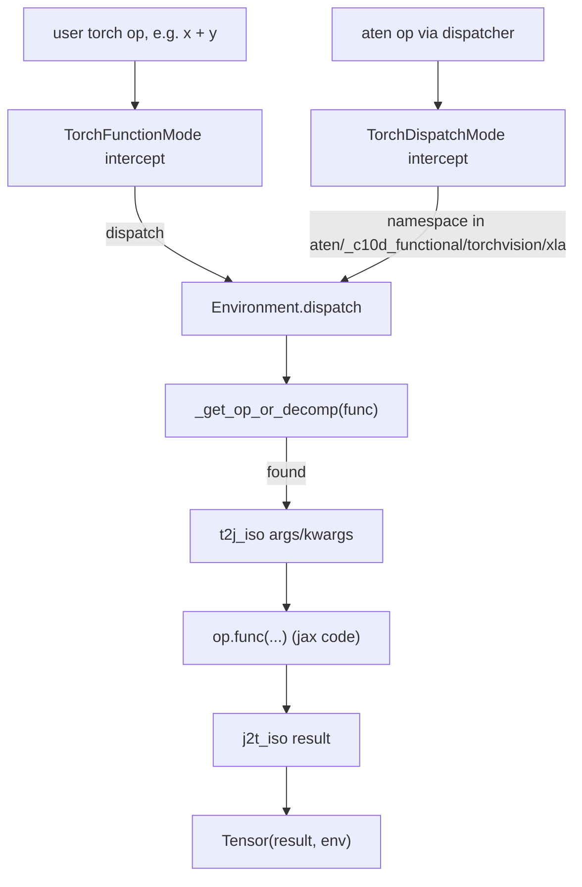

# torchax.tensor — the Tensor wrapper subclass and dispatch Environment

## Overview

This module is the physical mechanism behind everything in [torchax](torchax.md):
[`Tensor`](../catalog/torchax/tensor.md#Tensor) is a `torch.Tensor` *wrapper subclass* whose
real data lives in a `jax.Array` (`self._elem`), and the module's `Environment` is the router
that, for every intercepted torch op, looks up a JAX-backed implementation via
[`_get_op_or_decomp`](../catalog/torchax/tensor.md#Environment._get_op_or_decomp), converts
operands, calls it via [`dispatch`](../catalog/torchax/tensor.md#Environment.dispatch), and
converts the result back. Two `TorchFunctionMode`/`TorchDispatchMode` subclasses (not in this
packet's own subgraph, but described in [torchax](torchax.md)) are how PyTorch's own extension
points ("intercept every op call") get hooked up to that router. Understanding this file is
understanding *how* a line of ordinary `torch.nn.Module` code ends up executing as XLA HLO on a
TPU without ever calling into `torch_xla`.

## Diagram

## Design rationale (why it's built this way)

**A wrapper subclass, not a new leaf type.** [`Tensor`](../catalog/torchax/tensor.md#Tensor)
overrides `__new__` to call `torch.Tensor._make_wrapper_subclass(cls, shape, dtype=dtype,
device="meta", requires_grad=requires_grad)` — i.e. it presents to the rest of PyTorch as a
`device="meta"` tensor with real shape/dtype metadata but no storage, while the actual payload
sits in [`_elem`](../catalog/torchax/tensor.md#Tensor._elem)`: jax.Array`. This is the standard
PyTorch "wrapper subclass" pattern — it lets torchax reuse PyTorch's autograd engine,
`nn.Module` machinery, and pytree utilities unmodified, at the cost of every operation needing an
explicit registered lowering (there is no fallback to eager CPU torch for an unregistered op).

**Views are handled outside the JAX conversion.** [`dispatch`](../catalog/torchax/tensor.md#Environment.dispatch)
special-cases `op.is_view_op` (an [`Operator`](../catalog/torchax/ops/ops_registry.md#Operator)
flag): non-view ops get [`v2t_iso`](../catalog/torchax/tensor.md#Environment.v2t_iso)'d (a
[`View`](../catalog/torchax/view.md#View) is materialized to a concrete
[`Tensor`](../catalog/torchax/tensor.md#Tensor) before crossing into JAX) while view ops are
allowed to keep operating on `View` objects directly. This is because JAX arrays are immutable
value types with no aliasing — torchax cannot represent a "view into a jax.Array" except as a
lazy transformation chain, which is exactly what [torchax-view](torchax-view.md) implements.

**Op resolution falls back to decomposition, never to a generic default.**
[`_get_op_or_decomp`](../catalog/torchax/tensor.md#Environment._get_op_or_decomp) first checks
the live registry (`self._ops`, populated by [`load_ops`](../catalog/torchax/tensor.md#Environment.load_ops)
from [`all_aten_ops`](../catalog/torchax/ops/ops_registry.md#all_aten_ops.all_aten_ops)/
[`all_torch_functions`](../catalog/torchax/ops/ops_registry.md#all_torch_functions.all_torch_functions)),
then falls back to `self._decomps` (torch's own decomposition table, wrapped as `Operator`
entries), and raises `OperatorNotFound` if neither has a match — a deliberate closed-world
design: every executable op must be either directly lowered or explicitly decomposable, with no
silent fallback path.

**Tensor construction is routed through the same device-aware decision every time.**
[`_should_use_torchax_tensor`](../catalog/torchax/tensor.md#Environment._should_use_torchax_tensor)
is the single predicate [`_handle_tensor_constructor`](../catalog/torchax/tensor.md#Environment._handle_tensor_constructor)
and [`_to_copy`](../catalog/torchax/tensor.md#Environment._to_copy) both consult to decide
whether a given device string (`cpu`/`cuda`/`jax`/`privateuseone`/`meta`) means "build/keep a
real JAX-backed tensor" or "hand off to native torch" — centralizing what would otherwise be a
device-string comparison scattered across every constructor lowering.

> [!inferred] Debug-oriented config flags threaded through `dispatch` (per-op tracing, per-op
> numerical comparison against real CPU torch, and a breakpoint on mixed-tensor-type assertion
> failures — visible in the source but outside this packet's cited subgraph) suggest this
> `Environment` doubles as the primary debugging surface when porting a new model to torchax.

## Entry points

- [`dispatch`](../catalog/torchax/tensor.md#Environment.dispatch) — the single choke point every
  intercepted op passes through, regardless of whether it arrived via the function-mode or
  dispatch-mode interception layer.
- [`load_ops`](../catalog/torchax/tensor.md#Environment.load_ops) — runs once at `Environment`
  construction; imports the op-lowering modules and merges
  [`all_aten_ops`](../catalog/torchax/ops/ops_registry.md#all_aten_ops.all_aten_ops) /
  [`all_torch_functions`](../catalog/torchax/ops/ops_registry.md#all_torch_functions.all_torch_functions)
  plus the torch decomposition table into `self._ops` / [`_decomps`](../catalog/torchax/tensor.md#Environment._decomps).
- [`manual_seed`](../catalog/torchax/tensor.md#Environment.manual_seed) — where a caller sets
  the PRNG key explicitly, accepting either a Python int or a scalar tensor/`Tensor`.
- [`getitem`](../catalog/torchax/ops/jtorch.md#getitem) — not defined in this module but the
  primary constructor of [`View`](../catalog/torchax/view.md#View) instances that later flow
  through this module's `is_view_op` branch in `dispatch`.

## Mechanism (step-by-step)

1. **Construction.** `Tensor.__new__` computes `dtype` via
   [`t2j_dtype`](../catalog/torchax/ops/mappings.md#t2j_dtype)'s inverse
   ([`j2t_dtype`](../catalog/torchax/ops/mappings.md#t2j_dtype) is used for the reverse
   direction elsewhere), coerces any non-integer symbolic shape dimension to `1`, and builds the
   wrapper subclass on `device="meta"`.
2. **An op is called on a `Tensor`.** Whichever interception layer catches it ultimately calls
   [`dispatch`](../catalog/torchax/tensor.md#Environment.dispatch).
3. **Constructor short-circuit.** `dispatch` first checks whether `func` is a tensor constructor
   and routes those through
   [`_handle_tensor_constructor`](../catalog/torchax/tensor.md#Environment._handle_tensor_constructor),
   which decides — via
   [`_should_use_torchax_tensor`](../catalog/torchax/tensor.md#Environment._should_use_torchax_tensor) —
   whether the requested device means "build a real JAX array" or "fall back to native torch".
4. **Op lookup.** For all other ops,
   [`_get_op_or_decomp`](../catalog/torchax/tensor.md#Environment._get_op_or_decomp) looks the op
   up first in `self._ops`, falling back to
   [`_decomps`](../catalog/torchax/tensor.md#Environment._decomps) (wrapped as
   [`Operator`](../catalog/torchax/ops/ops_registry.md#Operator) entries with
   `is_jax_function=False`), raising `OperatorNotFound` if neither has it.
5. **Conversion sandwich.** If the matched op is a view op, args stay as
   [`View`](../catalog/torchax/view.md#View)/[`Tensor`](../catalog/torchax/tensor.md#Tensor);
   else [`v2t_iso`](../catalog/torchax/tensor.md#Environment.v2t_iso) materializes any `View`
   args to concrete tensors, then (if `op.is_jax_function`) args/kwargs are converted via
   [`t2j_iso`](../catalog/torchax/tensor.md#Environment.t2j_iso), the JAX function runs, and the
   result is converted back via [`j2t_iso`](../catalog/torchax/tensor.md#Environment.j2t_iso) —
   the mechanical heart of the whole bridge.
6. **Bulk state transfer** uses the copying variants
   [`t2j_copy`](../catalog/torchax/tensor.md#Environment.t2j_copy) /
   [`j2t_copy`](../catalog/torchax/tensor.md#Environment.j2t_copy) rather than the zero-copy
   `_iso` siblings — used when a whole pytree of parameters/buffers needs to physically move
   across the boundary (e.g. during model setup), rather than being reinterpreted in place.

## Key data structures

- **[`Tensor._elem: jax.Array`](../catalog/torchax/tensor.md#Tensor._elem)** — the actual
  payload; every op ultimately reads/writes this.
- **`self._ops` / [`_decomps`](../catalog/torchax/tensor.md#Environment._decomps)** — the op
  registry and decomposition fallback table, both keyed by the raw torch op object; `_ops` is
  populated by [`load_ops`](../catalog/torchax/tensor.md#Environment.load_ops), `_decomps` from
  torch's own decomposition rules wrapped as [`Operator`](../catalog/torchax/ops/ops_registry.md#Operator).
- **[`config`](../catalog/torchax/tensor.md#Environment.config)** — the
  [`Configuration`](../catalog/torchax/tensor.md#Environment.config) object gating debug/
  precision/dlpack behavior consulted throughout `dispatch`.

## Dynamics (design intent)

[`manual_seed`](../catalog/torchax/tensor.md#Environment.manual_seed) accepts a scalar
`torch.Tensor` or Python int and builds a fresh `jax.random.PRNGKey` from it, asserting the input
is a non-floating-point scalar — mirroring `torch.Generator`'s implicit statefulness inside
JAX's explicit-key model. This is the seam through which every op needing randomness
(`torch.randn`, dropout, etc.) gets a reproducible, explicitly-seeded key rather than an
ambient global one.

## Edge cases

- [`_should_use_torchax_tensor`](../catalog/torchax/tensor.md#Environment._should_use_torchax_tensor)
  treats `device="meta"` specially: whether a bare `meta` tensor is materialized as a torchax
  `Tensor` depends on whether the environment is currently active — a common trip point when
  constructing tensors inside vs. outside an active `with env:` block.
- [`_to_copy`](../catalog/torchax/tensor.md#Environment._to_copy) special-cases
  [`View`](../catalog/torchax/view.md#View) inputs by first materializing them to a concrete
  tensor via [`torch`](../catalog/torchax/view.md#View.torch) before applying any
  dtype/device conversion.
- [`Tensor`](../catalog/torchax/tensor.md#Tensor)'s `.data` accessor (not itself in this
  packet's subgraph, but visible on the same class as [`detach`](../catalog/torchax/tensor.md#Tensor.detach))
  is documented in source to still perform a copy on TPU for in-place `.data` writes — torchax
  cannot give true in-place aliasing semantics for this legacy PyTorch pattern.

## Open questions

- The shape-handling placeholder (coercing non-integer symbolic shape dimensions to `1` in
  `Tensor.__new__`) means dynamic-shape symbolic dimensions are not faithfully represented in the
  wrapper's reported shape — the actual dimension only becomes concrete via the real `jax.Array`
  shape inside [`_elem`](../catalog/torchax/tensor.md#Tensor._elem).
- Whether debug-mode breakpoints on mixed-tensor-type assertion failures are meant to survive
  into non-interactive CI usage is not resolved by this packet's cited symbols alone.

## See also
- [torchax](torchax.md) — the bootstrap/global-toggle layer built on this module's `Environment`.
- [torchax-view](torchax-view.md) — the `View` type this module special-cases in `dispatch`.
- [torchax-ops-ops_registry](torchax-ops-ops_registry.md) — the `Operator`/registry types
  `_get_op_or_decomp` looks up.
- [torchax-ops-mappings](torchax-ops-mappings.md) — the dtype/tensor conversion functions
  underlying `t2j_iso`/`j2t_iso`/`t2j_copy`/`j2t_copy`.
