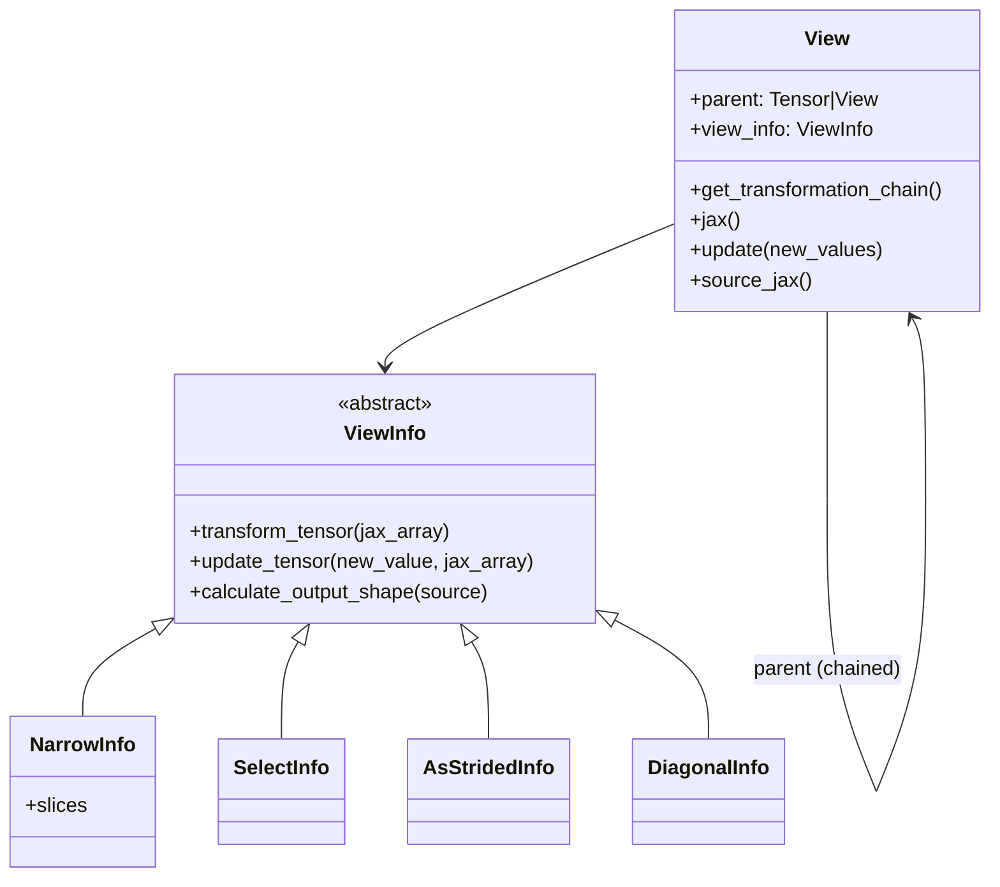

# torchax.view — lazy view chains over immutable JAX arrays

## Overview

PyTorch's aliasing model assumes mutable, storage-backed tensors: `x[1:3]` returns a *view*
that shares storage with `x`, so writing to the view mutates `x`. `jax.Array` has no such
concept — it is a pure value, and `arr[1:3]` is a copy. [`View`](../catalog/torchax/view.md#View)
is torchax's answer: instead of eagerly computing a sliced/reshaped array, it stores a
transformation recipe ([`ViewInfo`](../catalog/torchax/view.md#ViewInfo)) plus a pointer to its
parent (`Tensor` or another `View`), and only materializes the actual `jax.Array` on read
([`View.jax`](../catalog/torchax/view.md#View.jax)). Writes replay the transformation chain in
reverse to splice the new value back into the ultimate source array. This reconstructs
PyTorch's view-aliasing semantics on top of JAX's copy-on-read functional arrays.

## Diagram

## Design rationale (why it's built this way)

**Only `NarrowInfo` is actually implemented.** [`SelectInfo`](../catalog/torchax/view.md#SelectInfo),
[`AsStridedInfo`](../catalog/torchax/view.md#AsStridedInfo), and
[`DiagonalInfo`](../catalog/torchax/view.md#DiagonalInfo) all define their
`transform_tensor`/`update_tensor`/`calculate_output_shape` as `raise
NotImplementedError(...)` — they exist as declared extension points in the `ViewInfoType` enum
and class hierarchy (so callers/future code can pattern-match on view kind) but only slicing
(`tensor[...]`) is wired up end-to-end today. This is a scaffold for a wider view system, not a
finished one.

**Chains, not flat state.** A `View` does not store "my slice of the original array" directly —
it stores its *own* `ViewInfo` plus a reference to `parent`, and
[`get_transformation_chain`](../catalog/torchax/view.md#View.get_transformation_chain)
recursively walks `parent` links to build the ordered list of transforms from the true source
(a [`Tensor`](../catalog/torchax/tensor.md#Tensor)) down to this view. This lets `View`s be
built on top of `View`s (e.g. `x[1:3][:, 2:5]`) without collapsing intermediate state, at the
cost of re-walking and re-applying the whole chain on every `.jax()` read.

**Writes replay the chain in reverse with intermediate snapshots.** [`View.update`](../catalog/torchax/view.md#View.update)
first forward-applies every `ViewInfo` except the last to build `intermediate_values` (a list of
progressively-narrowed arrays), then walks `view_infos` and `intermediate_values` *in reverse*,
calling each `ViewInfo.update_tensor(new_value, parent_array)` to splice the write back one
level at a time, ending with [`replace_source_jax`](../catalog/torchax/view.md#View.replace_source_jax)
mutating the ultimate source `Tensor._elem` in place. The `# TODO: Investigate efficiency of
this algorithm` comment directly on this code is an explicit, author-acknowledged perf
concern — every write to a deep view chain re-materializes every intermediate level.

## Entry points

- [`View.__setitem__`](../catalog/torchax/view.md#View.__setitem__) — where `view[idx] = val`
  is caught; appends a fresh [`NarrowInfo`](../catalog/torchax/view.md#NarrowInfo) to the
  existing chain and calls [`update`](../catalog/torchax/view.md#View.update).
- [`View.jax`](../catalog/torchax/view.md#View.jax) — where any consumer that needs the
  concrete value (e.g. [`Environment.v2t_iso`](torchax-tensor.md)/`t2j_iso` materializing a view
  before crossing into a JAX-function call) reaches in.
- [`View.create_sub_view`](../catalog/torchax/view.md#View.create_sub_view) — how a view-on-a-view
  is constructed; called from op lowerings that need to chain further indexing without
  collapsing to a concrete `Tensor` first.
- [`View.torch`](../catalog/torchax/view.md#View.torch) — materializes this view into a plain
  [`Tensor`](../catalog/torchax/tensor.md#Tensor); used whenever downstream code needs a
  non-view torch tensor (e.g. `Environment.dispatch`'s `v2t_iso` for non-view ops).

## Mechanism (step-by-step)

1. **A view is created**, e.g. by `x[1:3]` dispatching to
   [`getitem`](../catalog/torchax/ops/jtorch.md#getitem) in
   [torchax-ops-jtorch](torchax-ops-jtorch.md), which constructs a
   [`View`](../catalog/torchax/view.md#View) with view_info=
   [`NarrowInfo`](../catalog/torchax/view.md#NarrowInfo)`(indexes)`.
2. **[`View.__new__`](../catalog/torchax/view.md#View.__new__)** computes the output shape
   eagerly via `view_info.calculate_output_shape(parent.jax())` (so this does force
   materialization of the *parent's* array to compute shape metadata, even though the view's own
   data stays lazy) and builds a `device="meta"` wrapper subclass, matching the same trick used by
   [`Tensor`](../catalog/torchax/tensor.md#Tensor).
3. **Reading the view** ([`jax`](../catalog/torchax/view.md#View.jax)) calls
   [`source_jax`](../catalog/torchax/view.md#View.source_jax) to walk to the true root `Tensor`,
   then applies every `ViewInfo` in
   [`get_transformation_chain`](../catalog/torchax/view.md#View.get_transformation_chain) in
   forward order via [`transform_tensor`](../catalog/torchax/view.md#ViewInfo.transform_tensor).
4. **Writing to the view** ([`update`](../catalog/torchax/view.md#View.update)/
   [`__setitem__`](../catalog/torchax/view.md#View.__setitem__)) computes the full chain,
   forward-applies all but the last transform to get intermediate snapshots, then walks backward
   applying [`update_tensor`](../catalog/torchax/view.md#NarrowInfo.update_tensor) at each level,
   finishing with [`replace_source_jax`](../catalog/torchax/view.md#View.replace_source_jax)
   which asserts the new value's shape matches the root
   [`_elem`](../catalog/torchax/tensor.md#Tensor._elem)'s shape before overwriting it directly —
   an in-place mutation of the wrapper's backing store, which is how torchax fakes PyTorch's
   in-place-write-through-a-view semantics.

## Key data structures

- **`ViewInfoType`** — an `Enum` tag (`NARROW`, `NO_OP`, `PERMUTE`, `RESHAPE`, `RESIZE`,
  `SELECT`, `AS_STRIDED`, `DIAGONAL`) recording which kind of view a `ViewInfo` represents,
  used for dispatch/introspection even where the corresponding class isn't implemented yet.
- **`View.parent: Tensor | View`** — the aliasing link; forms the chain that
  `get_transformation_chain` walks.
- **`View.view_info: ViewInfo`** — this view's own transformation step, appended to the parent
  chain.

## Dynamics (design intent)

`View` is itself a `torch.Tensor` wrapper subclass with `__torch_dispatch__` raising
`AssertionError` unconditionally (mirroring [`Tensor.__torch_dispatch__`](torchax-tensor.md)) —
a `View` cannot receive an arbitrary op outside the torchax environment either; only the
explicit methods on `View` (`__setitem__`, `.jax()`, `.torch()`) are meant to be called on it
directly, with everything else expected to route through `Environment.dispatch`'s
`is_view_op`/`v2t_iso` handling in [torchax-tensor](torchax-tensor.md).

## Edge cases

- `View.replace_source_jax` asserts `new_value.shape == self.parent._elem.shape` — if a bug
  anywhere upstream produces a mismatched shape for the *root* array, this fails loudly rather
  than silently broadcasting or truncating.
- Constructing a `View` forces evaluation of `calculate_output_shape`, which for `NarrowInfo`
  means actually slicing `source` (`source[self.slices].shape`) — so shape computation is not
  free even though data materialization is deferred.
- Since `SelectInfo`/`AsStridedInfo`/`DiagonalInfo` raise `NotImplementedError`, any op lowering
  that tries to construct one of those `ViewInfo` subclasses today will fail at the first
  `transform_tensor`/`update_tensor`/`calculate_output_shape` call, not at construction time.

## Open questions

- No lowering in the packet subgraph is visible constructing `SelectInfo`, `AsStridedInfo`, or
  `DiagonalInfo` — whether they are dead scaffolding or awaiting op coverage
  (`aten.select`/`aten.as_strided`/`aten.diagonal`) is not resolved by this file alone.
- The efficiency TODO on `View.update`'s reverse-replay algorithm is unresolved in source; no
  benchmark or alternate algorithm is present in this module.

## See also
- [torchax-tensor](torchax-tensor.md) — `Environment.dispatch`'s `is_view_op` branch and
  `v2t_iso`, which decide when a `View` gets materialized vs. passed through.
- [torchax-ops-jtorch](torchax-ops-jtorch.md) — `getitem`, the primary constructor of `View`
  instances via `NarrowInfo`.
