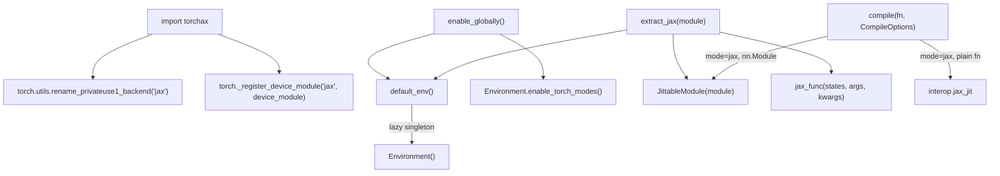

# torchax package root — bootstrap, global toggle, and PyTorch/XLA-Jax bridge

## Overview

`torchax/__init__.py` is the seam where PyTorch's dispatcher is wired to JAX. It does three
things at import time: registers `"jax"` as a real PyTorch device (via
`torch.utils.rename_privateuse1_backend`), lazily constructs one process-global
[`Environment`](../catalog/torchax/tensor.md#Environment) that owns the op registry and
dispatch modes, and exposes the handful of functions users actually call —
[`enable_globally`](../catalog/torchax/__init__.md#enable_globally),
[`extract_jax`](../catalog/torchax/__init__.md#extract_jax),
[`compile`](../catalog/torchax/__init__.md#compile) — that turn an ordinary `torch.nn.Module`
into something JAX can trace, jit, and shard. The key idea: torchax is not a new tensor
library, it is a *lowering layer* that makes `torch.Tensor` operations replay as `jax.Array`
operations, so existing PyTorch model code runs unmodified under `jax.jit`.

## Diagram

## Design rationale (why it's built this way)

**Global-but-lazy environment.** [`default_env`](../catalog/torchax/__init__.md#default_env)
constructs the single [`Environment`](../catalog/torchax/tensor.md#Environment) under a
`threading.Lock` on first use rather than at import time. This matters because building an
`Environment` calls `load_ops()`, which imports every op-lowering module
(`jaten`, `jc10d`, `jtorch`, `jtorchvision_nms`) — a nontrivial cost that should not run for
users who only import `torchax` to get `torch_view`/`jax_view` without ever enabling the
dispatch modes.

**Global enable/disable is a mode toggle, not a device move.** [`enable_globally`](../catalog/torchax/__init__.md#enable_globally)
/ [`disable_globally`](../catalog/torchax/__init__.md#disable_globally) flip
`Environment.enable_torch_modes` — they install `TorchFunctionMode`/`TorchDispatchMode`
context managers process-wide. [`disable_temporarily`](../catalog/torchax/__init__.md#disable_temporarily)
exists because library code (e.g. checkpoint save/load, dataset transforms) frequently needs a
window of *real* CPU-torch semantics even while a training script has torchax enabled globally.

> [!inferred] `enable_accuracy_mode` / `enable_performance_mode` toggle `jax_enable_x64` and
> `jax_default_matmul_precision` together with `internal_respect_torch_return_dtypes`. This
> reads as a deliberate escape hatch for numerics debugging: accuracy mode forces float64 and
> "highest" matmul precision (slow, exact) to bisect whether a discrepancy vs. eager PyTorch is
> a precision artifact of TPU's default bf16-ish matmul path, and performance mode reverts to
> the fast default. This is a first-class perf/numerics dial for anyone chasing a mismatch.

**`extract_jax` deduplicates before crossing the boundary.** [`extract_jax`](../catalog/torchax/__init__.md#extract_jax)
builds a [`JittableModule`](../catalog/torchax/interop.md#JittableModule) with
`dedup_parameters=True` by default, then copies the resulting state pytree into JAX arrays with
`env.t2j_copy`. The returned `jax_func` closure re-splits the flat `states` back into
params/buffers, converts inbound args from JAX to torch view with `env.j2t_iso`, executes the
model under `with env:` so the dispatch modes are active, and converts the result back with
`env.t2j_iso`. This is the shape every `jax.jit`-friendly entry point in torchax takes: JAX in,
torch view for the forward, JAX out — never letting a raw `torch.Tensor` escape the boundary.

## Entry points

- [`default_env`](../catalog/torchax/__init__.md#default_env) — the lazy global
  [`Environment`](../catalog/torchax/tensor.md#Environment) accessor; almost every other
  function in this package calls it first if no explicit `env` is threaded through.
- [`enable_globally`](../catalog/torchax/__init__.md#enable_globally) /
  [`disable_globally`](../catalog/torchax/__init__.md#disable_globally) — the switch a user
  flips once at process start to make `torch.Tensor` ops on `device="jax"` route through
  torchax's `__torch_dispatch__`/`__torch_function__` handlers.
- [`extract_jax`](../catalog/torchax/__init__.md#extract_jax) — control reaches this when a
  caller wants a *pure* `(state, jax_func)` pair out of an `nn.Module`, e.g. to hand to
  `jax.jit`, `jax.grad`, or a sharding transform directly, bypassing
  [`JittableModule`](../catalog/torchax/interop.md#JittableModule)'s own internal jit cache.
- [`compile`](../catalog/torchax/__init__.md#compile) — the single-call convenience entry
  point; dispatches to [`interop.JittableModule`](../catalog/torchax/interop.md#JittableModule)
  for `nn.Module`s or [`interop.jax_jit`](../catalog/torchax/interop.md#jax_jit) for plain
  callables, and raises for the (currently unimplemented) `dynamo`/`export` modes.

## Mechanism (step-by-step)

1. **Import-time device registration**, ahead of [`default_env`](../catalog/torchax/__init__.md#default_env)
   ever being called: `torch.utils.rename_privateuse1_backend("jax")` claims PyTorch's single
   generic `PrivateUse1` dispatch key for `"jax"`, and `torch._register_device_module("jax",
   torchax.device_module)` gives `torch.jax.*` device-management calls somewhere to land. This
   is why only one alternative backend (torchax *or* `torch_xla`) can be loaded at a time in a
   given process — both fight over the same `PrivateUse1` slot, which is exactly the class of
   conflict recorded in this project's own memory about `TORCH_DEVICE_BACKEND_AUTOLOAD`.
2. **First call to [`default_env`](../catalog/torchax/__init__.md#default_env)** constructs
   `Environment`, which in turn calls `load_ops()` to populate the op registry from
   `jaten`/`jtorch`/`jc10d` and merges in the decomposition table. Every subsequent call returns
   the same instance.
3. **[`enable_globally`](../catalog/torchax/__init__.md#enable_globally)** calls
   [`enable_torch_modes`](../catalog/torchax/tensor.md#Environment.enable_torch_modes), entering
   both interception-mode context managers *without exiting them* — a deliberately unbalanced
   enter used to make the mode process-wide/global rather than scoped to a `with` block.
4. **[`extract_jax`](../catalog/torchax/__init__.md#extract_jax)`(mod)`** wraps `mod` in a
   [`JittableModule`](../catalog/torchax/interop.md#JittableModule),
   pulls out `buffers`/`params`, converts them to JAX arrays once via `env.t2j_copy`, and
   returns a closure (`jax_func`) that does the params/buffers split + view conversion + the
   actual `functional_call` on every invocation — this closure is what a caller then wraps in
   `jax.jit` themselves (torchax does not jit it for you here, unlike `compile`).
5. **`compile(fn, options)`** is the ergonomic entry point most users hit first: for an
   `nn.Module` in `mode="jax"` it builds a `JittableModule` and pre-jits the requested methods
   via `make_jitted`; for a plain function it calls
   [`interop.jax_jit`](../catalog/torchax/interop.md#jax_jit) directly.

## Key data structures

- **`_env` / `_env_lock`** — module-level singleton state; the only global mutable state in
  the bootstrap path, guarded by a `threading.Lock` for first-construction races.
- **`CompileOptions`** (a dataclass defined in this module, outside this packet's own cited
  subgraph: `methods_to_compile`, `jax_jit_kwargs`, `mode`) — parameterizes
  [`compile`](../catalog/torchax/__init__.md#compile); `mode` is a string tag (`"jax"` is the
  only implemented path today).

## Dynamics (design intent)

`default_env()`'s double-checked locking (`if _env is None: with lock: if _env is not None:
return`) is textbook lazy-singleton-under-contention: cheap on the fast path (no lock once
constructed), safe on the slow path (only one thread wins construction). Everything downstream
assumes single-environment-per-process; there is no documented multi-`Environment` use case in
this file beyond the fact that `Environment()` itself is constructible standalone "for advanced
configuration" per its docstring on [`default_env`](../catalog/torchax/__init__.md#default_env).

## Edge cases

- `torch.backends.mha.set_fastpath_enabled(False)` is set at import time specifically because
  the fastpath uses sparse-tensor internals torchax doesn't support — any code path relying on
  PyTorch's fused MHA fastpath will silently take the slower reference path instead.
- `compile(fn, options)` raises `RuntimeError` immediately for `mode="dynamo"` or
  `mode="export"` — these are declared but not implemented; do not assume `CompileOptions.mode`
  is a free choice.
- The `jax_pjrt_client_create_options` telemetry string
  (`ml_framework_name:PyTorch/XLA2;ml_framework_version:...`) is only set `if getattr(jax.config,
  "jax_pjrt_client_create_options", None)` — i.e. guarded for JAX versions that don't expose the
  option, so it silently no-ops on older/newer JAX rather than erroring.

## Open questions

- Whether `enable_accuracy_mode()`/`enable_performance_mode()` are meant to be toggled
  mid-run or only once at start — the implementation mutates global `jax.config` state, so
  toggling inside a jitted region would not retroactively affect an already-traced function.
- The `dynamo` and `export` `CompileOptions.mode` values are stubbed with no target date visible
  in this file.

## See also
- [torchax-tensor](torchax-tensor.md) — the `Environment`/`Tensor`/dispatch mechanism this
  module bootstraps.
- [torchax-interop](torchax-interop.md) — `JittableModule`, `jax_jit`, and the `torch_view`/
  `jax_view` bridge used throughout.
- [torchax-export](torchax-export.md) — the `export`/StableHLO path referenced by `compile`'s
  unimplemented `mode="export"`.
