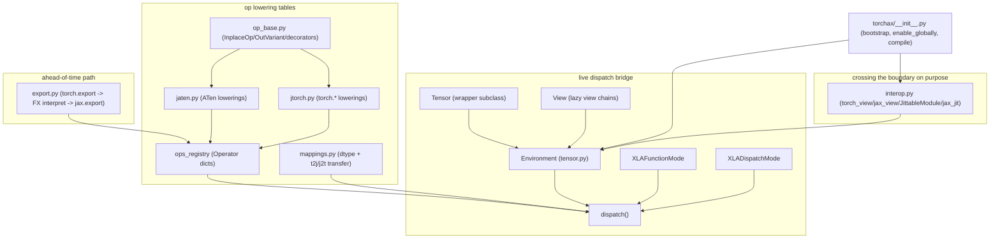

# torchax — what it is and how it fits together

## In one paragraph

torchax lets ordinary PyTorch model code (`nn.Module`, eager ops, `torch.export`) run on TPU by
executing every intercepted op as JAX/XLA under the hood, without going through `torch_xla`. The
central trick is a `torch.Tensor` wrapper subclass whose real payload is a `jax.Array`; PyTorch's
own `__torch_function__`/`__torch_dispatch__` extension points are hijacked to route every op
call through an `Environment` that looks the op up in a registry, converts operands to JAX,
calls a JAX-native lowering, and converts the result back. A second, symmetric layer
(`torch_view`/`jax_view`) lets a user cross that same boundary *on purpose* — handing a whole
model or function to `jax.jit`, `jax.grad`, or `shard_map` as if it were native JAX. A third,
independent path (`torch.export` → FX interpretation → `jax.export`) supports ahead-of-time
StableHLO export using the same op-lowering table.

## Core architecture

## Main concepts

**The `Tensor` wrapper and `Environment` dispatch loop.** A
[`Tensor`](concepts/torchax-tensor.md) presents to PyTorch as a `device="meta"` wrapper
subclass; its actual data is a `jax.Array` in `self._elem`. Every intercepted op funnels through
`Environment.dispatch`, which looks the op up in a registry, converts operands JAX-ward if
needed, calls the lowering, and converts back. See [torchax-tensor](concepts/torchax-tensor.md).

**Lazy views over immutable arrays.** Since `jax.Array` has no aliasing, PyTorch's
view-mutates-parent semantics are reconstructed by [`View`](concepts/torchax-view.md) — a chain
of `ViewInfo` transforms that materializes lazily on read and replays in reverse on write.

**The op registry: one flat table, two lookup keys.** [`ops_registry`](concepts/torchax-ops-ops_registry.md)
holds `all_aten_ops` (keyed by ATen overloads, for `__torch_dispatch__`) and `all_torch_functions`
(keyed by public `torch.*` callables, for `__torch_function__`), each entry an `Operator` record
carrying dispatch-relevant flags (`is_jax_function`, `needs_env`, `is_view_op`).

**Two lowering modules, one shared toolbox.** [`jaten`](concepts/torchax-ops-jaten.md) covers the
bulk of ATen ops (matmuls, norms, convolution, reductions); [`jtorch`](concepts/torchax-ops-jtorch.md)
covers the public `torch.*`/`torch.nn.functional.*` surface (constructors, `einsum`,
`scaled_dot_product_attention`'s reference-math implementation, tensor indexing/views). Both
lean on [`op_base`](concepts/torchax-ops-op_base.md)'s shared decorators
(`convert_dtype`/`promote_int_input`) and mutation wrappers (`InplaceOp`/`OutVariant`).

**Crossing the boundary on purpose: `torch_view`/`jax_view`.** [`interop`](concepts/torchax-interop.md)'s
tree-map transforms convert values *and callables* between torch-land and JAX-land, powering
`JittableModule` (a near-transparent `nn.Module` proxy that lazily jits per method),
`jax_value_and_grad`/`jax_shard_map`/`gradient_checkpoint` (any JAX transform applied to torch
code), and `j2t_autograd` (bridging `jax.vjp` into `torch.autograd.Function` for gradient
correctness).

**dtype and tensor transfer.** [`mappings`](concepts/torchax-ops-mappings.md) is the DLPack-first,
numpy-fallback data-transfer layer and the hand-maintained torch↔JAX dtype crosswalk (including
bf16/fp8 special-casing) — on the hot path of every boundary crossing.

**Ahead-of-time export.** [`export`](concepts/torchax-export.md) takes an already-`torch.export`d
graph and replays it through the *same* op registry via a custom FX interpreter, then optionally
lowers to StableHLO via `jax.export` — a second execution engine sharing one lowering table with
the live-dispatch path.

**Worked examples.** The two tutorials —
[distributed arrays / automatic parallelization](concepts/docs-docs-tutorials-distributed_array.md)
and [training a PyTorch model with a JAX train loop](concepts/docs-docs-tutorials-trainingyt.md) —
demonstrate that a torchax `Tensor` is shardable with plain JAX `Mesh`/`NamedSharding`, and that
the `loss.backward()`/`optimizer.step()` idiom is replaced by `jax_value_and_grad` + `optax`,
culminating in `torchax.train.make_train_step` and `jax.jit` with buffer donation.

## How a request flows

A user calls [`torchax.enable_globally()`](concepts/torchax.md) once, which lazily constructs the
process-global [`Environment`](concepts/torchax-tensor.md) (importing and registering every
`jaten`/`jtorch` lowering) and installs the dispatch modes. From then on, every `torch.Tensor` op
on a `Tensor`/`View` is intercepted, looked up in [`ops_registry`](concepts/torchax-ops-ops_registry.md),
converted via [`mappings`](concepts/torchax-ops-mappings.md), executed by a
[`jaten`](concepts/torchax-ops-jaten.md)/[`jtorch`](concepts/torchax-ops-jtorch.md) lowering, and
converted back. To get compiled, sharded, or differentiated execution, a user reaches for
[`interop`](concepts/torchax-interop.md) (`compile`/`JittableModule`/`jax_jit`/`jax_value_and_grad`)
rather than relying on ambient dispatch alone. For serialization or cross-framework export, the
separate [`export`](concepts/torchax-export.md) path replays an already-captured `torch.export`
graph through the same lowering table.

## Map of the wiki

- **"What does `torch.foo` actually compute on TPU?"** → [torchax-ops-jaten](concepts/torchax-ops-jaten.md)
  or [torchax-ops-jtorch](concepts/torchax-ops-jtorch.md), depending on whether it's an ATen op
  or a public `torch.*` function.
- **"How does a view/mutation actually work?"** → [torchax-view](concepts/torchax-view.md) +
  the dispatch-side handling in [torchax-tensor](concepts/torchax-tensor.md).
- **"How do I jit/shard/grad torch code?"** → [torchax-interop](concepts/torchax-interop.md).
- **"How do I export to StableHLO?"** → [torchax-export](concepts/torchax-export.md).
- **"Show me a worked training loop / sharding example"** →
  [docs-docs-tutorials-trainingyt](concepts/docs-docs-tutorials-trainingyt.md) /
  [docs-docs-tutorials-distributed_array](concepts/docs-docs-tutorials-distributed_array.md).
- For the exhaustive per-symbol index, see `catalog/`; for the full concept list with commit
  provenance, see `index.md`.
