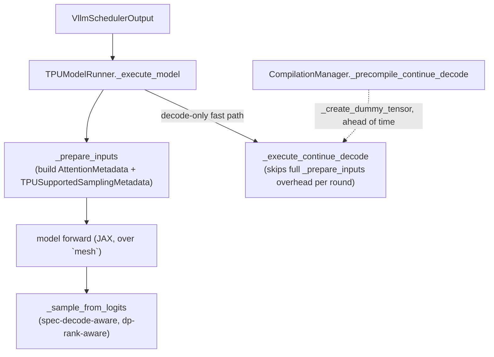

# tpu_inference.runner.tpu_runner — TPUModelRunner's execute/prepare/sample decode loop

## Overview

`TPUModelRunner` is tpu-inference's (vLLM-TPU's JAX backend) per-step model executor: `_execute_model`
prepares inputs, runs the model, and samples — with a dedicated fast path,
`_execute_continue_decode`, for repeated decode-only rounds. Every step consumes and updates an
`input_batch: InputBatch` (see
[tpu_inference-runner-input_batch](tpu_inference-runner-input_batch.md)) and an
[`AttentionMetadata`](../catalog/tpu_inference/layers/common/attention_metadata.md#AttentionMetadata)
(the paged-attention bookkeeping every attention kernel call consumes). Every JIT-compiled path this
runner will ever call is precompiled ahead of time by `CompilationManager` (see
[tpu_inference-runner-compilation_manager](tpu_inference-runner-compilation_manager.md)) using dummy
tensors shaped to match real traffic, so no shape ever triggers a first-request compilation stall.

## Diagram

## Design rationale (why it's built this way)

**`_execute_continue_decode` is a separate, narrower method from `_execute_model`, not a branch
inside it — because the decode-only steady-state loop (no new prefill admission) has a fundamentally
simpler input-preparation path than the general step that must also handle admission/eviction.** Both
methods share `_prepare_inputs`, `input_batch`, `mesh`, and sampling
(`rng_params_for_sampling`/`sample`), but `_execute_continue_decode`'s own signature (just
`scheduler_output`, no `intermediate_tensors`) is narrower than `_execute_model`'s general one.

**Every code path `_execute_continue_decode` will run is precompiled ahead of time via
`_create_dummy_tensor`-built inputs**, per
[`CompilationManager._precompile_continue_decode`](../catalog/tpu_inference/runner/compilation_manager.md#CompilationManager._precompile_continue_decode) —
this guarantees the hot continuous-batching decode loop never triggers an on-demand JIT compilation,
which would otherwise stall the whole serving pipeline for every new batch-size combination.

**`_sample_from_logits` accepts data-parallel-rank-specific parameters
(`req_ids_dp`/`padded_num_scheduled_tokens_per_dp_rank`) alongside speculative-decoding parameters
(`spec_decode_metadata`), meaning sampling is a single unified function handling DP sharding and
speculative decoding together, not two separate sampling paths.** This mirrors the general tpu-inference
design principle (seen elsewhere in this codebase) of one code path handling multiple orthogonal
serving features via explicit optional parameters, rather than a matrix of specialized functions.

## Entry points

- `TPUModelRunner._execute_model` — the general per-step entry point, handling prefill admission and
  decode uniformly, building the per-step
  [`AttentionMetadata`](../catalog/tpu_inference/layers/common/attention_metadata.md#AttentionMetadata).
- `TPUModelRunner._execute_continue_decode` — the decode-only fast path for the steady-state
  continuous-batching loop, calling straight into
  [`continue_decode`](../catalog/tpu_inference/runner/decode_loop.md#continue_decode).
- [`CompilationManager._precompile_continue_decode`](../catalog/tpu_inference/runner/compilation_manager.md#CompilationManager._precompile_continue_decode) —
  called once at server startup to warm every shape the decode loop will need.

## Mechanism (step-by-step)

1. **`_prepare_inputs` builds an
   [`AttentionMetadata`](../catalog/tpu_inference/layers/common/attention_metadata.md#AttentionMetadata)
   and `TPUSupportedSamplingMetadata` from the scheduler's output**, reading current `input_batch`
   state and DP-sharding parameters (`dp_size`).
2. **The model forward pass runs over the configured `mesh`** (whose axes are named per
   [`ShardingAxisName`](../catalog/tpu_inference/layers/common/sharding.md#ShardingAxisName)),
   producing `hidden_states`/`logits` (and optionally `aux_hidden_states` for auxiliary
   losses/speculative-decode draft heads, represented as
   [`JaxIntermediateTensors`](../catalog/tpu_inference/models/jax/jax_intermediate_tensor.md#JaxIntermediateTensors)).
3. **`_sample_from_logits` samples tokens**, handling speculative-decode draft-token proposal via
   [`propose_draft_token_ids`](../catalog/tpu_inference/runner/speculative_decoding_manager.md#SpeculativeDecodingManager.propose_draft_token_ids),
   prompt log-probabilities, and per-DP-rank output slicing.
4. **For the decode-only fast path, `_execute_continue_decode` skips the general admission-handling
   overhead**, calling straight into
   [`continue_decode`](../catalog/tpu_inference/runner/decode_loop.md#continue_decode) after a
   narrower `_prepare_inputs` call.
5. **Ahead of any real traffic,
   [`CompilationManager._precompile_continue_decode`](../catalog/tpu_inference/runner/compilation_manager.md#CompilationManager._precompile_continue_decode)
   builds dummy tensors via
   [`_create_dummy_tensor`](../catalog/tpu_inference/runner/compilation_manager.md#CompilationManager._create_dummy_tensor)
   ("Helper to create dummy tensors for precompilation") and runs the full decode path once per shape
   to force compilation.**

## Key data structures

- **`TPUModelRunner`** — holds `mesh`, `input_batch`, `max_num_reqs`, `vllm_config`, `kv_caches`.
- **[`AttentionMetadata`](../catalog/tpu_inference/layers/common/attention_metadata.md#AttentionMetadata)** —
  a `jax.tree_util.register_dataclass`-registered dataclass with data fields `input_positions`,
  `block_tables`, `seq_lens`, `query_start_loc`, `request_distribution`, `mamba_state_indices` and meta
  field `padded_num_reqs`.

## Dynamics (design intent)
Not addressable beyond the precompile-then-execute design described above from this packet's subgraph.

## Edge cases
None directly visible in this packet's subgraph beyond the DP-rank-aware sampling parameters.

## Open questions
- The exact criteria for when `_execute_model` chooses the general path vs. when the decode-only
  `_execute_continue_decode` fast path is used isn't fully resolved by the symbols in this packet's
  subgraph (`tpu_runner.py` itself isn't in this packet's own catalog, only its cross-references into
  `compilation_manager.py`/`attention_metadata.py`/`sharding.py` are).

## See also
- [tpu_inference-runner-compilation_manager](tpu_inference-runner-compilation_manager.md) — the
  precompilation machinery that guarantees this runner's hot paths never trigger on-demand JIT.
- [tpu_inference-layers-common-attention_metadata](tpu_inference-layers-common-attention_metadata.md) —
  `AttentionMetadata`, the paged-attention bookkeeping every model forward pass consumes.
- [tpu_inference-runner-input_batch](tpu_inference-runner-input_batch.md) — `InputBatch`, the
  continuous-batching request-slot state this runner reads/updates each step.
