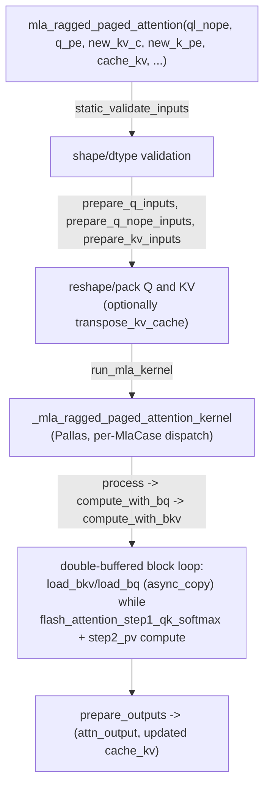

# tpu_inference.kernels.mla.v2.kernel — the MLA (Multi-head Latent Attention) Pallas kernel

<!-- connect:up:begin -->
> **Cross-repo concept:** part of [pallas-kernel](../../../concepts/pallas-kernel.md) across this wiki's repos.
<!-- connect:up:end -->
## Overview

[`mla_ragged_paged_attention`](../catalog/tpu_inference/kernels/mla/v2/kernel.md#mla_ragged_paged_attention)
("MLA Ragged paged attention that supports mixed prefill and decode") is tpu-inference's Pallas TPU
kernel for DeepSeek-style Multi-head Latent Attention — a variant of ragged paged attention adapted to
MLA's compressed KV representation (`kv_c` — a shared latent, plus separate rotary/non-rotary query
parts `q_pe`/`ql_nope`). The kernel handles prefill, decode, and mixed-batch cases in one call
(`MlaCase`: `PREFILL`/`DECODE`/`MIXED`/`BATCHED_DECODE`), with double-buffered async KV fetch
(`_async_copy`) and an optional two-step flash-attention decomposition
(`two_step_flash_attention`).

## Diagram

## Design rationale (why it's built this way)

**MLA's compressed KV representation (one shared latent `kv_c` plus a small rotary-only `k_pe`, rather
than full per-head K/V) is threaded through as separate arguments (`new_kv_c`, `new_k_pe`), not
merged into a conventional per-head KV tensor before the kernel call.**
[`mla_ragged_paged_attention`](../catalog/tpu_inference/kernels/mla/v2/kernel.md#mla_ragged_paged_attention)'s
signature keeps `ql_nope`/`q_pe` (the non-rotary and rotary query parts) and `new_kv_c`/`new_k_pe`
(the latent and rotary key parts) distinct throughout — MLA's whole memory-saving premise is that the
cached KV representation is much smaller than conventional per-head K/V, so the kernel must handle
this compressed layout natively rather than materializing a conventional KV tensor first.

**The kernel is `jax.jit`-compiled with a long list of `static_argnames` covering every
performance-tuning knob (block sizes, VMEM limit, dtype, transpose choice, two-step-flash-attention
toggle) and `donate_argnames=("cache_kv",)`, so the KV cache buffer is updated in place rather than
copied.** This mirrors the same donate-for-reuse pattern seen in other in-place-cache-update kernels
across the TPU-perf ecosystem (cf. levanter's `SequenceTable.free_pages`, a different codebase, same
underlying JAX buffer-donation technique) — every distinct combination of static args is its own
compiled variant, which is exactly what `CompilationManager`-style precompilation (see
[root](root.md)) exists to warm ahead of time.

**Mixed prefill/decode is one `MlaCase` dispatch inside a single kernel, not two separate kernels
glued together at the JAX level** — the kernel's own doc, "supports mixed prefill and decode,"
combined with `MlaCase` values `PREFILL`/`DECODE`/`MIXED`/`BATCHED_DECODE`, means a single Pallas
kernel invocation can serve a continuous-batching step containing both newly-admitted prefill
requests and steady-state decode requests together.

**KV fetch is explicitly double-buffered and asynchronous (`_async_copy`, `wait_fetch_bkv`,
`load_batch_bkv`/`load_bkv`), overlapping the next block's KV fetch with the current block's
attention compute (`compute_with_bkv` calling `flash_attention_step1_qk_softmax`/`step2_pv`)** — the
classic flash-attention-kernel technique of hiding HBM↔VMEM latency behind compute, applied here to
MLA's paged/ragged KV layout specifically.

## Entry points

- [`mla_ragged_paged_attention`](../catalog/tpu_inference/kernels/mla/v2/kernel.md#mla_ragged_paged_attention) —
  the public kernel entry point.
- [`_mla_ragged_paged_attention`](../catalog/tpu_inference/layers/common/attention_interface.md#mla_attention._mla_ragged_paged_attention) —
  the thin wrapper inside `attention_interface.mla_attention` that calls the kernel from the layer
  level.

## Mechanism (step-by-step)

1. **Inputs are validated**
   ([`static_validate_inputs`](../catalog/tpu_inference/kernels/mla/v2/kernel.md#static_validate_inputs))
   **then reshaped/packed** via
   [`prepare_q_inputs`](../catalog/tpu_inference/kernels/mla/v2/kernel.md#prepare_q_inputs)/
   [`prepare_q_nope_inputs`](../catalog/tpu_inference/kernels/mla/v2/kernel.md#prepare_q_nope_inputs)/
   [`prepare_kv_inputs`](../catalog/tpu_inference/kernels/mla/v2/kernel.md#prepare_kv_inputs) (or
   [`prepare_kv_inputs_for_transposed_kv_cache`](../catalog/tpu_inference/kernels/mla/v2/kernel.md#prepare_kv_inputs_for_transposed_kv_cache)
   if `transpose_kv_cache=True`).
2. **[`run_mla_kernel`](../catalog/tpu_inference/kernels/mla/v2/kernel.md#mla_ragged_paged_attention.run_mla_kernel)
   dispatches the Pallas kernel per
   [`MlaCase`](../catalog/tpu_inference/kernels/mla/v2/kernel.md#MlaCase)**
   ([`PREFILL`](../catalog/tpu_inference/kernels/mla/v2/kernel.md#MlaCase.PREFILL)/
   [`DECODE`](../catalog/tpu_inference/kernels/mla/v2/kernel.md#MlaCase.DECODE)/
   [`MIXED`](../catalog/tpu_inference/kernels/mla/v2/kernel.md#MlaCase.MIXED)/
   [`BATCHED_DECODE`](../catalog/tpu_inference/kernels/mla/v2/kernel.md#MlaCase.BATCHED_DECODE)),
   each case handling its own block-iteration structure.
3. **[`process`](../catalog/tpu_inference/kernels/mla/v2/kernel.md#_mla_ragged_paged_attention_kernel.process)'s
   inner loop
   ([`compute_with_bq`](../catalog/tpu_inference/kernels/mla/v2/kernel.md#_mla_ragged_paged_attention_kernel.process.compute_with_bq)
   →
   [`compute_with_bkv`](../catalog/tpu_inference/kernels/mla/v2/kernel.md#_mla_ragged_paged_attention_kernel.process.compute_with_bq.compute_with_bkv))
   double-buffers KV block fetch**:
   [`_async_copy`](../catalog/tpu_inference/kernels/mla/v2/kernel.md#_mla_ragged_paged_attention_kernel._async_copy)
   issues the next block's HBM→VMEM copy while
   [`flash_attention_step1_qk_softmax`](../catalog/tpu_inference/kernels/mla/v2/kernel.md#_mla_ragged_paged_attention_kernel.flash_attention_step1_qk_softmax)/
   [`flash_attention_step2_pv`](../catalog/tpu_inference/kernels/mla/v2/kernel.md#_mla_ragged_paged_attention_kernel.flash_attention_step2_pv)
   compute over the current, already-fetched block.
4. **[`prepare_outputs`](../catalog/tpu_inference/kernels/mla/v2/kernel.md#prepare_outputs) assembles
   the final attention output and the updated (donated, in-place) KV cache.**

## Key data structures

- **`MlaCase`** — the prefill/decode/mixed/batched-decode discriminator driving the kernel's internal
  dispatch.
- **Kernel arguments** — `ql_nope`/`q_pe` (query, split rotary/non-rotary), `new_kv_c`/`new_k_pe`
  (new latent/rotary key), `cache_kv` (donated, updated in place), `kv_lens`/`page_indices`/
  `cu_q_lens`/`distribution` (ragged-paged bookkeeping, analogous to `AttentionMetadata`'s
  fields in the general attention path).

## Dynamics (design intent)

The `donate_argnames=("cache_kv",)` decoration means callers must not reuse a pre-call reference to
`cache_kv` — consistent with the kernel updating the KV cache in place rather than allocating a fresh
buffer each call, a deliberate memory-bandwidth optimization for a structure this large and
frequently-updated.

## Edge cases
None directly visible in this packet's subgraph beyond the `debug_mode`/`debug_print` diagnostic path.

## Open questions
- The precise numerical difference between `two_step_flash_attention=True` and the single-step
  alternative (and when one is preferred over the other) isn't resolved by the symbols in this
  packet's subgraph.

## See also
- [tpu_inference-layers-jax-attention](tpu_inference-layers-jax-attention.md) — the general
  (non-MLA) ragged-paged-attention layer this kernel is a specialized sibling of.
- [tpu_inference-layers-common-attention_metadata](tpu_inference-layers-common-attention_metadata.md) —
  the analogous per-request bookkeeping structure for the general attention path.
