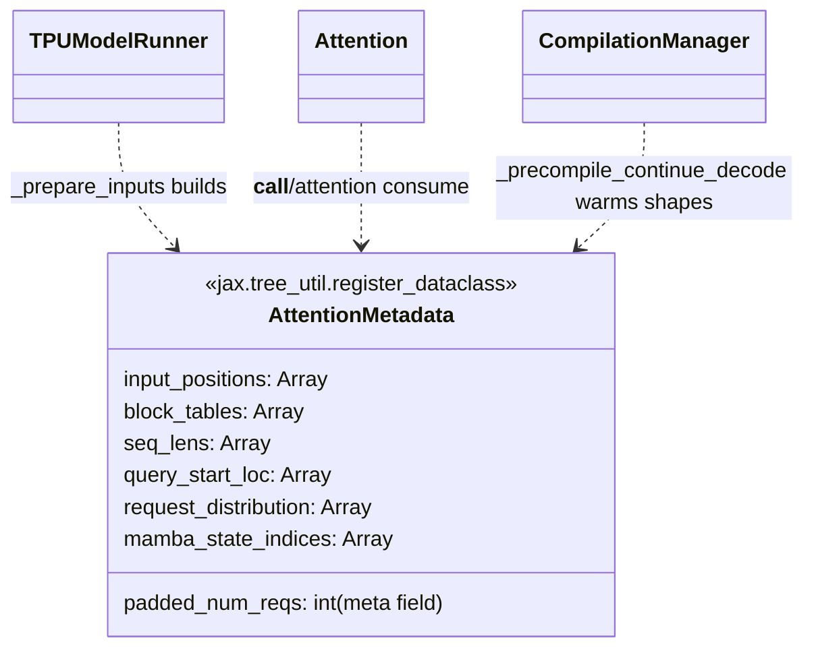

# tpu_inference.layers.common.attention_metadata — AttentionMetadata, the shared paged-attention bookkeeping

## Overview

[`AttentionMetadata`](../catalog/tpu_inference/layers/common/attention_metadata.md#AttentionMetadata)
is a `jax.tree_util.register_dataclass`-registered dataclass carrying every piece of per-request
bookkeeping the ragged-paged-attention kernel needs:
[`input_positions`](../catalog/tpu_inference/layers/common/attention_metadata.md#AttentionMetadata.input_positions)
(for RoPE), `block_tables` (KV-cache page ownership),
[`seq_lens`](../catalog/tpu_inference/layers/common/attention_metadata.md#AttentionMetadata.seq_lens),
[`query_start_loc`](../catalog/tpu_inference/layers/common/attention_metadata.md#AttentionMetadata.query_start_loc)
(ragged-batch offsets), `request_distribution`, and `mamba_state_indices` (for hybrid
attention/state-space-model architectures). It is built once per step by
`TPUModelRunner._prepare_inputs` and threaded unchanged through every attention layer's forward call
(see [tpu_inference-layers-jax-attention](tpu_inference-layers-jax-attention.md)), the sampler
(`_sample_from_logits`), and the precompilation warm-up path
(`CompilationManager._precompile_continue_decode`).

## Diagram

## Design rationale (why it's built this way)

**`AttentionMetadata` is registered as a JAX pytree dataclass with an explicit `data_fields`/
`meta_fields` split — `padded_num_reqs` is a *meta* field (static, part of the pytree structure), while
every array field is a *data* field (traced leaf).** This split means changing `padded_num_reqs`
(e.g. batch size) triggers a retrace/recompile, while the array contents themselves flow through as
ordinary traced data — consistent with `padded_num_reqs` being exactly the kind of shape-determining
value that must be static under `jax.jit`.

**`query_start_loc` (ragged-batch cumulative offsets) and `seq_lens` are both carried explicitly,
rather than one being derivable from the other at kernel-call time** — this is the standard
ragged-attention representation (cumulative offsets for indexing into a flat token buffer, per-sequence
lengths for masking/positions), kept as two separate precomputed arrays so the kernel doesn't need to
recompute either from the other on every call.

**`mamba_state_indices` lives on the same shared `AttentionMetadata`, alongside pure-attention
fields**, rather than a separate metadata type for state-space-model layers — implying tpu-inference
supports hybrid architectures (mixing attention and Mamba/SSM layers) sharing one per-step metadata
object rather than requiring the runner to build and thread two parallel metadata structures.

## Entry points

- [`AttentionMetadata`](../catalog/tpu_inference/layers/common/attention_metadata.md#AttentionMetadata) —
  the constructor `TPUModelRunner._prepare_inputs` calls once per step.
- [`CompilationManager._precompile_continue_decode`](../catalog/tpu_inference/runner/compilation_manager.md#CompilationManager._precompile_continue_decode) —
  builds dummy `AttentionMetadata` instances (via
  [`input_positions`](../catalog/tpu_inference/layers/common/attention_metadata.md#AttentionMetadata.input_positions)/
  [`query_start_loc`](../catalog/tpu_inference/layers/common/attention_metadata.md#AttentionMetadata.query_start_loc)/
  [`seq_lens`](../catalog/tpu_inference/layers/common/attention_metadata.md#AttentionMetadata.seq_lens)
  dummy tensors) to warm every shape ahead of real traffic.

## Mechanism (step-by-step)

1. **`TPUModelRunner._prepare_inputs` builds one
   [`AttentionMetadata`](../catalog/tpu_inference/layers/common/attention_metadata.md#AttentionMetadata)
   per step** from the scheduler's output, computing
   [`input_positions`](../catalog/tpu_inference/layers/common/attention_metadata.md#AttentionMetadata.input_positions)/`block_tables`/
   [`seq_lens`](../catalog/tpu_inference/layers/common/attention_metadata.md#AttentionMetadata.seq_lens)/
   [`query_start_loc`](../catalog/tpu_inference/layers/common/attention_metadata.md#AttentionMetadata.query_start_loc)/
   `request_distribution` (and `mamba_state_indices` for hybrid architectures) from the current
   `input_batch` state.
2. **The same `AttentionMetadata` instance is passed unchanged into every attention layer's forward
   call** ([`Attention.__call__`](../catalog/tpu_inference/layers/jax/attention/attention.md#Attention.__call__)/
   [`.attention`](../catalog/tpu_inference/layers/jax/attention/attention.md#Attention.attention)),
   the sampler, and speculative-decoding machinery.
3. **At server startup,
   [`CompilationManager._precompile_continue_decode`](../catalog/tpu_inference/runner/compilation_manager.md#CompilationManager._precompile_continue_decode)
   constructs dummy `AttentionMetadata` instances at every shape the decode loop will encounter**,
   forcing JIT compilation ahead of real requests.

## Key data structures

- **[`AttentionMetadata`](../catalog/tpu_inference/layers/common/attention_metadata.md#AttentionMetadata)** —
  see fields above; data fields are traced pytree leaves, `padded_num_reqs` is a static meta field.

## Dynamics (design intent)

Because `padded_num_reqs` is a static meta field, every distinct padded batch size is its own
compiled program variant — consistent with `CompilationManager` needing to precompile across the full
range of padded batch sizes the server will serve, not just one.

## Edge cases
None directly visible in this packet's subgraph.

## Open questions
- The exact semantics of `request_distribution` (how it differs from `seq_lens`/`query_start_loc`,
  e.g. whether it's a DP-rank assignment vector) isn't resolved by the symbols in this packet's
  subgraph.

## See also
- [tpu_inference-layers-jax-attention](tpu_inference-layers-jax-attention.md) — `Attention.__call__`,
  the primary consumer of `AttentionMetadata`.
- [root](root.md) — `TPUModelRunner`/`CompilationManager`, the builder and precompilation-time
  synthesizer of `AttentionMetadata`.
