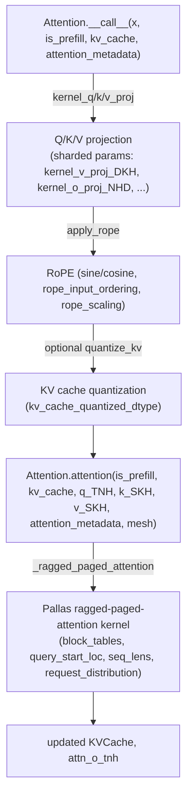

# tpu_inference.layers.jax.attention — the JAX attention layer over ragged paged attention

## Overview

[`Attention.__call__`](../catalog/tpu_inference/layers/jax/attention/attention.md#Attention.__call__)
("Performs the forward pass of the attention module") is tpu-inference's JAX-native attention layer:
Q/K/V projection with explicitly-sharded parameters
([`kernel_v_proj_DKH`](../catalog/tpu_inference/layers/jax/attention/attention.md#Attention.kernel_v_proj_DKH),
[`kernel_o_proj_NHD`](../catalog/tpu_inference/layers/jax/attention/attention.md#Attention.kernel_o_proj_NHD)),
RoPE application
([`apply_rope`](../catalog/tpu_inference/layers/jax/rope_interface.md#apply_rope), "Applies Rotary
Positional Embedding using the sine and cosine strategy"), then
[`Attention.attention`](../catalog/tpu_inference/layers/jax/attention/attention.md#Attention.attention)
("Performs scaled dot-product attention and updates the KV cache"), which dispatches to
`_ragged_paged_attention` — the shared Pallas ragged-paged-attention kernel every architecture-specific
attention variant (e.g.
[`Llama4Attention.__call__`](../catalog/tpu_inference/layers/jax/attention/llama4_attention.md#Llama4Attention.__call__))
ultimately calls into.

## Diagram

## Design rationale (why it's built this way)

**KV-cache quantization is an optional, per-call toggle (`quantize_kv`, `kv_cache_quantized_dtype`),
not baked into the layer's structure — the same `Attention` layer serves both quantized and
full-precision KV caches.** [`Attention.__call__`](../catalog/tpu_inference/layers/jax/attention/attention.md#Attention.__call__)
reads `_k_scale`/`_v_scale` (quantization scale factors) alongside `kv_cache_quantized_dtype`, applying
them conditionally — this lets a served model's KV-cache memory footprint be reduced (e.g. int8 KV
cache) purely via config, without a separate quantized-attention code path.

**`Attention.attention` takes `is_prefill` as an explicit boolean, not inferring it from shapes**,
letting the kernel dispatch differently for prefill (processing a full new prompt) vs. decode
(extending existing sequences) even when the underlying tensor shapes could in principle be ambiguous
— this is the same explicit-mode-flag pattern seen in other perf-focused attention implementations
across the TPU ecosystem (cf. AXLearn's `ForwardMode`, a different codebase, same underlying need).

**The actual attention math is delegated to `_ragged_paged_attention`, a single shared kernel, with
per-request bookkeeping (`block_tables`, `query_start_loc`, `seq_lens`, `request_distribution`) passed
in via [`AttentionMetadata`](../catalog/tpu_inference/layers/common/attention_metadata.md#AttentionMetadata)**
rather than each model architecture's `Attention` subclass reimplementing the ragged/paged mechanics —
[`Llama4Attention.__call__`](../catalog/tpu_inference/layers/jax/attention/llama4_attention.md#Llama4Attention.__call__)'s
near-identical signature and field usage to the base `Attention.__call__` confirms this shared-kernel
design holds across architectures.

**RoPE is a standalone function (`apply_rope`), not a method on `Attention`**, parameterized by
`rope_theta`/`rope_scaling`/`rope_input_ordering`/`rope_proportion` — this lets RoPE variants be
swapped or reused (e.g. by `Llama4Attention`, which calls the identical `apply_rope`) without
modifying the attention layer itself.

## Entry points

- [`Attention.__call__`](../catalog/tpu_inference/layers/jax/attention/attention.md#Attention.__call__) —
  the layer's forward pass; called once per attention layer per model forward call.
- [`Attention.attention`](../catalog/tpu_inference/layers/jax/attention/attention.md#Attention.attention) —
  the scaled-dot-product-attention-plus-KV-cache-update core, callable independently of the full
  `__call__` (e.g. after Q/K/V are already projected).
- [`apply_rope`](../catalog/tpu_inference/layers/jax/rope_interface.md#apply_rope) — called from within
  `__call__` (and reused by architecture-specific variants like `Llama4Attention`) to rotate
  query/key projections.

## Mechanism (step-by-step)

1. **`__call__` projects `x` to Q/K/V via sharded parameter kernels**
   ([`kernel_v_proj_DKH`](../catalog/tpu_inference/layers/jax/attention/attention.md#Attention.kernel_v_proj_DKH)
   and siblings, created via
   [`create_param`](../catalog/tpu_inference/layers/jax/base.md#create_param)).
2. **RoPE is applied to Q/K via [`apply_rope`](../catalog/tpu_inference/layers/jax/rope_interface.md#apply_rope)**,
   using the layer's configured `rope_theta`/`rope_scaling`/`rope_input_ordering`.
3. **If [`quantize_kv`](../catalog/tpu_inference/layers/common/__init__.md#quantize_kv) is set, K/V are
   quantized to
   [`kv_cache_quantized_dtype`](../catalog/tpu_inference/layers/jax/attention/attention.md#Attention.kv_cache_quantized_dtype)
   before being written into the KV cache** (scaled by
   [`_k_scale`](../catalog/tpu_inference/layers/jax/attention/attention.md#Attention._k_scale)/
   [`_v_scale`](../catalog/tpu_inference/layers/jax/attention/attention.md#Attention._v_scale)).
4. **`Attention.attention` calls `_ragged_paged_attention`**, passing
   [`AttentionMetadata`](../catalog/tpu_inference/layers/common/attention_metadata.md#AttentionMetadata)'s
   `block_tables`/`query_start_loc`/
   [`seq_lens`](../catalog/tpu_inference/layers/common/attention_metadata.md#AttentionMetadata.seq_lens)/
   `request_distribution` so the kernel knows exactly which KV pages belong to which request.
5. **The kernel returns an updated
   [`KVCache`](../catalog/tpu_inference/layers/jax/attention/attention.md#KVCache) and the attention
   output**
   ([`attn_o_tnh`](../catalog/tpu_inference/layers/jax/attention/attention.md#Attention.attn_o_tnh)),
   projected back through
   [`kernel_o_proj_NHD`](../catalog/tpu_inference/layers/jax/attention/attention.md#Attention.kernel_o_proj_NHD)
   in `__call__`.

## Key data structures

- **`Attention`** — holds sharded Q/K/V/O projection parameters
  ([`kernel_v_proj_DKH`](../catalog/tpu_inference/layers/jax/attention/attention.md#Attention.kernel_v_proj_DKH),
  [`kernel_o_proj_NHD`](../catalog/tpu_inference/layers/jax/attention/attention.md#Attention.kernel_o_proj_NHD)),
  RoPE config, and KV-quantization config.
- **[`AttentionMetadata`](../catalog/tpu_inference/layers/common/attention_metadata.md#AttentionMetadata)** —
  see [tpu_inference-layers-common-attention_metadata](tpu_inference-layers-common-attention_metadata.md);
  the shared per-request paged-attention bookkeeping every attention call consumes.
- **`KVCache`** — the paged key/value store `attention` reads and updates.

## Dynamics (design intent)
Not addressable beyond the shared-kernel-dispatch design described above from this packet's subgraph.

## Edge cases
None directly visible in this packet's subgraph beyond the optional KV-quantization path.

## Open questions
- The exact set of architecture-specific `Attention` subclasses beyond `Llama4Attention` (e.g. for
  MLA-based architectures — see
  [tpu_inference-kernels-mla-v2-kernel](tpu_inference-kernels-mla-v2-kernel.md)) and how they diverge
  from this base implementation isn't fully resolved by the symbols in this packet's subgraph.

## See also
- [tpu_inference-layers-common-attention_metadata](tpu_inference-layers-common-attention_metadata.md) —
  `AttentionMetadata`, the shared paged-attention bookkeeping structure.
- [root](root.md) — `TPUModelRunner`, the caller that builds `AttentionMetadata` each step.
- [tpu_inference-kernels-mla-v2-kernel](tpu_inference-kernels-mla-v2-kernel.md) — a specialized
  (multi-latent) ragged-paged-attention kernel variant.
