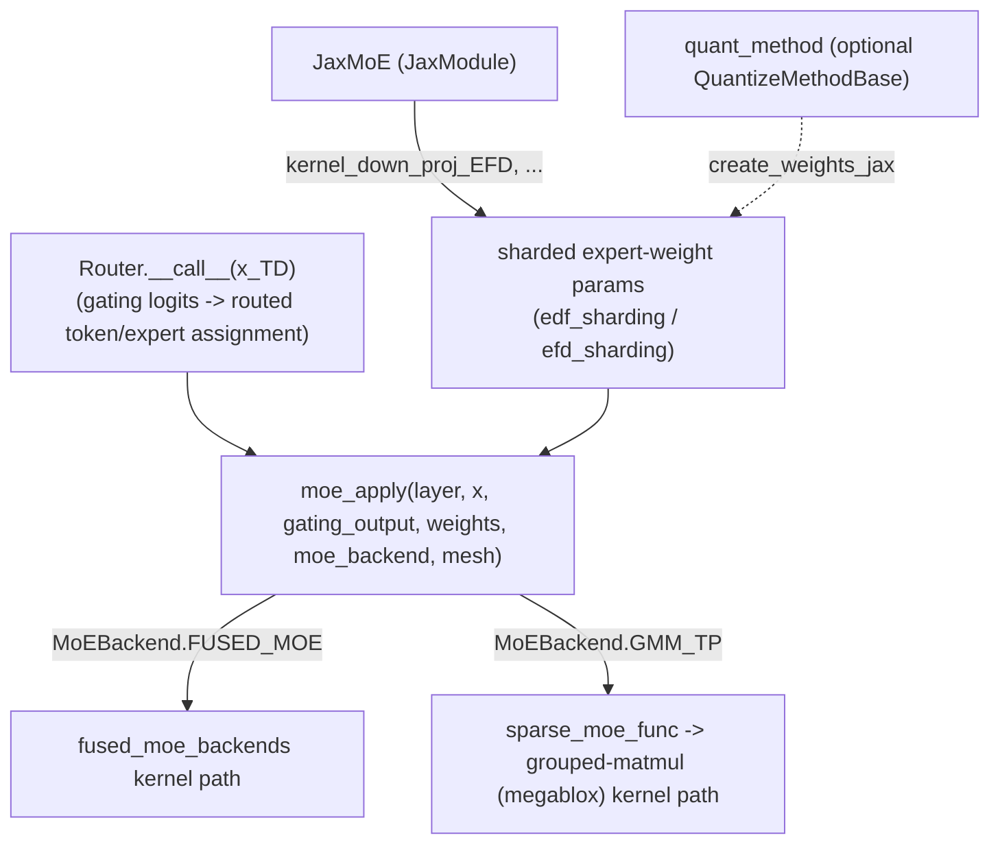

# tpu_inference.layers.jax.moe — JaxMoE, a backend-pluggable routed MLP layer

## Overview

[`JaxMoE`](../catalog/tpu_inference/layers/jax/moe/moe.md#JaxMoE) ("Mixture-of-Experts (MoE) Routed
MLP Layer") is a `JaxModule` subclass ("Base module for JAX layers, extending flax.nnx.Module") whose
actual expert-compute strategy is selected via a
[`MoEBackend`](../catalog/tpu_inference/layers/common/moe.md#MoEBackend) enum (`FUSED_MOE`, `GMM_TP`),
dispatched through the shared free function
[`moe_apply`](../catalog/tpu_inference/layers/common/moe.md#moe_apply). Routing itself is a separate
component — [`Router.__call__`](../catalog/tpu_inference/layers/jax/moe/moe.md#Router.__call__)
("Routes tokens to experts") — decoupled from the expert-compute backend choice.

## Diagram

## Design rationale (why it's built this way)

**Routing (`Router`) and expert compute (`JaxMoE`/`moe_apply`) are two independent components, not
one fused layer — a model architecture (e.g.
[`Qwen3MoeSparseMoeBlock`](../catalog/tpu_inference/models/jax/qwen3_moe.md#Qwen3MoeSparseMoeBlock.experts))
composes them explicitly.** [`Router.__call__`](../catalog/tpu_inference/layers/jax/moe/moe.md#Router.__call__)'s
doc — "Routes tokens to experts" — describes purely the gating/assignment step; the actual expert
computation (the potentially large batched-matmul or grouped-matmul work) is entirely `moe_apply`'s
responsibility, parameterized by whichever `JaxMoE` instance holds the expert weights.

**Expert compute backend is a runtime-selectable enum (`MoEBackend.FUSED_MOE` vs. `GMM_TP`), not a
compile-time architecture choice, dispatched through one shared `moe_apply` function.**
[`moe_apply`](../catalog/tpu_inference/layers/common/moe.md#moe_apply) accepts `moe_backend:
MoEBackend` as an explicit parameter and dispatches to either a fused-kernel path or `sparse_moe_func`
(a grouped-matmul/megablox-style path) — this lets the same `JaxMoE` layer definition serve different
hardware/batch-size tradeoffs (fused kernels typically favor smaller expert counts/larger batches;
grouped-matmul favors the opposite) purely via configuration.

**Quantization is optional and pluggable via `quant_method`, applied to weight creation
(`create_weights_jax`) rather than baked into `JaxMoE`'s structure** — `quant_method` defaults to
`None` and is resolved via `get_quant_method`/`quant_config`, following the same "quantization as an
attachable strategy, not a structural fork" pattern seen in
[`Attention`](tpu_inference-layers-jax-attention.md)'s own optional KV-cache quantization.

## Entry points

- [`JaxMoE`](../catalog/tpu_inference/layers/jax/moe/moe.md#JaxMoE) — the MoE layer itself, constructed
  once per MoE decoder layer.
- [`Router.__call__`](../catalog/tpu_inference/layers/jax/moe/moe.md#Router.__call__) — the routing
  step, called once per MoE layer per forward pass.
- [`moe_apply`](../catalog/tpu_inference/layers/common/moe.md#moe_apply) — the shared expert-compute
  dispatch function, called with the routing output and the chosen `MoEBackend`.

## Mechanism (step-by-step)

1. **[`Router.__call__`](../catalog/tpu_inference/layers/jax/moe/moe.md#Router.__call__) computes
   gating logits for each token and produces a routed token-to-expert assignment** (`gating_output`).
2. **[`moe_apply`](../catalog/tpu_inference/layers/common/moe.md#moe_apply) is called (from
   [`JaxMoE.__call__`](../catalog/tpu_inference/layers/jax/moe/moe.md#JaxMoE.__call__)) with the
   `JaxMoE` layer, the routing output, its sharded expert weights, and the configured
   [`MoEBackend`](../catalog/tpu_inference/layers/common/moe.md#MoEBackend).**
3. **For [`FUSED_MOE`](../catalog/tpu_inference/layers/common/moe.md#MoEBackend.FUSED_MOE), a fused
   kernel path
   ([`fused_moe_backends`](../catalog/tpu_inference/layers/common/moe.md#MoEBackend.fused_moe_backends))
   runs the expert computation.** For
   [`GMM_TP`](../catalog/tpu_inference/layers/common/moe.md#MoEBackend.GMM_TP),
   [`sparse_moe_func`](../catalog/tpu_inference/layers/jax/moe/sparse_moe.md#sparse_moe_func)
   dispatches to a grouped-matmul (megablox-style) kernel instead.
4. **The expert-weight parameters themselves**
   (e.g. [`kernel_down_proj_EFD`](../catalog/tpu_inference/layers/jax/moe/moe.md#JaxMoE.kernel_down_proj_EFD))
   **are created via `create_param` with explicit `edf_sharding`/`efd_sharding` mesh layouts**, and
   optionally quantized at creation time via `quant_method`/`create_weights_jax`.

## Key data structures

- **[`JaxMoE`](../catalog/tpu_inference/layers/jax/moe/moe.md#JaxMoE)** — a `kw_only` dataclass
  extending `JaxModule`; holds expert-weight params
  ([`kernel_down_proj_EFD`](../catalog/tpu_inference/layers/jax/moe/moe.md#JaxMoE.kernel_down_proj_EFD)
  and siblings) and an optional
  [`quant_method`](../catalog/tpu_inference/layers/jax/moe/moe.md#JaxMoE.quant_method).
- **[`MoEBackend`](../catalog/tpu_inference/layers/common/moe.md#MoEBackend)** — the
  `FUSED_MOE`/`GMM_TP` (and likely other) expert-compute backend discriminator.
- **`JaxModule`** ("Base module for JAX layers, extending flax.nnx.Module") — the common base every
  JAX-native layer (`JaxMoE`, `JaxEinsum`, `JaxEmbed`, `JaxRmsNorm`, ...) extends.

## Dynamics (design intent)
Not addressable beyond the routing/compute separation described above from this packet's subgraph.

## Edge cases
None directly visible in this packet's subgraph.

## Open questions
- The exact criteria (expert count, batch size, hardware generation) that should guide choosing
  `FUSED_MOE` vs. `GMM_TP` in practice isn't resolved by the symbols in this packet's subgraph.

## See also
- [tpu_inference-layers-jax-attention](tpu_inference-layers-jax-attention.md) — the analogous
  optional-quantization pattern in the attention layer's KV cache.
