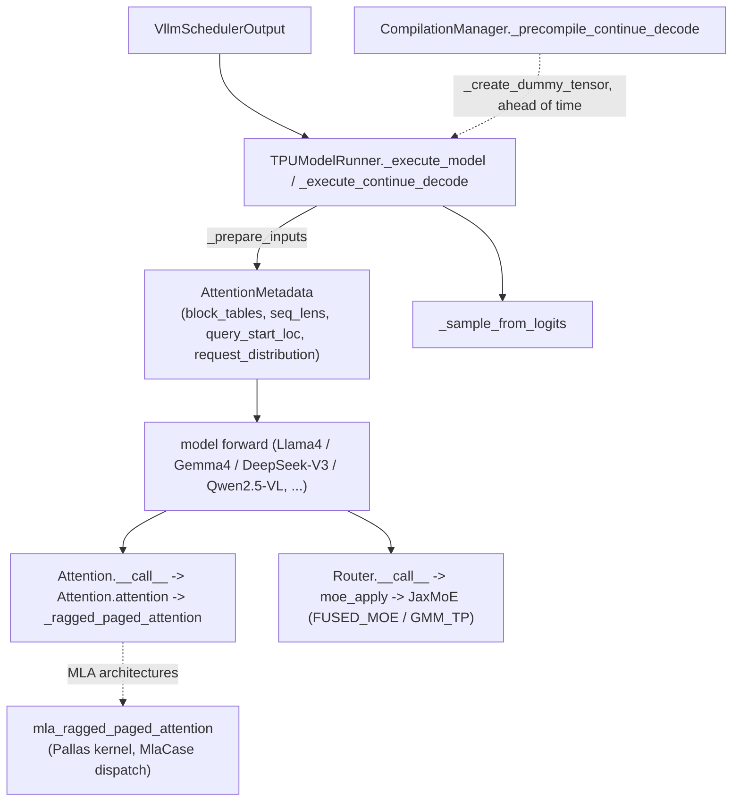

# tpu-inference — what it is and how it fits together

## In one paragraph

tpu-inference is vLLM's JAX/TPU backend: `TPUModelRunner` drives a per-step execute/prepare/sample
decode loop over a continuous-batching `InputBatch`, with every JIT-compiled shape precompiled ahead
of time by `CompilationManager` so no request ever triggers an on-demand compilation stall. Model
architectures (Llama4, Gemma4, DeepSeek-V3, Qwen2.5-VL, ...) are JAX-native layers built from shared
building blocks: a ragged-paged-attention `Attention` layer (with an MLA-specialized Pallas kernel
variant for DeepSeek-style architectures) and a backend-pluggable `JaxMoE` routed-MLP layer
(fused-kernel vs. grouped-matmul/megablox dispatch). Every attention and MoE call threads a single
per-step `AttentionMetadata` pytree carrying the ragged/paged bookkeeping (block tables, sequence
lengths, query offsets) that lets one kernel serve mixed prefill+decode batches. This catalog covers
`tpu_inference/kernels/`, `layers/`, `models/`, and `runner/` — the perf-relevant serving core; broader
vLLM integration/scheduling glue outside these directories is out of scope.

## Core architecture

## Main concepts

**The per-step decode loop and its precompilation warm-up are two separate concerns, tightly
coupled.** `TPUModelRunner._execute_model`/`_execute_continue_decode` drive the actual hot loop, while
`CompilationManager._precompile_continue_decode` guarantees every shape it will ever hit was already
JIT-compiled before serving starts. See [root](concepts/root.md).

**All attention layers funnel into one shared ragged-paged-attention kernel via a single metadata
pytree.** `Attention.__call__`/`.attention` project, apply RoPE, optionally quantize the KV cache, and
dispatch to `_ragged_paged_attention`, driven entirely by the fields on
[`AttentionMetadata`](concepts/tpu_inference-layers-common-attention_metadata.md). See
[tpu_inference-layers-jax-attention](concepts/tpu_inference-layers-jax-attention.md).

**`AttentionMetadata` is a JAX pytree dataclass with an explicit static/traced split.** Only
`padded_num_reqs` is a meta (static) field — every other field (`input_positions`, `block_tables`,
`seq_lens`, `query_start_loc`, `request_distribution`, `mamba_state_indices`) is a traced data leaf,
built once per step and threaded unchanged through attention, MoE, sampling, and precompilation. See
[tpu_inference-layers-common-attention_metadata](concepts/tpu_inference-layers-common-attention_metadata.md).

**MLA (DeepSeek-style) attention is a specialized Pallas kernel sibling, not a variant of the base
attention layer.** `mla_ragged_paged_attention` handles MLA's compressed KV representation
(`kv_c`/`k_pe` split from `ql_nope`/`q_pe`) with its own `MlaCase`-driven prefill/decode/mixed dispatch
and double-buffered async KV fetch. See
[tpu_inference-kernels-mla-v2-kernel](concepts/tpu_inference-kernels-mla-v2-kernel.md).

**MoE routing and MoE expert-compute are decoupled, with expert compute itself backend-pluggable.**
`Router.__call__` only computes token-to-expert assignment; `moe_apply` dispatches the actual expert
computation to either a fused kernel (`MoEBackend.FUSED_MOE`) or a grouped-matmul/megablox path
(`MoEBackend.GMM_TP`) against the same `JaxMoE` layer. See
[tpu_inference-layers-jax-moe](concepts/tpu_inference-layers-jax-moe.md).

## How a request flows

**Prefill/decode step:** `TPUModelRunner._execute_model` calls `_prepare_inputs` to build a fresh
`AttentionMetadata` + sampling metadata from the scheduler's output, runs the model forward pass over
the configured mesh (each attention layer consuming the shared `AttentionMetadata`, each MoE layer
routing through `Router`/`moe_apply`), then `_sample_from_logits` samples the next tokens
(speculative-decode- and DP-rank-aware).

**Steady-state decode fast path:** `_execute_continue_decode` skips the general admission-handling
overhead of `_execute_model`, relying on `CompilationManager._precompile_continue_decode` having
already warmed every shape this path will hit via dummy tensors built at server startup.

## Map of the wiki

- "What does the runner's per-step loop look like, and how is it kept compilation-stall-free?" →
  [root](concepts/root.md).
- "How does the JAX attention layer work, and how does KV-cache quantization plug in?" →
  [tpu_inference-layers-jax-attention](concepts/tpu_inference-layers-jax-attention.md).
- "What bookkeeping does every attention/MoE call share, and what's static vs. traced?" →
  [tpu_inference-layers-common-attention_metadata](concepts/tpu_inference-layers-common-attention_metadata.md).
- "How does MLA (DeepSeek-style) attention differ from the base ragged-paged-attention kernel?" →
  [tpu_inference-kernels-mla-v2-kernel](concepts/tpu_inference-kernels-mla-v2-kernel.md).
- "How is MoE routing separated from expert compute, and how is the compute backend chosen?" →
  [tpu_inference-layers-jax-moe](concepts/tpu_inference-layers-jax-moe.md).
- For the exhaustive per-symbol index, see `catalog/`; for the ranked concept list, see `index.md`.
