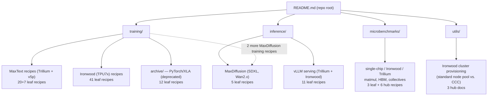

# tpu-recipes — what it is and how it fits together

## In one paragraph

tpu-recipes is a documentation-only repository of point-in-time benchmark **recipes** — step-by-step
instructions to reproduce specific training/inference/microbenchmark performance measurements on
Cloud TPU, for customers and partners validating hardware performance or making purchasing decisions
([README.md](sources/README.md)). It is not a code library: nearly every "recipe" is a README whose
payload is a launch command plus a config (MaxText `tuning_params`/`xla_flags`, a vLLM Docker/serving
command, a microbenchmark YAML) parameterized by model × hardware × precision × topology ×
launcher — the same combinatorial-matrix idea this wiki's own SCHEMA uses for model pages, just
expressed as a directory tree of READMEs instead of a single page's variant-matrix table. 117 docs
were ingested; 15 hub/orientation docs got their own [`sources/`](sources/) landing page, and the
remaining 102 leaf recipes are represented via citations from the six [`topics/`](topics/) pages,
which is where the actual cross-recipe synthesis (what varies, what's held constant, what the
measured deltas are) lives.

## Core structure

## Main topics

**Every non-Ironwood MaxText recipe (27 of them) is one launch template plus a `MaxTextModel` config
diff.** Cluster via XPK, environment via a shared MaxText prep doc, then one `benchmark_runner xpk`
invocation whose `tuning_params`/`xla_flags` encode everything that varies per model/hardware/
precision row. See
[MaxText training recipe pattern](topics/maxtext-training-recipes.md).

**Ironwood (TPU7x) training is the largest single recipe family (41 recipes) and the only place with
directly-measured, paired bf16-vs-fp8 deltas.** The directory path itself encodes every matrix axis
(model/precision/topology/launcher/storage). See
[Ironwood training recipe matrix](topics/ironwood-training-recipes.md).

**The PyTorch/XLA recipes are an explicitly deprecated predecessor generation.** 12 recipes (GCE vs.
XPK launch pairs) for Llama3.x/Mixtral/Diffusion-2, kept for reference only, superseded by the
MaxText-based family. See
[PyTorch/XLA legacy training recipes](topics/pytorch-legacy-training-recipes.md).

**vLLM serving recipes exist as a stopgap ahead of the unified `tpu-inference` JAX backend maturing.**
11 recipes across Trillium (GCE) and Ironwood (GKE) for Gemma4/Llama3.x/Qwen2.x/Qwen3/GPT-OSS. See
[vLLM inference serving recipes](topics/vllm-inference-recipes.md).

**MaxDiffusion covers the non-LLM (image/video generation) half of both training and inference.**
SDXL and the Wan2.x video family, 7 recipes total, structurally parallel to the MaxText/vLLM patterns
but for diffusion models. See [MaxDiffusion recipes](topics/maxdiffusion-recipes.md).

**Microbenchmarks isolate single operations (matmul, HBM copy, collectives) at three scales**
(single-chip, Ironwood multi-chip, Trillium multi-chip), with a dedicated Kueue-based automation
harness for running the Ironwood matrix at fleet scale. See
[TPU microbenchmarks](topics/tpu-microbenchmarks.md).

## Recurring cross-cutting patterns

- **XPK is the shared cluster-orchestration layer** for nearly every non-Ironwood-k8s recipe —
  [training/XPK_README.md](sources/training-XPK_README.md) is the single doc almost every training
  and Trillium-collectives recipe points back to for cluster creation.
- **k8s (raw manifests) vs. XPK (orchestrated) is a recurring launcher choice on Ironwood** — visible
  in the training matrix, the vLLM inference recipes, and the cluster-provisioning utilities
  (standard node pool vs. CCC) alike.
- **Storage backend (default / GCS / Managed Lustre) is an emerging first-class recipe axis** for the
  largest models — DeepSeek-V3-671B training and GPT-OSS-120B serving both publish it.
- **fp8 vs. bf16 is measured, not just documented, only on Ironwood** — the training hub table is the
  one place in the repo with directly comparable bf16/fp8 step-time numbers on identical hardware.

## Map of the wiki

- "What's the common MaxText training recipe shape, and how do the tuning knobs vary across models?"
  → [MaxText training recipe pattern](topics/maxtext-training-recipes.md).
- "What's in the Ironwood training matrix, and what's the measured fp8 speedup?" →
  [Ironwood training recipe matrix](topics/ironwood-training-recipes.md).
- "What did the pre-MaxText PyTorch/XLA recipes look like?" →
  [PyTorch/XLA legacy training recipes](topics/pytorch-legacy-training-recipes.md).
- "How do you serve a model with vLLM on TPU, and what's the Trillium vs. Ironwood difference?" →
  [vLLM inference serving recipes](topics/vllm-inference-recipes.md).
- "What diffusion/video-generation recipes exist?" → [MaxDiffusion recipes](topics/maxdiffusion-recipes.md).
- "What raw op-level (matmul/HBM/collectives) numbers has this repo measured?" →
  [TPU microbenchmarks](topics/tpu-microbenchmarks.md).
- For the full per-doc landing pages, see [`sources/`](sources/); for the assembled index, see
  `index.md`.
