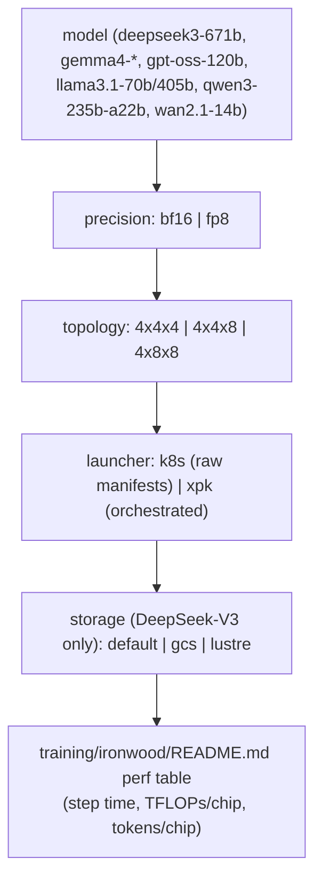

# Ironwood (TPU7x) training recipe matrix

## Overview

`training/ironwood/` is the largest single recipe family in the repo: 41 leaf recipes covering 7
models (DeepSeek-V3-671B, Gemma4-2B/4B/26B/31B, GPT-OSS-120B, Llama3.1-70B/405B, Qwen3-235B-A22B,
Wan2.1-14B) crossed with precision (bf16 / fp8), multi-slice topology (`4x4x4`, `4x4x8`, `4x8x8`),
launcher (`k8s` raw manifests vs. `xpk` orchestration), and — for DeepSeek-V3 specifically — storage
backend (default vs. `gcs` vs. `lustre`). Every recipe path segment encodes one axis of this matrix
(`<model>/<seqlen>-<precision>-tpu7x-<topology>[-<storage>]/<launcher>/README.md`), making the
directory tree itself a literal, filesystem-encoded variant matrix — the same design idea this
wiki's own model pages use for `<size>/<hardware>` rows, just one level more axes deep. The hub page
([training/ironwood/README.md](../sources/training-ironwood-README.md)) is where the repo actually
publishes measured step time / TFLOPs-per-chip / tokens-per-chip for (most of) this matrix.

## Diagram

## k8s vs. xpk: two launchers for the same recipe

Every model/topology/precision combination in this matrix has (at least) two sibling recipes that
differ only in launcher: a `k8s/` variant using raw Kubernetes Job/Pod manifests directly, and an
`xpk/` variant that wraps the same workload through XPK's orchestration layer (cluster lifecycle,
workload queuing, `check-results` monitoring). This mirrors the k8s-vs-xpk choice already documented
for [Ironwood cluster utilities](../sources/utils-ironwood-README.md) (standard node pool vs. CCC) —
the training recipes make the same "raw primitive vs. orchestrated" choice one layer up, at the
workload level rather than the cluster-provisioning level.

## Recipe matrix

| Model | Precision | Topology | Storage | Launcher(s) |
|---|---|---|---|---|
| deepseek3-671b | bf16 | 4x4x8 | default | [k8s](src:training/ironwood/deepseek3-671b/4k-bf16-tpu7x-4x4x8/k8s/README.md#check-results), [xpk](src:training/ironwood/deepseek3-671b/4k-bf16-tpu7x-4x4x8/xpk/README.md#check-results) |
| deepseek3-671b | bf16 | 4x8x8 | default | [k8s](src:training/ironwood/deepseek3-671b/4k-bf16-tpu7x-4x8x8/k8s/README.md#check-results), [xpk](src:training/ironwood/deepseek3-671b/4k-bf16-tpu7x-4x8x8/xpk/README.md#check-results) |
| deepseek3-671b | bf16 | 4x8x8 | gcs | [xpk](src:training/ironwood/deepseek3-671b/4k-bf16-tpu7x-4x8x8-gcs/xpk/README.md#check-results) |
| deepseek3-671b | bf16 | 4x8x8 | lustre | [xpk](src:training/ironwood/deepseek3-671b/4k-bf16-tpu7x-4x8x8-lustre/xpk/README.md#check-results) |
| deepseek3-671b | fp8 | 4x4x8 | default | [k8s](src:training/ironwood/deepseek3-671b/4k-fp8-tpu7x-4x4x8/k8s/README.md#check-results), [xpk](src:training/ironwood/deepseek3-671b/4k-fp8-tpu7x-4x4x8/xpk/README.md#check-results) |
| deepseek3-671b | fp8 | 4x8x8 | default | [k8s](src:training/ironwood/deepseek3-671b/4k-fp8-tpu7x-4x8x8/k8s/README.md#check-results), [xpk](src:training/ironwood/deepseek3-671b/4k-fp8-tpu7x-4x8x8/xpk/README.md#check-results) |
| gemma4-2b | bf16 | 4x4x4 | default | [k8s](src:training/ironwood/gemma4-2b/8k-bf16-tpu7x-4x4x4/k8s/README.md#check-results), [xpk](src:training/ironwood/gemma4-2b/8k-bf16-tpu7x-4x4x4/xpk/README.md#check-results) |
| gemma4-4b | bf16 | 4x4x4 | default | [k8s](src:training/ironwood/gemma4-4b/8k-bf16-tpu7x-4x4x4/k8s/README.md#check-results), [xpk](src:training/ironwood/gemma4-4b/8k-bf16-tpu7x-4x4x4/xpk/README.md#check-results) |
| gemma4-26b | bf16 | 4x4x4 | default | [k8s](src:training/ironwood/gemma4-26b/4k-bf16-tpu7x-4x4x4/k8s/README.md#check-results), [xpk](src:training/ironwood/gemma4-26b/4k-bf16-tpu7x-4x4x4/xpk/README.md#check-results) |
| gemma4-26b | bf16 | 4x8x8 | default | [k8s](src:training/ironwood/gemma4-26b/4k-bf16-tpu7x-4x8x8/k8s/README.md#check-results), [xpk](src:training/ironwood/gemma4-26b/4k-bf16-tpu7x-4x8x8/xpk/README.md#check-results) |
| gemma4-31b | bf16 | 4x4x4 | default | [k8s](src:training/ironwood/gemma4-31b/8k-bf16-tpu7x-4x4x4/k8s/README.md#check-results), [xpk](src:training/ironwood/gemma4-31b/8k-bf16-tpu7x-4x4x4/xpk/README.md#check-results) |
| gpt-oss-120b | bf16 | 4x4x4 | default | [k8s](src:training/ironwood/gpt-oss-120b/8k-bf16-tpu7x-4x4x4/k8s/README.md#check-results), [xpk](src:training/ironwood/gpt-oss-120b/8k-bf16-tpu7x-4x4x4/xpk/README.md#check-results) |
| gpt-oss-120b | bf16 | 4x8x8 | default | [k8s](src:training/ironwood/gpt-oss-120b/8k-bf16-tpu7x-4x8x8/k8s/README.md#check-results), [xpk](src:training/ironwood/gpt-oss-120b/8k-bf16-tpu7x-4x8x8/xpk/README.md#check-results) |
| llama3.1-405b | bf16 | 4x8x8 | default | [single-README](src:training/ironwood/llama3.1-405b/8k-bf16-tpu7x-4x8x8/README.md#check-results) |
| llama3.1-405b | fp8 | 4x8x8 | default | [single-README](src:training/ironwood/llama3.1-405b/8k-fp8-tpu7x-4x8x8/README.md#check-results) |
| llama3.1-70b (8k) | bf16 | 4x4x4 | default | [k8s](src:training/ironwood/llama3.1-70b/8k-bf16-tpu7x-4x4x4/k8s/README.md#check-results), [xpk](src:training/ironwood/llama3.1-70b/8k-bf16-tpu7x-4x4x4/xpk/README.md#check-results) |
| llama3.1-70b (8k) | bf16 | 4x8x8 | default | [k8s](src:training/ironwood/llama3.1-70b/8k-bf16-tpu7x-4x8x8/k8s/README.md#check-results), [xpk](src:training/ironwood/llama3.1-70b/8k-bf16-tpu7x-4x8x8/xpk/README.md#check-results) |
| llama3.1-70b (8k) | fp8 | 4x4x4 | default | [k8s](src:training/ironwood/llama3.1-70b/8k-fp8-tpu7x-4x4x4/k8s/README.md#check-results), [xpk](src:training/ironwood/llama3.1-70b/8k-fp8-tpu7x-4x4x4/xpk/README.md#check-results) |
| llama3.1-70b (8k) | fp8 | 4x8x8 | default | [single-README](src:training/ironwood/llama3.1-70b/8k-fp8-tpu7x-4x8x8/README.md#check-results) |
| llama3.1-70b (128k) | bf16 | 4x8x8 | default | [k8s](src:training/ironwood/llama3.1-70b/128k-bf16-tpu7x-4x8x8/k8s/README.md#check-results), [xpk](src:training/ironwood/llama3.1-70b/128k-bf16-tpu7x-4x8x8/xpk/README.md#check-results) |
| llama3.1-70b (128k) | fp8 | 4x8x8 | default | [single-README](src:training/ironwood/llama3.1-70b/128k-fp8-tpu7x-4x8x8/README.md#check-results) |
| qwen3-235b-a22b | bf16 | 4x8x8 | default | [k8s](src:training/ironwood/qwen3-235b-a22b/4k-bf16-tpu7x-4x8x8/k8s/README.md#check-results), [xpk](src:training/ironwood/qwen3-235b-a22b/4k-bf16-tpu7x-4x8x8/xpk/README.md#check-results) |
| qwen3-235b-a22b | fp8 | 4x8x8 | default | [single-README](src:training/ironwood/qwen3-235b-a22b/4k-fp8-tpu7x-4x8x8/README.md#check-results) |
| wan2.1-14b | bf16 | 4x4x4 | default | [k8s](src:training/ironwood/wan2.1-14b/bf16-tpu7x-4x4x4/k8s/README.md#check-results), [xpk](src:training/ironwood/wan2.1-14b/bf16-tpu7x-4x4x4/xpk/README.md#check-results) |

For measured step time / TFLOPs-per-chip / tokens-per-chip for each of these rows, see the
[hub performance table](../sources/training-ironwood-README.md#key-data-points).

## Precision: fp8 vs bf16

This is the one place in the repo where bf16 and fp8 recipes are published as **directly paired,
measured** rows on identical topology (not just "a separate recipe exists") — from the hub table:

| Model | Chips | bf16 step (s) | fp8 step (s) | fp8 speedup |
|---|---|---|---|---|
| deepseek-v3 | 128 | 27.02 | 22.47 | ~1.20x |
| deepseek-v3 | 256 | 26.79 | 22.08 | ~1.21x |
| llama3.1-70b (8k, 64 chips) | 64 | 12.20 | 7.93 | ~1.54x |
| llama3.1-70b (8k, 256 chips) | 256 | 12.27 | 7.95 | ~1.54x |
| llama3.1-70b (131072 seq, 256 chips) | 256 | 34.02 | 30.11 | ~1.13x |
| llama3.1-405b | 256 | 98.34 | 64.37 | ~1.53x |
| qwen3-235b-a22b | 256 | 30.87 | 27.67 | ~1.12x |

The fp8 speedup is not uniform: dense-ish models at moderate sequence length (llama3.1-70b/405b at
8k) see the largest gain (~1.5x), while long-context (131072) and MoE (qwen3-235b, deepseek-v3) see a
smaller gain (~1.1-1.2x) — consistent with fp8 primarily accelerating the matmul-bound portion of the
step, which shrinks as a fraction of step time once attention/communication (long context) or
routing/all-to-all (MoE) start to dominate.

## Storage backend as a recipe axis (DeepSeek-V3 only)

DeepSeek-V3-671B at `4x8x8` is the only model/topology pair with three storage-backend variants:
default, `gcs`, and `lustre` (Google Cloud Managed Lustre) — each its own `xpk`-launched recipe. This
is the training-side counterpart to the same default/gcs/lustre split seen on the
[GPT-OSS-120B vLLM inference recipe](vllm-inference-recipes.md), suggesting checkpoint/data storage
backend choice is treated as a first-class, independently-tunable axis for large models on Ironwood.

## See also
- [MaxText training recipe pattern (Trillium + v5p)](maxtext-training-recipes.md) — the smaller,
  non-Ironwood sibling recipe family using the same MaxText `benchmark_runner` launch pattern.
- [vLLM inference serving recipes](vllm-inference-recipes.md) — the inference-side Ironwood recipes
  (Gemma4, Qwen3, GPT-OSS) that share this training matrix's model set.
- [Ironwood cluster provisioning utilities](../sources/utils-ironwood-README.md) — the standard/CCC
  node-pool scripts the k8s-launched recipes in this matrix build their clusters with.

## Sources
- [training/ironwood/README.md](../sources/training-ironwood-README.md)
- `training/ironwood/<model>/<config>/{k8s,xpk}/README.md` (41 recipes, cited inline above)
