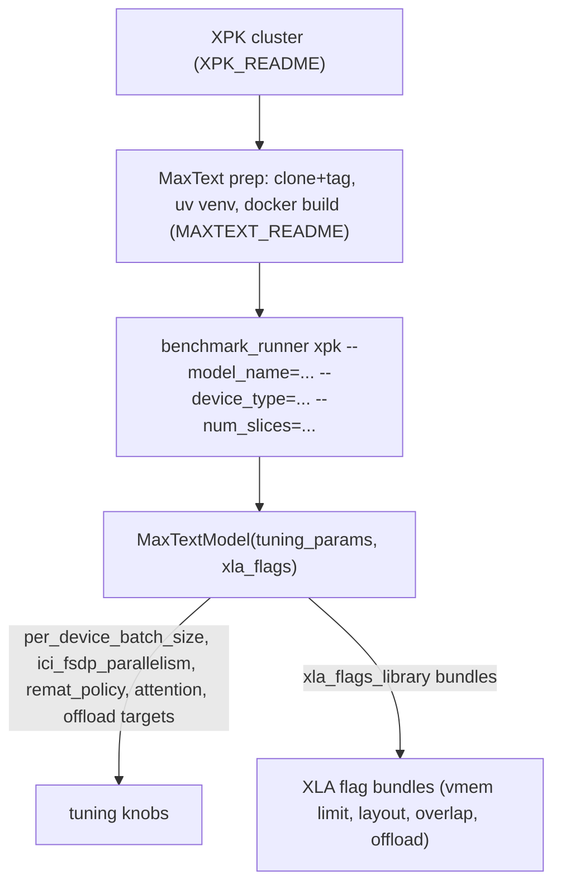

# MaxText training recipe pattern (Trillium + v5p)

## Overview

Every non-Ironwood MaxText training recipe in this repo (20 on Trillium v6e, 7 on v5p) follows one
template: create an XPK cluster
([XPK setup](../sources/training-XPK_README.md)), install MaxText and build a Docker image at a
pinned `tpu-recipes-v0.1.x` tag and `jax-stable-stack`/`jax-ai-image` base image
([MaxText prep](../sources/training-MAXTEXT_README.md)), then launch via
`python3 -m benchmarks.benchmark_runner xpk --model_name=<name> --device_type=<v6e-N|v5p-N>
--num_slices=<N>`. What differs per recipe is entirely encoded in a `MaxTextModel` config object:
`tuning_params` (batch size, parallelism, remat policy, attention kernel, sequence length,
selective-offload targets) and `xla_flags` (a composable list of named flag bundles). This is the
recipe-level analog of this wiki's own model-page "variant matrix" — one code path, many
(model × hardware × precision) rows.

## Diagram

## Trillium (v6e) recipes

| Model | Device | Slices | PDBS | Seq len | Remat | ici_fsdp | Attention | Offloaded projections | Recipe |
|---|---|---|---|---|---|---|---|---|---|
| GPT3-175B bf16 | v6e-256 | 1 | 3 | — | full | -1 | flash | — | [recipe](src:training/trillium/GPT3-175B-MaxText/bf16/README.md#workload-details) |
| GPT3-175B fp8 | v6e-256 | 1 | — | — | — | — | — | — | [recipe](src:training/trillium/GPT3-175B-MaxText/fp8/README.md#instructions-for-training-gpt3-175b-maxtext-on-tpu-trillium) |
| Gemma3-12B (1x) | v6e-256 | 1 | 1 | 32768 | custom | -1 | flash | — | [recipe](src:training/trillium/Gemma3-12B-MaxText/v6e-256/README.md#workload-details) |
| Gemma3-12B (2x) | v6e-256 | 2 | 1 | 32768 | custom | 1 | flash | — | [recipe](src:training/trillium/Gemma3-12B-MaxText/2x-v6e-256/README.md#workload-details) |
| Gemma3-12B (4x) | v6e-256 | 4 | 1 | 32768 | custom | 1 | flash | — | [recipe](src:training/trillium/Gemma3-12B-MaxText/4x-v6e-256/README.md#workload-details) |
| Llama2-70B | v6e-256 | 1 | 3 | 4096 | qkv_proj_offloaded | 1 | flash | — | [recipe](src:training/trillium/Llama2-70B-MaxText/README.md#workload-details) |
| Llama3.1-405B (pure FSDP/ICI) | v6e-256 | 2 | 1 | 8192 | custom | 256 | flash | decoder_layer_input | [recipe](src:training/trillium/Llama3.1-405B-MaxText/README.md#workload-details) |
| Llama3.1-70B v6e-128 | v6e-128 | 1 | 4 | 8192 | custom | -1 | flash | decoder_layer_input, q/k/v_proj | [recipe](src:training/trillium/Llama3.1-70B-MaxText/v6e-128/README.md#workload-details) |
| Llama3.1-70B v6e-256 | v6e-256 | 1 | 5 | 8192 | custom | -1 | flash | decoder_layer_input, q/k/v_proj | [recipe](src:training/trillium/Llama3.1-70B-MaxText/v6e-256/README.md#workload-details) |
| Llama3.1-70B v6e-64 | v6e-64 | 1 | 2 | 8192 | custom | -1 | flash | decoder_layer_input, q/k/v_proj | [recipe](src:training/trillium/Llama3.1-70B-MaxText/v6e-64/README.md#workload-details) |
| Llama3.1-70B v6e-32 (no collective matmul) | v6e-32 | 1 | 2 | 8192 | custom | -1 | flash | decoder_layer_input, q/k/v_proj | [recipe](src:training/trillium/Llama3.1-70B-MaxText/v6e-32/README.md#workload-details) |
| Llama3.1-8B v6e-256 | v6e-256 | 1 | 4 | 8192 | custom | -1 | flash | decoder_layer_input, out_proj, q/k/v_proj | [recipe](src:training/trillium/Llama3.1-8B-MaxText/v6e-256/README.md#workload-details) |
| Llama3.1-8B v6e-128 | v6e-128 | 1 | 4 | 8192 | custom | -1 | flash | decoder_layer_input, out_proj, q/k/v_proj | [recipe](src:training/trillium/Llama3.1-8B-MaxText/v6e-128/README.md#workload-details) |
| Llama3.1-8B v6e-64 | v6e-64 | 1 | 5 | 8192 | custom | -1 | flash | decoder_layer_input, out_proj, q/k/v_proj | [recipe](src:training/trillium/Llama3.1-8B-MaxText/v6e-64/README.md#workload-details) |
| Llama3.1-8B v6e-32 (no collective matmul) | v6e-32 | 1 | 3 | 8192 | custom | -1 | flash | decoder_layer_input, out_proj, q/k/v_proj | [recipe](src:training/trillium/Llama3.1-8B-MaxText/v6e-32/README.md#workload-details) |
| Llama3.1-8B v6e-16 (no collective matmul) | v6e-16 | 1 | 3 | 8192 | custom | -1 | flash | decoder_layer_input, out_proj, q/k/v_proj | [recipe](src:training/trillium/Llama3.1-8B-MaxText/v6e-16/README.md#workload-details) |
| Llama3.1-8B v6e-8 (no collective matmul) | v6e-8 | 1 | 3 | 8192 | custom | -1 | flash | decoder_layer_input, out_proj, q/k/v_proj | [recipe](src:training/trillium/Llama3.1-8B-MaxText/v6e-8/README.md#workload-details) |
| Mistral-7B | v6e-8 | 1 | 6 | 8192 | custom | -1 | flash | decoder_layer_input, out_proj, q/k/v_proj | [recipe](src:training/trillium/Mistral-7B-MaxText/README.md#workload-details) |
| Mixtral-8x7B (dropped) | v6e-256 | 1 | 12 | 4096 | custom | -1 | flash | decoder_layer_input, out_proj, q/k/v_proj | [recipe](src:training/trillium/Mixtral-8x7B-MaxText/README.md#workload-details) |
| Mixtral-8x22B (dropped) | v6e-256 | 1 | — | — | — | — | — | — | [recipe](src:training/trillium/Mixtral-8x22B-MaxText/README.md#instructions-for-training-mixtral-8x22b-maxtext-on-tpu-trillium) |

`ici_fsdp_parallelism=-1` (used by every Llama3.1/Mistral/Mixtral row) means "use all remaining ICI
mesh axis for FSDP" — the recipe doesn't hand-tune the FSDP/tensor split explicitly. The three
Gemma3-12B rows (1x/2x/4x v6e-256) are the same model at increasing slice count and are this topic's
clearest example of the size/hardware "combinatorial accident" this wiki's own SCHEMA describes: same
`per_device_batch_size`/`remat`/`attention`, only `ici_fsdp_parallelism` and slice count change going
from 1 to 2/4 slices (2x/4x reduce fsdp parallelism to 1, pushing more of the split to DCN).

## v5p recipes

| Model | Device | Slices | PDBS | Seq len | Remat | ici_fsdp | ici_tp | Recipe |
|---|---|---|---|---|---|---|---|---|
| DeepSeek3-671B | v5p-1024 | 1 | — | — | — | — | — | [recipe](src:training/v5p/DeepSeek3-671B-MaxText/README.md#instructions-for-training-deepseek-671b-maxtext-on-tpu-v5p-1024) |
| GPT3-175B | v5p | — | — | — | — | — | — | [recipe](src:training/v5p/GPT3-175B-MaxText/README.md#configs-based-on-tpu-type) |
| Llama2-7B | v5p | — | — | — | — | — | — | [recipe](src:training/v5p/Llama2-7B-Maxtext/README.md#instructions-for-training-llama2-7b-maxtext-on-tpu-v5p) |
| Llama3.1-405B | v5p-1024 | 1 | — | — | — | — | — | [recipe](src:training/v5p/Llama3.1-405B-MaxText/README.md#instructions-for-training-llama31-405b-maxtext-on-tpu-v5p-1024) |
| Llama4-Maverick-17B-128E (dropless) | v5p-256 | 1 | 4 | 8192 | custom | 32 | 4 | [recipe](src:training/v5p/Llama4-Maverick-17B-128E-Maxtext/README.md#instructions-for-training-llama4-maverick-17b-128e-maxtext-on-tpu-v5p-256) |
| Llama4-Scout-17B-16E (dropless) | v5p-256/512/1024 | — | — | — | — | — | — | [recipe](src:training/v5p/Llama4-Scout-17B-16E-Maxtext/README.md#instructions-for-training-llama4-scout-17b-16e-maxtext-on-tpu-v5p-256-v5p-512-and-v5p-1024) |
| Mixtral-8X7B | v5p | — | — | — | — | — | — | [recipe](src:training/v5p/Mixtral-8X7B-Maxtext/README.md#instructions-for-training-mixtral-8x7b-maxtext-on-tpu-v5p) |

Llama4-Maverick is the one v5p recipe that tunes **both** `ici_fsdp_parallelism=32` and
`ici_tensor_parallelism=4` explicitly (rather than `-1`/FSDP-only) — consistent with a 128-expert MoE
needing an explicit tensor-parallel split alongside FSDP rather than relying on FSDP-only sharding.

> [!inferred] Several v5p recipes' launch commands parameterize `--model_name`/`--device_type` behind
> a `${DEVICE_TYPE}`-style shell variable rather than hardcoding it in the doc text captured by this
> ingest; the exact per-recipe tuning params for those rows were not resolvable from the doc packet
> alone and are left blank above rather than guessed.

## Precision as a recipe axis (bf16 vs fp8)

GPT3-175B is the one MaxText model in this set with an explicit bf16/fp8 recipe pair on the same
hardware (v6e-256) — the fp8 recipe is a from-scratch page (not just a flag diff on the bf16 one),
suggesting fp8 MaxText training needs its own tuning pass rather than a drop-in flag flip. See
[fp8 vs bf16 on Ironwood](ironwood-training-recipes.md#precision-fp8-vs-bf16) for the much larger,
directly-paired bf16/fp8 comparison this repo publishes for Ironwood.

## The one non-MaxText v5p training recipe: DLRM-V2

`training/v5p/DLRM-V2-Tensorflow/README.md` is the sole training recipe in the entire repo that is
neither MaxText nor MaxDiffusion nor PyTorch/XLA — a TensorFlow-based recommendation-model (DLRM-V2)
recipe on v5p
([recipe](src:training/v5p/DLRM-V2-Tensorflow/README.md)). It doesn't share this topic's
`MaxTextModel`/`tuning_params`/`xla_flags` structure at all; it's included here only because it's the
"odd one out" among the v5p training directory's otherwise-MaxText/MaxDiffusion recipe set.

## See also
- [Ironwood TPU7x training recipe matrix](ironwood-training-recipes.md) — the analogous recipe
  matrix for Ironwood, including this repo's only true measured bf16-vs-fp8 pairs.
- [PyTorch/XLA legacy training recipes](pytorch-legacy-training-recipes.md) — the deprecated
  predecessor pattern this MaxText pattern replaced.
- [MaxDiffusion recipes](maxdiffusion-recipes.md) — the diffusion-model sibling recipe family
  (also XPK-launched, different config surface).

## Sources
- [training/XPK_README.md](../sources/training-XPK_README.md)
- [training/MAXTEXT_README.md](../sources/training-MAXTEXT_README.md)
- `training/trillium/*-MaxText*/README.md` (20 recipes, cited inline above)
- `training/v5p/*-Ma[x]*text*/README.md` (7 MaxText recipes, cited inline above)
- `training/v5p/DLRM-V2-Tensorflow/README.md`
