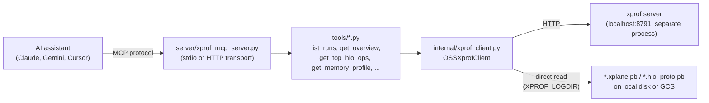

# xprof-mcp — what it is and how it fits together

## In one paragraph
`xprof-mcp` is a Model Context Protocol (MCP) server that lets AI assistants (Claude, Gemini, Cursor, etc.) analyze JAX/PyTorch-XLA/TensorFlow profiles on TPUs and GPUs by talking to a locally running open-source [xprof](https://github.com/openxla/xprof) profiler server. The server (`server/xprof_mcp_server.py`) exposes individual tools (`tools/*.py` — `list_runs`, `get_overview`, `get_top_hlo_ops`, `get_memory_profile`, and others referenced in the README) that each call into a shared internal layer (`internal/`) for actually talking to xprof: `xprof_client.py` is the HTTP/disk client every tool routes through, alongside sibling helpers (`xplane_tools.py`, `hlo_tools.py`, `hlo_dump_tools.py`, `xprof_data.py`) not covered by this ingest's selected packet.

## Core architecture

## Main concepts

### The client is the sole gateway to xprof
Every tool in `tools/` reaches the running `xprof` HTTP server (and, for raw-trace tools, the on-disk profile files) exclusively through [`OSSXprofClient`](concepts/internal-xprof_client.md) — see [internal/xprof_client](concepts/internal-xprof_client.md) for the full mechanism: environment-variable configuration (`XPROF_URL`, `XPROF_LOGDIR`), best-effort logdir auto-detection via `/proc` when the server runs locally, a uniform HTTP-fetch pattern across every listing/data endpoint, and GCS-aware direct-disk reads for tools that need the raw `.xplane.pb`/`.hlo_proto.pb` protobufs.

### Two data-access modes: server-rendered vs. raw-disk
Most tools go through the xprof HTTP server's own plugin API (pre-processed views like `overview_page`, `hlo_stats`, `memory_profile`). A smaller set of tools ("XPlane timeline tools", per the README) instead need the *raw* trace protobuf directly — those require `XPROF_LOGDIR` to be set (or auto-detectable) and route through `OSSXprofClient.read_xplane_bytes`/`read_hlo_proto_bytes` instead of `fetch`.

### `list_runs` as the discovery entry point
Per its own docstring ("**START HERE** if you don't know the run name"), `list_runs` is the tool an assistant calls first to discover available profiling runs before passing a `run` name to every other tool — a small but deliberate onboarding design choice visible directly in the tool's docstring.

## How a request flows
An AI assistant sends an MCP tool call to `server/xprof_mcp_server.py`, which dispatches to the matching function in `tools/`. That function calls `xprof_client.get_client()` to get the shared `OSSXprofClient` singleton, then calls one of its listing/fetch/disk-read methods, which either hits the xprof HTTP server (default `http://localhost:8791`) or reads a file from the configured logdir. The tool formats the result (typically JSON) and returns it as the MCP response.

## Map of the wiki
- Read [internal/xprof_client](concepts/internal-xprof_client.md) for the HTTP/disk client mechanics — logdir auto-detection, GCS-aware file helpers, and the uniform fetch pattern every tool depends on.
- See `catalog/` for the exhaustive per-module symbol index, and `index.md` for the concept table.
